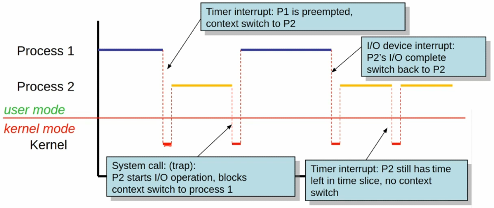
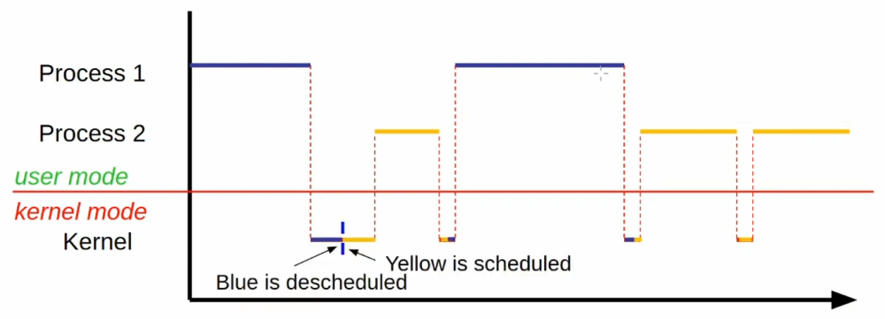
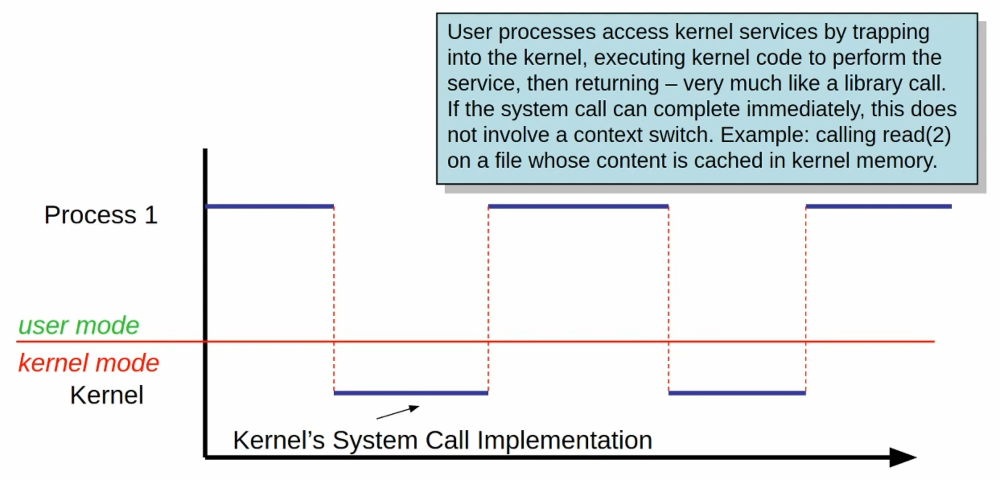
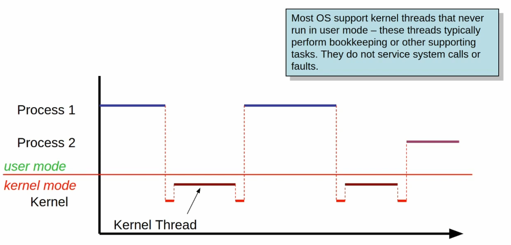
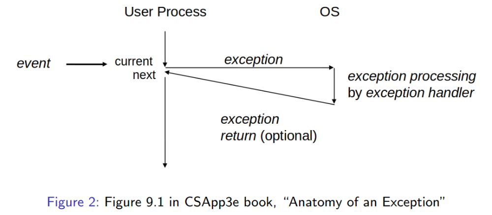

# Processes: Part I

# Table of Contents

- [Processes: Part I](#processes-part-i)
- [Table of Contents](#table-of-contents)
- [Processes](#processes)
- [Context Switching](#context-switching)
- [Dual-Mode Operation](#dual-mode-operation)
- [Mode Switching](#mode-switching)
- [Context Switch Scenarios](#context-switch-scenarios)
- [Context Switching Details](#context-switching-details)
- [System Calls](#system-calls)
- [Special Case: (In-) Kernel Threads](#special-case-in--kernel-threads)
- [Summary: Context Switches vs Mode Switches](#summary-context-switches-vs-mode-switches)
- [Bottom-Up View: Exceptions](#bottom-up-view-exceptions)
- [Source](#source)

# Processes

- Definition of Process
  - An instance of a program that is being executed (also known as a running instance).

> _Processes_. We consider that the system hardware comprises one or more processors, which we can identify as being distinct from the main memory, the file storage devices and the input/output devices. Each processor is capable of executing algorithms that are specified by sequences of instructions. A _process_ is a locus of control within an instruction sequence. That is, a process is that abstract entity which moves through the instructions of a procedure as the procedure is executed by the processor.
>
>  – Dennis and Van Horn: Programming Semantics for Multiprogrammed Computations (1966)

- OS provides, for each process:
  - Logical flows of control:
    - 1 flow for single-threaded programs.
    - Multiple flows for multi-threaded programs.
  - Private, protected address space.
  - Abstracted resources (file descriptors).
- These facilities abstract CPU, memory, and devices respectively.

# Context Switching

- Historical motivation for processes was introduction of multi-programming:
  - Load multiple processes into memory, and switch to another process if current process if (momentarily) blocked, perhaps waiting for user input.
  - This required protection and isolation between these processes, implemented by a priviledged kernal: _dual-mode operation_.
- _Time-sharing_:
  - A policy that switches to another process periodically to make sure all processes make progress.
- The act of switching between processes is called a _context switch_.
- "Context" here means the state of the running program (or the context of it), which includes the current program text, the location within the program text (PC/IP), and all associated state:
  - Variables
    - Global,
    - Heap,
    - Stack,
    - CPU Registers.
- Because context switching is typically managed by the kernel, it interacts with _mode switching_.

# Dual-Mode Operation

- To enable the implementation of switching between separate contexts, processors provide the ability to operate in different "_modes_", or _priviledge levels_.
  - At a minimum, there are 2 fundamental modes:
    1. _Kernel Mode_: Also known as _system mode_, _supervisor mode_, or _monitor mode_.
    2. _User Mode_: Non-priviledged mode.
  - These modes are maintained by the CPU (thing of a bit).
  - Rules:
    1. Rule 1:
       - Instructions designated as "priviledged" instructions will be executed only if in kernel mode, else they cause a _trap_.
    2. Rule 2:
       - Transition from/to kernel mode is carefully controlled.
  - Example: $HLT$ instruction.

# Mode Switching

- Two directions to consider:
  - User → Kernel:
    - Transitions to known, protected entry point in kernel code.
    - May occur for reasons external or internal to CPU.
    - _External Interrupt_:
      - Also known as a _hardware interrupt_.
      - Asynchronous:
        - Unrelated to what the currently executing program does.
      - Examples:
        - Timer/clock chip
        - I/O device
        - Network card
        - Keyboard
        - Mouse
    - _Internal Interrupt_:
      - Also known as a _software interrupt_, _trap_, or _exception_.
      - Synchronous:
        - Caused by what the current program does.
      - Can be:
        - Intended (trap):
          - For system call (process wants to enter kernel to obtain services)
        - Unintended (usually):
          - Fault/exception
          - Division by zero
          - Attempt to execute a priviledged intruction while in user mode
          - Memory access violation
          - Invalid instruction
          - Alignment error
    - Kernel → User:
      - Via special priviledged intruction.
        - Example:
          - Intel: $iret$
      - Represents either a return from interrupt or careful action to resume user program execution.

# Context Switch Scenarios

    

- Process 1
  - Decides it wants to read a file:
    - This results in a mode switch to Kernel Mode.
      - See gap of time between Process 1 and Process 2 in the figure.
- Kernel
  - OS decides what to do with the request.
  - Asks the CPU what needs to happen once we retrieve the data.
  - The CPU decides to context switch to Process 2.
- Process 2
  - Switches to User Mode in order to execute.
  - IO request is still in progress and will hopefully complete and arrive to memory at which point the device will trigger an interrupt.
  - We can see this at the end of the first run for Process 2, the end of it is the IRQ.
  - Now Process 1 is eligible to continue since Process 2, which was triggered by Process 1, is now complete.
- Kernel
  - Kernel will decide to context switch back to Process 1.
  - Returns to User Mode in order to run Process 1 since it runs in the context of User Mode.
- Process 1
  - Continues to execute until eventually there is a Timer Interrupt.
- Kernel
  - The Kernel evaluates that Process 1 has used the CPU for some time, it has used up its "time slice" and so the Kernel decides to instantiate a mode switch to Kernel Mode in order to let Process 2 run some more since it is deemed able to.
- Sidenotes
  - Typically requests cannot be executed immediately, for the sake of this example/demo though, they will.
  - Processes do not control context switch from one to another, they are ordered to do so through the Kernel which investigates a situation and determines if a context switch or mode switch is necessary.
    - This is something that happens under the hood without user knowledge of it.
  - At any given time a particular CPU can only run one process, so if more than one needs to run then the Kernel needs to manage the processes.
  - When the processes end, the OS will clean up after the process—as if it never existed there in the first place—by cleaning up all the residual evidence of resources used, etcetera.
    - Anything executed by a process is wiped by the OS.

# Context Switching Details

    

# System Calls

    

# Special Case: (In-) Kernel Threads

    

# Summary: Context Switches vs Mode Switches

- Mode switch guarantees that the kernel gains control when needed:
  - To react to external events.
  - To handle error situations.
  - Entry into kernel is controlled.
- Not all mode switched lead to context switches.
- Kernel decides if/when – subject to process state transitions and scheduling policies.
- Mode switch does not change the identity of the current process/thread.

# Bottom-Up View: Exceptions

    

# Source

[Godmar Back](https://people.cs.vt.edu/~gback/)