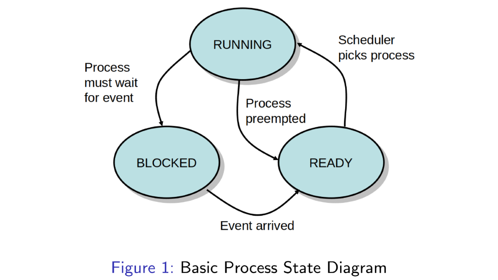
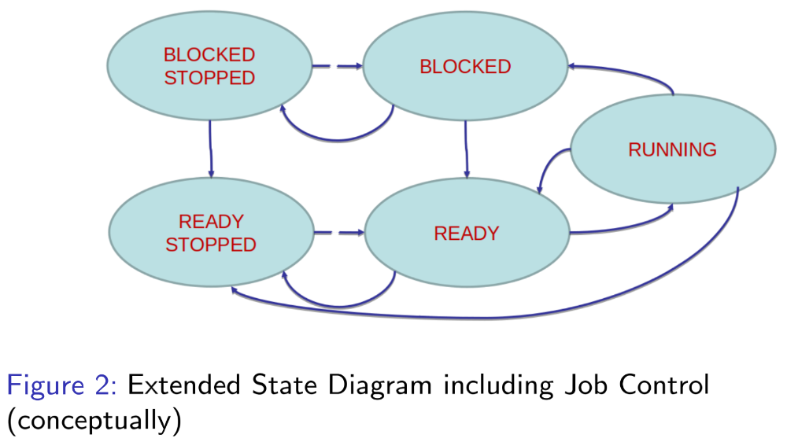

# Processes: Part II

# Table of Contents

- [Processes: Part II](#processes-part-ii)
- [Table of Contents](#table-of-contents)
- [Process States](#process-states)
- [Process State Transitions](#process-state-transitions)
- [Discussion Questions](#discussion-questions)
  - [Question 1](#question-1)
    - [Answer](#answer)
  - [Question 2](#question-2)
    - [Answer](#answer-1)
  - [Question 3](#question-3)
    - [Answer](#answer-2)
  - [Question 4](#question-4)
    - [Answer](#answer-3)
  - [Question 5](#question-5)
    - [Answer](#answer-4)
  - [Question 6](#question-6)
    - [Answer](#answer-5)
  - [Question 7](#question-7)
    - [Answer](#answer-6)
  - [Question 8](#question-8)
    - [Answer](#answer-7)
  - [Question 9](#question-9)
    - [Answer](#answer-8)
- [Process States in Linux & Other OS](#process-states-in-linux--other-os)
- [Process States & Job Control](#process-states--job-control)
- [Programmer's View](#programmers-view)
- [Mini Glossary](#mini-glossary)
    - [Running](#running)
    - [Stopping](#stopping)
    - [Interrupting](#interrupting)
    - [Killing](#killing)
- [Source](#source)

# Process States

<p align="center" width="100%">
    
</p>

- OS keeps track of the status of each process.
  - _RUNNING_:
    - This process is executing its instructions on a CPU.
  - _READY_:
    - This process is ready to execute on a CPU, but currently is not (it is waiting for the CPU to be assigned).
  - _BLOCKED_:
    - This process is not ready to execute on a CPU, because it is waiting for some event.
    - It cannot currently make use of a CPU even if one is available.
- NB: In systems whose kernels support multi-threading, the states are maintained for each thread separately.

# Process State Transitions

- RUNNING → BLOCKED:
  - Process cannot continue because it must first wait for something, e.g.
    - For input such as:
      - Keystroke,
      - File from disk,
      - Network message,
      - Data from Unix pipe.
    - For exclusive access to a resource (acquire a lock).
    - For a signal from another thread/process.
    - For time to pass (e.g. $sleep(2)$ syscall).
    - For a child process to terminate.
- BLOCKED → READY:
  - Process becomes ready when that _something_ finally becomes available.
    - OS adds process to a ready queue data structure.
- READY → RUNNING:
  - Process is chosen by the scheduler.
    - Only 1 process can be chosen per CPU.
    - Requires scheduling policy if demands exceeds supply.
- RUNNING → READY:
  - Process is descheduled.
    - OS preempted the process to give another READY process a turn.
    - Or, rarely, process voluntarily yielded the CPU.

# Discussion Questions

## Question 1

What happens if an $n$ CPU system has exactly $n$ READY processes?

### Answer

***

## Question 2

What happens if an $n$ CPU system has $0$ READY processes?

### Answer

***

## Question 3

What happens if an $n$ CPU system has $k < n$ READY processes?

### Answer

***

## Question 4

What happens if an $n$ CPU system has $2n$ READY processes?

### Answer

***

## Question 5

What happens if an $n$ CPU system has $m \gg n$ READY processes?

### Answer

***

## Question 6

What is a typical number of BLOCKED/READY/RUNNING processes in a
system (e.g. your phone or laptop)?


### Answer

***

## Question 7

How does the code you write influence the proportion of time your program
spends in the READY/RUNNING state?

### Answer

***

## Question 8

How can the number of processes in the READY/RUNNING state be used to
measure CPU demand?

### Answer

***

## Question 9

Assuming the same functionality is achieved, is it better to write code that
causes a process to spend most of its time BLOCKED, or READY?

### Answer

# Process States in Linux & Other OS

- Our model is simplified, real OS often maintain state diagrams with $5-15$ states for their threads/tasks.
- Case Study: Linux uses the following states,

```
D   Uninterruptible sleep (usually IO)
I   Idle kernel thread
R   Running or runnable (on run queue)
S   Interruptible sleep (waiting for an event to complete)
T   Stopped by job control signal
t   Stopped by debugger during the tracing
W   Paging (not valid since the 2.6.xx kernel)
X   Dead (should never be seen)
Z   Defunct ("zombie") process, terminated but not reaped by its parent
```

# Process States & Job Control

<p align="center" width="100%">
    
</p>

- Job Control
  - Some systems provide the ability to stop (suspend) a process for some time, and continue it later with all its state intact.
  - E.g. `Ctrl-Z` in Linux.
  - This mechanism is separate from the state transitions caused by events processes wait for – events can still arrive for stopped processes.

# Programmer's View

- Process state transitions are guided by (and/or):
  - Decisions or events outside the programmer's control:
    - User actions,
    - User input,
    - I/O events,
    - Interprocess communication,
    - Synchronization.
  - Decisions made by the OS:
    - Scheduling decisions.
- They may occur frequently, and over small time scales.
  - E.g. on Linux, preemption may occur every 4ms for RUNNING processes.
  - When processes interact on shared resources (locks, pipes) they may frequently block/unblock.
- For all practical purposes, these transitions, and the resulting execution order, are unpredictable.
- The resulting concurrency requres that programmers _not_ make any assumptions about the order in which processes execute.
  - Rather, they must use signaling and synchronization facilities to coordinate any process interactions.

# Mini Glossary

- A number of English verbs and gerunds are used with the respect to processes and job control that sometimes have an non-intuitive and/or context-dependent meaning.

### Running

- _Running_ can mean,
  - Laymens/Informal:
    - A running process is one that has been started but hasn't finished.
  - Precise OS Terminology:
    - A process that is currently in the RUNNING state, making progress and consuming CPU time in the process.

### Stopping

- _Stopping_ a process in Unix means to momentarily suspend it (independent of whether it's RUNNING, READY, or BLOCKED). Does not terminate the process − the process can be resumed ("continued") later.

### Interrupting

- _Interrupting_ a process (usually with `Ctrl-C`) typically, by default, terminates (ends) the process (but not always). It does not suspend it. It is not related to (hardware) interrupts.

### Killing

- _Killing_ a process means to send a signal to it, which often, but not always, terminates it.

# Source

[Godmar Back](https://people.cs.vt.edu/~gback/)