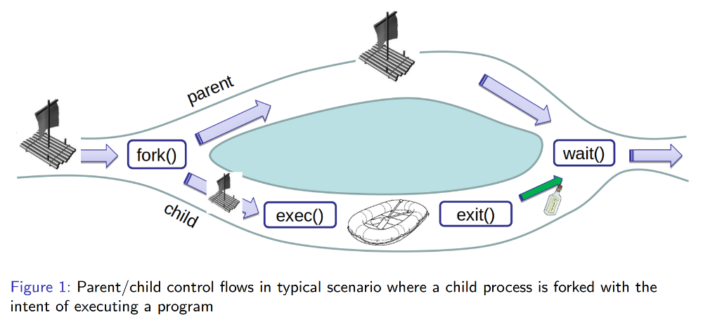

# Processes: Part III

# Table of Contents
- [Processes: Part III](#processes-part-iii)
- [Table of Contents](#table-of-contents)
- [Process Management](#process-management)
- [Process Management (Windows)](#process-management-windows)
- [Process Management (Unix)](#process-management-unix)
- [Comparison of `fork()` and `exec()`](#comparison-of-fork-and-exec)
- [Figure: fork/exec/exit/wait](#figure-forkexecexitwait)
- [Some Unix Jargon](#some-unix-jargon)
    - [Zombies](#zombies)
    - [Orphans & Daemons](#orphans--daemons)
    - [Run-Aways](#run-aways)
- [Source](#source)

# Process Management

- Os provide APIs (system calls) to manage processes.
- _Process Creation_
  - Includes way to set up new process's environment.
- _Process Termination_
  - Normal Termination:
    - `exit()`,
    - Return from `main`.
  - Abnormal Termination:
    - Due to misbehavior: "crash",
    - Due to outside intervention: "kill".
    - In either case, OS cleans up by:
      - Reclaiming all memory,
      - Closing all low-level file descriptors.
- _Process Interaction_
  - Examples:
    - Waiting for a process to finish.
    - Stopping/continuing a process.
- Change a process's scheduling and other attributes
- Reporting and profiling facilities
  - OS provides _facilities_ to be used by or in coordination with control programs.
  - Examples of control programs:
    - Shell,
    - GUI,
    - Task Manager.
  - Examples of facilities:
    - `Ctrl-C`
    - `Ctrl-Z`

# Process Management (Windows)

- OS provides APIs (system calls) to manage processes.
- Example: `CreateProcessA` in Windows:
    ```
    BOOL CreateProcessA(
        LPCSTR                  lpApplicationName,
        LPSTR                   lpCommandLine,
        LPSECURITY_ATTRIBUTES   lpProcessAttributes,
        LPSECURITY_ATTRIBUTES   lpThreadAttributes,
        BOOL                    bInheritHandles,
        DWORD                   dwCreationFlags,
        LPVOID                  lpEnvironment,
        LPCSTR                  lpCurrentDirectory,
        LPSTARTUPINFOA          lpStartupInfo,
        LPPROCESS_INFORMATION   lpProcessInformation
    );
    ```
- Creates ("spawns") a new process, and instructs it to run a new program with arguments and attributes.

# Process Management (Unix)

- Unix separates process creation from loading a new program.
- The `fork()` system call creates a new process, but does not load a new program.
- The newly created process is called a child process such that the process that created it is referred to as its parent.
  - Corollary:
    - Unix processes form a a tree-like hierarchy.
  - Child processes may inherit parts of their environment from their parents, but are otherwise distinct entities.
- The child process then may change/set up the environment and, when ready, load a new program that replaces the current program but retains certain aspects of the environment, see `exec()`.
- The parent has the option of waiting, via `wait()`, for the child process to terminate, which is also called "joining" the child process.
  - Parent can also learn how the child process terminated, e.g.
    - The code that the child passed to `exit()`. 

# Comparison of `fork()` and `exec()`

- `fork()`
  - Keeps program and process, but also creates a new process.
  - New process is a clone of the parent; child state is a (now separate) copy of parent’s state including everything:
    - Heap,
    - Stack,
    - File descriptors.
  - Called once, returns twice
    - Once in parent,
    - Once in child.
- `exec()`
  - Keeps process, but discards old program and loads a new program.
  - Reinitializes process state:
    - Clears heap,
    - Clears stack,
    - Starts at new program’s `main()`).
    - _EXCEPT_ it _retains_ file descriptors.
  - If successful, is called once but does not return.
  - Includes multiple variants such as `execvp()`, etcetera.


# Figure: fork/exec/exit/wait

<p align="center" width="100%">
    
</p>

- Parent/child control flows in typical scenario where a child process is forked with the intent of executing a program.

# Some Unix Jargon

### Zombies

- Processes that have exited, but whose parent is still alive **and** has not (yet) waited for them.
- They will exist until either their parent waits for them ("reaps them") or their parent exits.

### Orphans & Daemons

- Processes that are alive, but whose parent exited without waiting for them.
- They are reassigned to the $init$ process (pid 1).
- Usually unintended.
- If intended, the _orphan_ may also be called a _daemon_.

### Run-Aways

- Processes that are alive, have not exited, are always READY/RUNNING and thus, if scheduled, use up to $100\%$ of a CPU without performing useful work.

# Source

[Godmar Back](https://people.cs.vt.edu/~gback/)