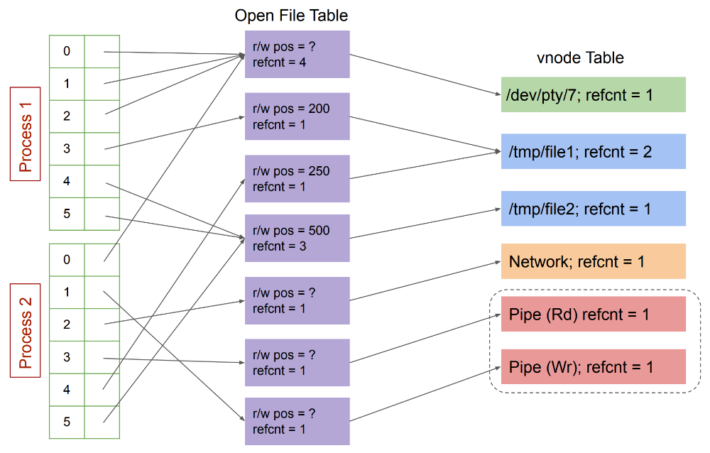

# Unix File Descriptors

# Table of Contents

- [Unix File Descriptors](#unix-file-descriptors)
- [Table of Contents](#table-of-contents)
- [Unix File Descriptors](#unix-file-descriptors-1)
- [Standard Streams](#standard-streams)
- [File Descriptors: The Subtle Parts](#file-descriptors-the-subtle-parts)
- [Figure: In-Kernel Management of File Descriptors](#figure-in-kernel-management-of-file-descriptors)
- [File Descriptor Manipulation](#file-descriptor-manipulation)
- [Source](#source)

# Unix File Descriptors

- A file descriptor is a handle that allows user processes to refer to files, which are sequences of bytes.
- Unix represents many different kernel abstractions as files to abstact I/O devices, e.g.
  - Disks,
  - Terminals,
  - Network Sockets,
  - IPC Channels (pipes),
  - Etcetera.
- Provide a uniform API, no matter the kind of the underlying object.
  - Functions:
    - `read(2)`,
    - `write(2)`,
    - `close(2)`,
    - `lseek(2)`,
    - `dup(2)`,
    - And more.
  - May maintain a read/write position if seekable.
  - But Note:
    - Not all operations work on all kinds of file descriptors.
- Are represented using (small) integers obtained from system calls such as `open(2)`.
- Are considered low-level I/O.
- Are inherited/cloned by a child process upon fork().
- Are retained when a process `exec()`s another program.
- Are closed when a process `exit()`s or is killed.

# Standard Streams

- By convention:
  - 0
    - Standard Input
  - 1
    - Standard Output
  - 2
    - Standard Error
- Programs do not have to open any files, they are preconnected, thus programs can use them without needing any additional information.
- Control programs (shell), or the program starting a program can set those up to refer to some regular file, terminal device, or something else.
- When used, they access the underlying kernel object in the same way if they'd opened it themselves.
- Programs should, in general, avoid changing their behavior depending on the specific type of object their standard streams are connected to.
  - Exceptions exist:
    - Flushing strategy of C's `stdio` depends on whether standard output is a terminal or not.
    - Python 2 `sys.stdout.encoding`.

# File Descriptors: The Subtle Parts

- To properly understand file descriptors, must understand their implementation inside the kernel.
- File descriptors use 2 layers of indirection, both which involve reference counting.
  - (Integer) file descriptors in a per-process table point to entries in a global open file table.
  - Pre-process file descriptor table has a limit on the number of entries.
  - Each open file table entry maintains a read/write offset (or position) for the file.
  - Entries in the open file table point to entires in a global "vnode" table, which contains specialized entries for each file-like object.
- File descriptor tables are (generally) per-process, but processes can duplicate and rearrange entries.

# Figure: In-Kernel Management of File Descriptors

    

# File Descriptor Manipulation

- `close(fd)`
  - Clear entry in file descriptor table, decrement refcount in open file table.
  - If zero, deallocate entry in:
    - Open file table and decrement refcount in vnode table.
    - vnode table and close underlying object.
  - For certain objects (pipes, sockets), closing the underlying object has important side effects that occur only if all file descriptors referring to it have been closed.
- `dup(int fd)`
  - Create a new file descriptor referring to the same file descriptor as `fd`.
  - Increment refcount.
- `dup2(int fromfd, int tofd)`
  - If `tofd` is open, close it.
  - Then, assign `tofd` to the same open file entry as `fromfd`.
  - Increment refcount.
- `fork()`
  - On `fork()` The child inherits a copy of the parent's file descriptor table and the reference count of each open file table entries incremented.
- `exit()`
  - On `exit()`, or abnormal termination, all entries are closed.

# Source

[Godmar Back](https://people.cs.vt.edu/~gback/)