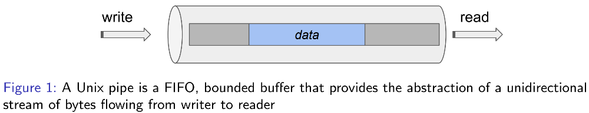

# Pipes

# Table of Contents

- [Pipes](#pipes)
- [Table of Contents](#table-of-contents)
- [Pipes](#pipes-1)
- [Source](#source)

# Pipes

    

- A Unix pipe is a FIFO, bounded buffer that provides the abstraction of a unidirectional
stream of bytes flowing from writer to reader
- Writers:
  - Can store data in the pipe as long as there is space.
  - Blocks if pipe is full until reader drains pipe.
- Readers:
  - Drains pipe by reading from it.
  - If empty, blocks until writer writes data.
- Pipes provide a classic "bounded buffer" abstraction that:
  - Is safe:
    - No race conditions,
    - No shared memory,
    - Handled by Kernel.
  - Provides flow control that automatically controls relative progress:
    - E.g. if a writer is BLOCKED, but reader is READY, it'll be scheduled and vice versa.
- Created unnamed.
  - File descriptor table entry provide for automatic cleanup.
- Using regular dup2 would be affecting the shell's file decriptors rather than the child's. This is because the child inherits a shallow copy of the file descriptors of the parent before `posix_spawn_file_actions_adddup2` is called.
  - Therefore, when dealing with the children of the parent we want to use the aforementioned posix_spawn version of dup2 and not the standalone `dup2`.
- Remember you need to close the pipe ends of the parent once all piping in the children is complete. The children are able to handle their own pipes closing through the O_CLOEXEC parameter of `pipe2`.

# Source

[Godmar Back](https://people.cs.vt.edu/~gback/)