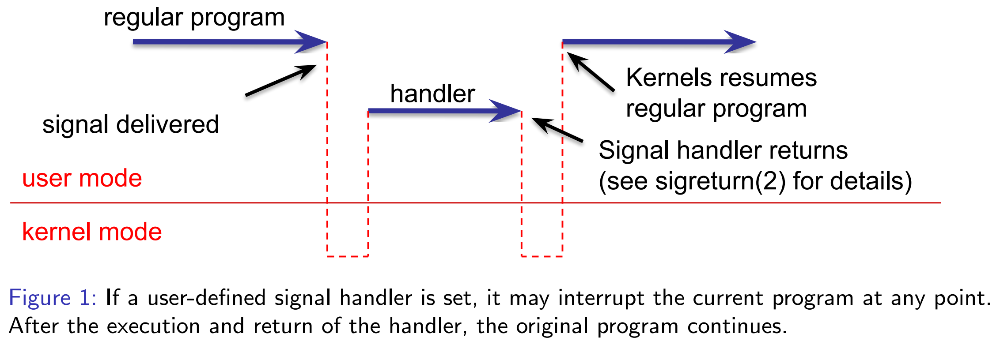
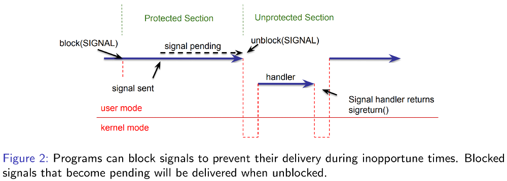

# Unix Signals

# Table of Contents

- [Unix Signals](#unix-signals)
- [Table of Contents](#table-of-contents)
- [Unix Signals](#unix-signals-1)
- [Signals Representing Synchronous Conditions](#signals-representing-synchronous-conditions)
- [Selected Signals Representing Asynchronous Notifications](#selected-signals-representing-asynchronous-notifications)
- [How Signals Work](#how-signals-work)
- [Signals Don't Queue](#signals-dont-queue)
- [Figure: Control Flow (Asynchronous Notification)](#figure-control-flow-asynchronous-notification)
- [Control Flow Example](#control-flow-example)
- [Async-Signal Safety](#async-signal-safety)
- [Blocking/Masking Signals](#blockingmasking-signals)
- [Source](#source)

# Unix Signals

- Unix Signals present a uniform mechanism that allows the kernel to inform processes of events of interest from a small predefined set ($< 32$).
  - Traditionally represented by their integer number, sometimes associated with some optional additional information.
- These events fall into 2 groups:
  1. Synchronous:
      - Caused by something the process did (aka "internally generated event").
  2. Asynchronous:
     - Not related to what the process currently does (aka "externally generated
event").
- Uniform API includes provisions for programs to determine actions to be taken
for signals, which includes:
  - Terminating the process, optionally with core dump.
  - Ignoring the signal.
  - Invoking a user-defined handler.
  - Stopping the process (in the job control sense).
  - Continuing the process.
- Sensible default actions support use control and fail-stop behavior when faults occur.

# Signals Representing Synchronous Conditions

|  Signal  | Action | Description                 |  More                                                                       |
|---------:|:------:|-----------------------------|-----------------------------------------------------------------------------|
|  SIGILL  |   (1)  | Illegal Instruction         |                                                                             |
| SIGABRT  |   (1)  | Programmed called `abort()` |                                                                             |
|  SIGFPE  |   (1)  | Floating Point Exception    |                                                                             |
| SIGSEGV  |   (1)  | Segmentation Fault          | E.g. integer division by zero, but but not usually IEEE 754 division by 0.0 |
| SIGPIPE  |   (1)  | Broken Pipe                 | Catch all for memory and privilege violations                               |
| SIGTTIN  |   (2)  | Terminal Input              | Attempt to read from terminal while in background                           |
| SIGTTOU  |   (2)  | Terminal Output             | Attempt to write to terminal while in background                            |

- (1) Default action: Terminate the process.
- (2) Deafult action: Stop the process.

# Selected Signals Representing Asynchronous Notifications

|  Signal  | Action(s) | Description                               |
|---------:|:---------:|-------------------------------------------|
|   SIGINT |   (1, 3)  | Interrupt: User typed `Ctrl-C`            |
|  SIGQUIT |   (1, 3)  | Interrupt: User typed `Ctrl-\`            |
|  SIGTERM |    (3)    | User typed kill pid (default)             |
|  SIGKILL |   (2, 3)  | User typed kill -9 pid (urgent)           |
| SIGALARM |   (1, 3)  | An alarm went off, E.g. `alarm(2)`        |
|  SIGCHLD |    (1)    | A child process terminated or was stopped |
|  SIGTSTP |    (1)    | Terminal stop: User typed `Ctrl-Z`        |
|  SIFSTOP |    (2)    | User typed kill -STOP pid                 |

- (1) These are sent by the kernel.
  - E.g. Terminal device driver.
- (2) SIGKILL and SIGSTOP cannot be caught or ignored.
- (3) Default action: Terminate the process.

# How Signals Work

- First, a signal is sent (via the kernel) to a target process.
  - Some signals are sent internally by the kernel (e.g. SIGALRM, SIGINT, SIGCHLD).
  - User processes can use the `kill(2)` system call to send signals to each other (subject to permission).
  - The `kill(1)` command or your shell’s built-in kill command do just that.
  - The `raise(3)` command sends a signal to the current process.
- This action makes the signal become "pending".
- Then (possibly some time later) the target process receives the signal and performs the action:
  - Ignore,
  - Terminate,
  - Or call handler.
- Aside: the details of how processes learn about pending signals and how they react to them are complicated, but handled by the kernel.
- Here we focus on what user programmers need to observe when using signals.

# Signals Don't Queue

- Each signal represents a bit in the target process's pending mask saying whether the signal has been sent (but not yet received).
- Thus, sending a signal that’s already pending has no effect.
- This applies to internally triggered signals as well:
  - Notably, multiple children that terminate while SIGCHLD is pending will result in a single delivery of SIGCHLD.
- More like railway signals (on/off) than individual messages.

# Figure: Control Flow (Asynchronous Notification)

<p align="center" width="100%">
    
</p>

# Control Flow Example

```c
void list_insert (struct list_elem *before, struct list_elem *elem) {
  elem->prev = before->prev;
  elem->next = before;
  before->prev->next = elem;
  before->prev = elem;
}
```
```c
list_insert:
  movq (%rdi), %rax
  movq %rdi, 8(%rsi)
  movq %rax, (%rsi)
  movq %rsi, 8(%rax)
  movq %rsi, (%rdi)
  ret
```
- If a signal arrives in the middle of `list_insert()`, the manipulated list’s list element are in a partially linked state. If the signal handler now takes a path where the same list is being accessed (iterated over, etc.), inconsistent behavior will result. This situation must be avoided.

# Async-Signal Safety

- Is it safe to manipulate data from a signal handler while that same data is being manipulated by the program that was executing (and interrupted) when the signal was delivered?
- In general, is it safe to call a function from a signal handler while that same
function was executing when the signal was delivered?
  - Answer: It depends.
- POSIX defines a list of functions for which it is safe, so-called async-signal-safe
functions, see `signal-safety(7)` for a list and the book’s Web Aside: Async-Signal Safety.
- `printf()` is not async-signal-safe (acquires the console lock).
- Two strategies to write async-signal-safe programs:
  1. Don't call async-signal-unsafe function in a signal handler.
  2. Block signals while calling unsafe functions in the main control flow (or when manipulating shared data).

# Blocking/Masking Signals

<p align="center" width="100%">
    
</p>


# Source

[Godmar Back](https://people.cs.vt.edu/~gback/)