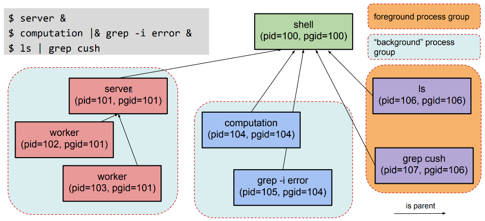

# Implementing Job Control Shells

# Table of Contents

- [Implementing Job Control Shells](#implementing-job-control-shells)
- [Table of Contents](#table-of-contents)
- [Job Control Shells](#job-control-shells)
- [Foreground vs Background vs Stopped Jobs](#foreground-vs-background-vs-stopped-jobs)
- [Process Groups](#process-groups)
- [Figure: Job Control Process Group Arrangement Example](#figure-job-control-process-group-arrangement-example)
- [Source](#source)

# Job Control Shells

- A job control shell is a control program that allows a user to start and manage programs from the command line.
- At their core, include a "read-eval" loop.
- Shells support built-in commands, although by default they allow a user to run an arbitrary program in a new process.
- Shells support arranging processes into pipes, typically via `|`.
- Shells arrange for users to be able to terminate and stop jobs if desired.
- Shells support the user’s notion of foreground vs background jobs and inform the OS of the user's intent.
- Shells interact with the OS to learn about the fate of the jobs they started on the user's behalf, and inform the user about what they've learned.

# Foreground vs Background vs Stopped Jobs

- User Expectations:
  - The shell waits for foreground jobs before outputting a new prompt.
  - Foreground jobs receive user input.
  - Foreground jobs can have full control of the terminal (e.g. vim).
  - Background jobs execute, but do not prevent further user interaction with the shell.
  - Stopped jobs are neither foreground nor background.
- OS Support:
  - Minimal notion of fg/bg inside the OS.
  - OS do maintain a foreground process group id for each terminal:
    - Control keys such as `Ctrl-C` and `Ctrl-Z` are turned into signals sent to foreground process group.
    - Certain terminal operations cause a process to be stopped with SIGTTOU/SIGTTIN if attempted while the calling process's group is not the foreground group.
    - In Linux, look for the plus `+` to see the fg process group.

> The shell's task is to relay the user's expectations to the OS, and to inform the user
of any events that result, while maintaining internal state that accurately reflects the
state of each job.

# Process Groups

- Purpose:
  - To group processes for the purposes of signal delivery.
    - Sending a signal sends it to all processes that are part of a process group.
    - This applies to both:
      1. Signals sent via a system call such as:
         - `kill(2)`
         - `killpg(3)` 
      2. Signals sent by the Kernel such as:
         - SIGTSTP
         - SIGINT
- Simple, cooperative management scheme:
  - Any process is part of exactly one process group at all times.
  - Each group has a leader whose pid is used to determine its process group id.
  - NB:
    - Process groups may persis even if the leader process has already exited, as long as there are still members alive.
  - Any process may create a new process group, declaring itself as the leader.
  - Any process may join (or be assigned to) an existing process group.
  - Subject to permission restrictions.
- Intended use:
  - Although the API is open to all processes, it is commonly used by control programs (shells) to arrange processes into groups that correspond to the jobs the shell manages, allowed the user to kill entire groups and `Ctrl-Z`/`Ctrl-C` to be sent to entire groups.
  - Nice default behavior:
    - A `fork()`'d child inherits the process group of its parent, making it automatically subject to any signals delivered to the group.

# Figure: Job Control Process Group Arrangement Example

    

# Source

[Godmar Back](https://people.cs.vt.edu/~gback/)