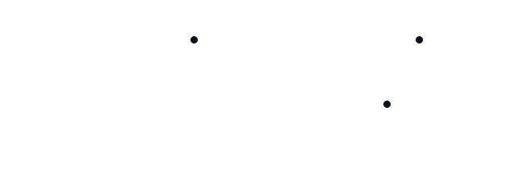

# Signals

    February 7, 2023

# Table of Contents

- [Signals](#signals)
- [Table of Contents](#table-of-contents)
- [Introduction](#introduction)
- [Sync/Async Signals](#syncasync-signals)
  - [Synchronous](#synchronous)
  - [Asynchronous](#asynchronous)
- [UNIX Unified API](#unix-unified-api)
  - [Signal Dispositions](#signal-dispositions)
    - [Fail-Stop](#fail-stop)
- [Signal Safety](#signal-safety)
  - [Man Page](#man-page)
- [Control Flow](#control-flow)
  - [Signal Masking](#signal-masking)
- [Source](#source)

# Introduction

- Signals are a way for the Kernel to communicate with its processes.
- What signals have we seen?
  - `SIGCHLD`
    - Child has terminated.
  - `SIGSEGV`
    - Segmentation fault.
  - `SIGINT`
    - User interrupt `Ctrl-C`.
  - `SIGKILL`
    - Invoked by `-9` flag of the `kill -9 [process]` command.
  - `SIGTERM`
    - Signal to terminate, can be ignored, whereas `SIGKILL` cannot be ignored.

# Sync/Async Signals

- Signals can be caused/sent internally or externally.

## Synchronous

- Synchronous/Internal Signals are caused by something a process has done.

## Asynchronous

- Asynchronous/Internal Signals are caused by some other event (not the processes themselves).

# UNIX Unified API

- Unix assigns each signal an associated number (integers).
  - Historically less than 32 Signals.
  - `SIGSEGV` is `11` and `SIGKILL` is `9` for example.
- Let the process specify what to do when it recieves a signal.
  - Some processes might terminate, while another might ignore a signal.
  - Run a "handler" in user space.
    - Signal might not be bad thing, might want to do something when signal for child exit received.
  - Stop/Continue (job control).

## Signal Dispositions

- A disposition determines how a process should behave when it recieves the signal in question.
- There are pre-defined default behaviors for signals.
  - `SIGCHLD` is `Ign` (ignored) by default although most signals `Term` (terminate) by default.
    - Some signals dispositions are a `Stop` or a `Core`-Dump by default.

### Fail-Stop

- Aside on the idea in computing where if anything unexpected happens its better to stop, called a "Fail-Stop".
  - We want our program to crash so we can debug the issue and be sure of the cause.
- Some believe "Fail-Stop" is always the way to go, but is some situations it is fine to ignore crashes like in Web Development.
  - Usually not good practice for Systems-related low-level programming.

# Signal Safety

- We may not want to kill a process right away.
  - What if the Kernel is performing some housekeeping related to a process we are trying to kill, such as updating tables, etcetera.
- Signals may not be delivered immediately.
- There are some safe and unsafe places to deliver some signals.
- User is not in control of when a signal comes.
  - Depending on what the Kernel is doing, there may be a delay.
- Be careful about making assumptions about when things will happen.
  - Users have control over some things, but not everything, such as timing of events.
    - The Kernel usually controls this.
- Signal bitmap with "pending" signals.

## Man Page

- The `man signal-safety` command will open a man page regarding signal safety.
  - See the "Async Signal Safety" section.

# Control Flow

- Control flow during signal handling.
- Signal handler function written by the user.

```c
handler {
    // Define what to do for any Signal sent by the Kernel
}
```

```c
main {
    // Call the handler{}
}
```

<p align="center" width="100%">
    
</p>

- `SIGRETURN` is a special signal that is sent by the handler to the Kernel after the handler is done "handling".

## Signal Masking

- Can't control when the handler is run which can lead to problems.
- Two options:
  1. Don't do "stuff" in handler.
     - Can't always mitigate the issue this way.
  2. Temporarily block/mask signals until the code is in a more safe/stable state.

# Source

[Dan Williams](https://people.cs.vt.edu/djwillia/)
