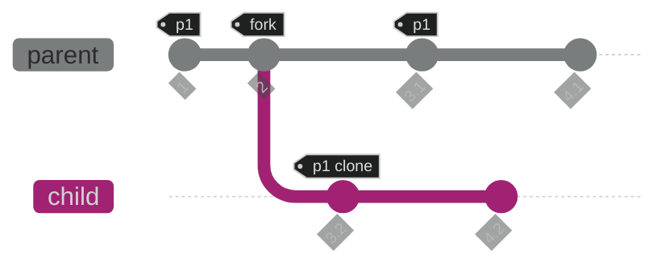
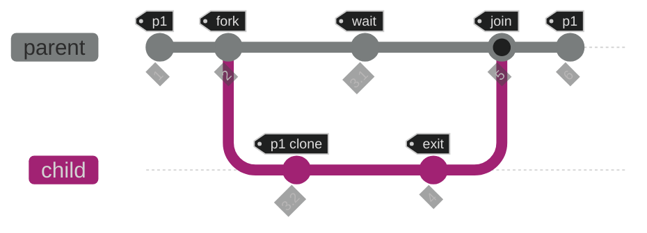
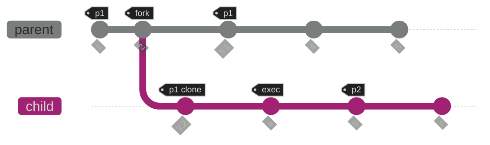

# Process Management

    January 31, 2023

# Table of Contents

- [Process Management](#process-management)
- [Table of Contents](#table-of-contents)
- [Introduction](#introduction)
  - [Resource Management](#resource-management)
  - [Process Creation](#process-creation)
    - [OS](#os)
  - [Process Termination](#process-termination)
    - [Normal](#normal)
    - [Abnormal](#abnormal)
  - [Interaction](#interaction)
- [Creation](#creation)
  - [Needs](#needs)
  - [Spawn](#spawn)
  - [Fork](#fork)
    - [`fork()`](#fork-1)
    - [Diagram](#diagram)
      - [Example](#example)
      - [Example: `sleep(5)`](#example-sleep5)
      - [Example: PID](#example-pid)
    - [`pstree`](#pstree)
  - [Wait](#wait)
    - [`wait()`](#wait-1)
    - [Diagram](#diagram-1)
    - [Zombies](#zombies)
      - [Defunct](#defunct)
  - [Exec](#exec)
    - [`exec()`](#exec-1)
    - [Diagram](#diagram-2)
  - [Fork-Exec](#fork-exec)
- [Source](#source)

# Introduction

- Some things we think of when we think of process management.

## Resource Management

- Behind the scenes.
- List resources.
- Scheduling (nice-ness of processes) and priority.

## Process Creation

- OS has to allocate resources.

### OS

- Resources:
  - Memory
  - CPU
- PID:
  - Process ID
    - Keep track of process.

## Process Termination

### Normal

- Can exit normally for different reasons (status codes).

### Abnormal

- Crashes or exceptions.
- OS has to clean up.

## Interaction

- With console or user.
- Processes running in foreground or background.
  - Continue the process in some "way", either in foreground or background.
- Stopping processes with `^Z` (SIGSTOP) or `^C` (SIGINT).
  - Stop the process in some "way", either kill (stop) it or interrupt it.

# Creation

- How to create a process.

## Needs

- Binary (path to it).
- Command line arguments.
- Environment to run in.
  - Includes `stdin` and `stdout` among other things.

## Spawn

- Spawn new processes using `syscalls`:
  - Unix: `posix_spawn()`
  - Windows: `createProcessA()`
- Creates Address Space and loads in:
  - Binary
  - Command Line Arguments on Stack
  - Environment-related stuff in a Table

## Fork

- Separate "process creation" concept from "new program" concept.
  - Exploits re-usability to save space:
    - Environment information.
    - Copy-on-Write:
      - If I want to spawn another process that is similar to pre-existing process that has already been mapped in memory, I can copy process that is using the same memory (do the same thing) to spawn a new process from it and have them diverge if they need to.
    - Ease of implementation.
- Child starts as a clone that is exactly the same as the parent except for one thing (file descriptors inherited from parent process).
  - Eventually the child can do whatever it wants without affecting the parent it came from (has its own destiny).
    - Other computation.
    - Become a new program.
    - Can continue to exist after parent terminates or dies.
    - "Private Address Space".

### `fork()`

- Function `fork()` creates a new process, not a new program.
- Called once, returns twice.

> Note: 1 Parent can have 0 or more Children.
>
> - Parent = 1
>   - Child $\geq$ 0

### Diagram



#### Example

```c
#include <stdio.h>
#include <unistd.h>

int main (int argc, char** argv) {
    pid_t childpid = fork();
    if (childpid == 0) {
        printf("child\n");
    } else {
        printf("parent\n");
    }
}
```

```
parent
child
```

- Function `fork()` returns twice, where if the return value of `fork()` is `0` then it is returning from the child, else it is returning from the parent.

#### Example: `sleep(5)`

```c
int main (int argc, char** argv) {
    pid_t childpid = fork();
    if (childpid == 0) {
        sleep(5);
        printf("child\n");
    } else {
        printf("parent\n");
    }
}
```

```
parent

...5 seconds later

child
```

- Child returns even after the parent has terminated.

#### Example: PID

```c
int main (int argc, char** argv) {
    printf("original pid = %d ppid = %d\n", getpid(), getppid());

    pid_t childpid = fork();
    if (childpid == 0) {
        printf("child pid = %d ppid = %d\n", getpid(), getppid());
        printf("child\n");
    } else {
        printf("parent pid = %d child pid = %d ppid = %d\n", getpid(), childpid, getppid());
        printf("parent\n");
    }
}
```

### `pstree`

- Will create a "process tree" that shows processes that are running on a machine and where they are forked from.

## Wait

- Sometimes a parent may want to wait for the return value of their child after which the child will exit and "join" with the parent who was "wait"ing.
  - Child exits with a status that explains why it exited.

### `wait()`

- Function `wait()` returns some information about the child process.
  - Can be accessed using macros like `WIFEXITED()`, `WEXITSTATUS()` or `WIFSIGNALED()`.
- Use `man7` for `signal` to look up different signals and their associated return values (integers).

### Diagram



### Zombies

- When a parent does not wait for a child, the child can become a zombie.

#### Defunct

- Also called a "Defunct" process.
  - Defunct processes are merely processes that have terminated but have not yet been removed from the process table.

## Exec

- Used to create a new program that replaces the process making the function call.

### `exec()`

- The `exec()` call replaces the entire current contents of the process with a new program.
- It loads the new program into the current process space and runs it from the entry point.

### Diagram



## Fork-Exec

- The `fork()` and `exec()` functions are often used in sequence to get a new program running as a child of a current process.

# Source

[Dan Williams](https://people.cs.vt.edu/djwillia/)
