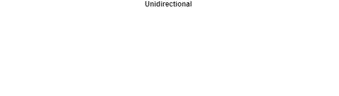
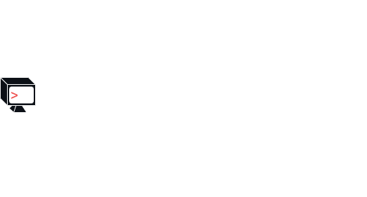
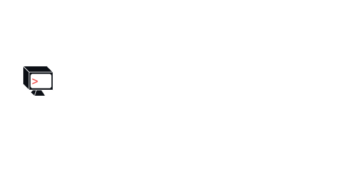
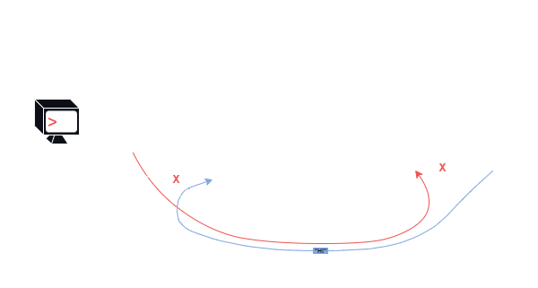

# File Descriptors & Pipes

    February 2, 2023

# Table of Contents

- [File Descriptors \& Pipes](#file-descriptors--pipes)
- [Table of Contents](#table-of-contents)
- [Introduction](#introduction)
  - [`fork`](#fork)
  - [`exec`](#exec)
  - [`fork` w/o `exec`](#fork-wo-exec)
    - [Example](#example)
  - [`exec` w/o `fork`](#exec-wo-fork)
- [File Descriptors](#file-descriptors)
  - [Pre-Defined](#pre-defined)
  - [User-Defined](#user-defined)
  - [Examples](#examples)
  - [UNIX Design Philosophy](#unix-design-philosophy)
    - [`open`](#open)
    - [`read(fd)`, `write(fd)`, `close(fd)`](#readfd-writefd-closefd)
    - [`fd` vs `FILE*`](#fd-vs-file)
      - [Example](#example-1)
    - [`lseek`](#lseek)
    - [`dup2`](#dup2)
    - [`close`](#close)
  - [Tables](#tables)
    - [Open File Table](#open-file-table)
    - [VNode Table](#vnode-table)
- [Pipes](#pipes)
  - [Example](#example-2)
    - [Part 1](#part-1)
    - [Part 2](#part-2)
    - [Part 3](#part-3)
- [Source](#source)
- [Supplements](#supplements)

# Introduction

- `fork`/`exec` vs `spawn` which combines the former syscalls.
- Decouple "new process" from "new program".

## `fork`

- New process, same program.
- Clone of the parent:
  - Heap
  - Stack
  - Shared File Descriptors
- Called once, returns twice.

## `exec`

- Same process, new program.
- Child's borrowed data from parent is overwritten in a sense to accomodate the new program initiated by `exec` call.
- Reinit:
  - Heap
  - Stack
  - Text
  - KEEPS File Descriptors
- Called one time, returns zero times.

## `fork` w/o `exec`

- Having two processes working on the same task.
- Multithreading.

### Example

- Maybe you have one large array and one process works on first half of array and the `fork`ed child process works on the second half of the array.

## `exec` w/o `fork`

- Shows up in containers often.
- Useful to do some setup or re-define some setup for a process.

# File Descriptors

- Can be thought of as a "handle" to an abstract "kernel object".
- Operating system has a table it uses to keep track of all the file descriptors.

## Pre-Defined

- 0 $\rightarrow$ `stdin`
- 1 $\rightarrow$ `stdout`
- 2 $\rightarrow$ `stderr`

## User-Defined

`int fd = open(...)`

- Integer `fd` is a small integer that will likely be set to `3`.

## Examples

- Could be a handle to:
  1. File
     - Is just a sequence of bytes.
  2. Pipe
     - A means of accomplishing IPC (inter-process communication).
  3. Network Sockets

## UNIX Design Philosophy

- Have unified interface to all "kernel abstract objects/things" .
  - Called "Files", which can be anything, and uses "File Descriptors" as a user-space handle.
- Programs are small but can accomplish many things (many use cases) or sometimes only have one use (like `echo`).

### `open`

- Returns a file descriptor.

### `read(fd)`, `write(fd)`, `close(fd)`

- Will use the `fd` returned by `open`.

### `fd` vs `FILE*`

|         `fd` | `FILE*`                                    |
| -----------: | :----------------------------------------- |
| Low-Level IO | Buffered IO (built on top of Low-Level IO) |
|       `open` | `fopen`                                    |
|       `read` | `fread`                                    |
|      `write` | `fwrite`                                   |

- Low-Level IO stuff like access to `fd` is abstracted from user.

#### Example

- `fwrite(FILE*)` $\leftrightarrow$ `writefd`

### `lseek`

- Unified interface is not always feasible in practice which is partly why this syscall exists.

### `dup2`

- All about renaming and rewiring file descriptors.
- What the file descriptor points to.

### `close`

- Decrements `refcount`.
  - OS knows that when `refcount` hits 0 it can clean up.
- Happens automatically on a process reference.

## Tables

- Two layers of indireciton.
- OS keeps track of which files are open and how many proesses are keeping the file open.
  - Allows kernel to do some clean up.

### Open File Table

- Keeps track of a `refcount` to keep track of which processes and how many processes have which files open.

### VNode Table

- Actual file being pointed to.
- Actual object or data.

# Pipes

- Kernel manages way to communicate between processes.
- FIFO: "First In, First Out".
  - Sometimes called FIFOs.
- Also called a "Bounded Buffer".
- Pipes are unidrectional.
- Pipes work such that the Kernel handles ensuring that data is written and read appropriately.
  - Handles synchronization.

<p align="center" width="100%">
    
</p>

## Example

```c
#include <unistd.h>
#include <stdlib.h>
#include <stdio.h>

int main(int argc, char **argv) {

  int pipe_ends [2];
  if (pipe(pipe_ends) == -1) {
    perror("pipe"), exit(1);
  }

  pid_t child = fork();
  if (child == -1) {
    perror("fork"), exit(1);
  }
  if (child == 0) {
    // the child
    char msg [] = { "Hi\n" };
    close(pipe_ends[0]); // Write End

    if (write(pipe_ends[1], msg, sizeof msg - 1) == 1) {
      perror("write");
    }
  } else {
    //the parent
    char pipe_buf[128];
    close(pipe_ends[1]); // Read End

    size_t m;
    while ((m = read(pipe_ends[0], pipe_buf, sizeof pipe_buf)) > 0) {
      if (write(1, pipe_buf, m) != m) {
        perror("write");
      }
    }
  }
}
```

- Need to close pipes to avoid dangling references (related to refcount).
  - Similar to not de-allocating dynamically allocated memory like with `malloc` or `calloc`.
- The `-f` flag in `strace -f [executable]` command traces the children.

### Part 1

```c
int pipe_ends [2];
if (pipe(pipe_ends) == -1) {
  perror("pipe"), exit(1);
}
```

<p align="center" width="100%">
    
</p>

### Part 2

```c
pid_t child = fork();
if (child == -1) {
  perror("fork"), exit(1);
}
```

<p align="center" width="100%">
    
</p>

### Part 3

```c
if (child == 0) {
  // the child
  char msg [] = { "Hi\n" };
  close(pipe_ends[0]); // Write End

  if (write(pipe_ends[1], msg, sizeof msg - 1) == 1) {
    perror("write");
  }
} else {
  //the parent
  char pipe_buf[128];
  close(pipe_ends[1]); // Read End

  size_t m;
  while ((m = read(pipe_ends[0], pipe_buf, sizeof pipe_buf)) > 0) {
    if (write(1, pipe_buf, m) != m) {
      perror("write");
    }
  }
}
```

<p align="center" width="100%">
    
</p>

# Source

[Dan Williams](https://people.cs.vt.edu/djwillia/)

# Supplements

[Unix Filesystem](https://github.com/emaanr/notes/blob/main/Coursework/Computer%20Systems/Coursenotes/Williams/1-P/L-P6/Supplements/unix-filesystem.md)

[Pipes, Forks, Dups](https://github.com/emaanr/notes/blob/main/Coursework/Computer%20Systems/Coursenotes/Williams/1-P/L-P6/Supplements/pipes-forks-dups.md)
