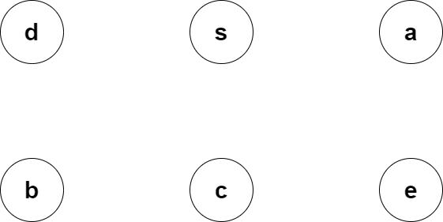
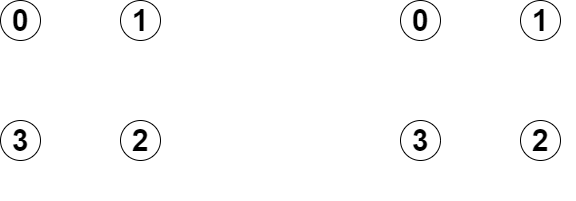
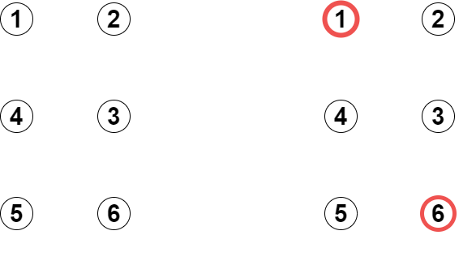
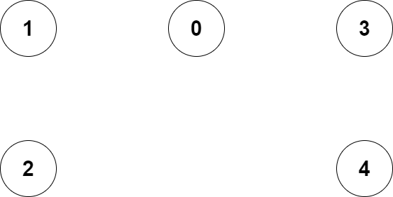
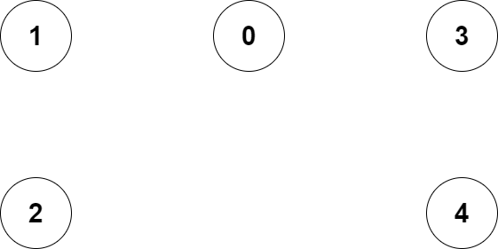
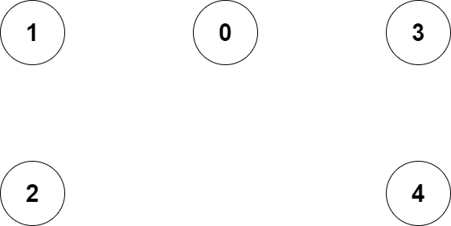
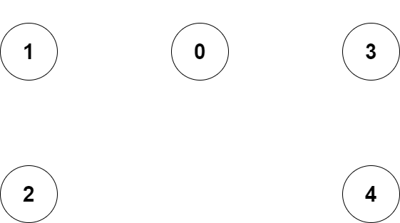

# Graphs

    A Graph is a type of non-linear data structure that is used to store data in the form of vertices (nodes) and edges.

# Table of Contents

- [Graphs](#graphs)
- [Table of Contents](#table-of-contents)
- [Question 1](#question-1)
  - [Question 1a](#question-1a)
    - [Solution](#solution)
  - [Question 1b](#question-1b)
    - [Solution](#solution-1)
- [Question 2](#question-2)
  - [Solution](#solution-2)
- [Question 3](#question-3)
  - [Examples](#examples)
    - [Example 1](#example-1)
    - [Example 2](#example-2)
  - [Solution](#solution-3)
- [Question 4](#question-4)
  - [Example](#example)
  - [Solution](#solution-4)
- [Question 5](#question-5)
  - [Examples](#examples-1)
    - [Example 1](#example-1-1)
    - [Example 2](#example-2-1)
    - [Example 3](#example-3)
  - [Solution](#solution-5)
- [Source](#source)

# Question 1

- You are given a list of all scheduled daily flights in the US, giving departure airports, departure times, destination airports, and arrival times.
  - We want an algorithm to compute travel times between airports, including waiting times between connections.
- Assume that if one flight arrives at time $t$ and another departs at time $t_0 \geq t$, travelers can make the connection.
  - Further assume that at a given airport, no two events (arrivals or departures) occur at the same time, and that there are at most $100$ events at any airport during a given day.
  - All times are given in GMT; don’t worry about time zones.
- Construct a weighted graph so that given a departure airport, a departure time $t$, and a destination airport, we can efficiently determine the earliest time $t_0$ that a traveler can be guaranteed (according to the schedules) of arriving at their destination on that day. 

## Question 1a

- What do vertices represent?
- What do edges in your graph represent?
- What is the weight of an edge?

### Solution

Solution goes here

## Question 1b

- What algorithm would you use to compute the shortest travel times?
  - What is its running time in terms of the number of vertices, $V$, and the number of edges, $E$?

### Solution

Solution goes here

---

# Question 2

- Give the visited node order for each type of graph search, starting with $s$, given the following adjacency lists and accompanying figure for BFS and DFS. 

    

## Solution

Solution goes here

---

# Question 3

- Given an undirected graph, task is to find the minimum number of weakly connected nodes after converting this graph into directed one.
  - Weakly Connected Nodes:
    - Nodes which are having $0$ in-degree (number of incoming edges).

## Examples

### Example 1

>Input:
>
> > `4 4`
> >
> > `0 1`
> >
> > `1 2`
> >
> > `2 3`
> >
> > `3 0`
> 
> Output:
> 
> > $0$ disconnected components.

### Example 2

>Input:
>
> > `6 5`
> >
> > `1 2`
> >
> > `2 3`
> >
> > `4 5`
> >
> > `4 6`
> >
> > `5 6`
>
> Output:
> 
> > $1$ disconnected component.
>
> 

>    
> 

>
> 

>    
> 

## Solution

Solution goes here

---

# Question 4

- Write an algorithm that returns true if a given undirected graph is tree and false otherwise.

## Example

- For example, the following graph is a tree:

    

- But the following graph is not a tree:

    

## Solution

Solution goes here

---

# Question 5

- Eulerian Path is a path in a graph that visits every edge exactly once.
- Eulerian Circuit is an Eulerian Path which starts and ends on the same vertex.
- There are many useful applications to Euler circuits and paths.
  - They can be used by mail carriers who want to have a route where they don't retrace any of their previous steps.
  - Euler circuits and paths are also useful to painters, garbage collectors, airplane pilots and all world navigators.
- How to find whether a given graph is Eulerian or not?

## Examples

### Example 1

    

- This graph has Eulerian Paths, such as "$4$ $3$ $0$ $1$ $2$ $0$", but no Eulerian Cycle.
  - Note that there are two vertices with odd in-degrees $(4$ and $0)$.

### Example 2

    

- This graph has Eulerian Cycles, such as "$2$ $1$ $0$ $3$ $4$ $0$ $2$".
  - Note that all vertices have even in-degrees.

### Example 3

    

- This graph is not Eulerian.
  - Note that there are four vertices with odd in-degrees $(0$, $1$, $3$, and $4)$

## Solution

Solution goes here

# Source

[Sally Hamouda](https://sallyhamouda.com/)