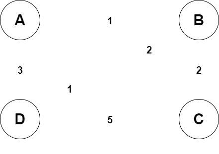
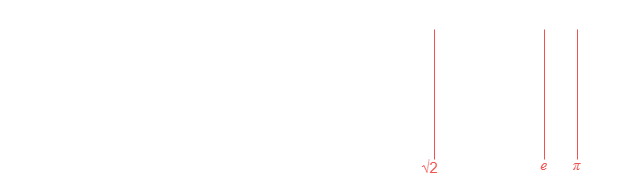

# Greedy Algorithms

    A Greedy Algorithm is any algorithm that follows the problem-solving heuristic of making the immediately, or locally, optimal choice at each stage.

# Table of Contents

- [Greedy Algorithms](#greedy-algorithms)
- [Table of Contents](#table-of-contents)
- [Question 1](#question-1)
  - [Solution](#solution)
- [Question 2](#question-2)
  - [Example](#example)
  - [Question 2a](#question-2a)
    - [Solution](#solution-1)
  - [Question 2b](#question-2b)
    - [Solution](#solution-2)
- [Question 3](#question-3)
  - [Solution](#solution-3)
- [Question 4](#question-4)
  - [Example](#example-1)
  - [Solution](#solution-4)
- [Question 5](#question-5)
  - [Example](#example-2)
  - [Question 5a](#question-5a)
    - [Solution](#solution-5)
  - [Question 5b](#question-5b)
    - [Solution](#solution-6)
- [Source](#source)

# Question 1

- Consider the problem of scheduling $n$ jobs of known durations $t_1, \dots, t_n$ for execution by a single processor.
  - The jobs can be executed in any order, one job at a time.
- You want to find a schedule that minimizes the total time spent by all the jobs in the system.
  - The time spent by one job in the system is the sum of the time spent by this job in waiting plus the time spent on its execution.
    - $Time_{job}$ = $Time_{execution} + Time_{waiting}$
- Design a greedy algorithm for this problem.

## Solution

Solution goes here

---

# Question 2

- The Masseuse:
  - A popular masseuse receives a sequence of back-to-back appointment requests and is debating which ones to accept.
  - They needs a 15-minute break between appointments and therefore they cannot accept any adjacent requests.
  - Given:
    - A sequence of back-to-back appointment requests.
      - All multiples of 15-minutes, none overlap, and none can be moved.
  - Find:
    - The optimal set the masseuse can honor.
      - Highest total booked minutes.
  - Return:
    - The number of minutes. 

## Example

> Input:
> > $\{30, 15, 60, 75, 45, 15, 15, 45\}$
> 
> Output:
> > $180$ Minutes $\leftarrow$ $\{30, 60, 45, 45\}$

## Question 2a

- If a greedy strategy is used to solve this problem, will this produce an optimal solution?
  - Why?

### Solution

Solution goes here

## Question 2b

- Design an algorithm to solve this problem.

### Solution

Solution goes here

---

# Question 3

- Consider the Traveling Salesman problem on the following graph.

    

- From $A$, the greedy cycle is $ABDCA$ of length $9$, while $ACBDA$ has length of $8$.
- Using a greedy algorithm, write down a cycle starting from node $A$ returning back to $A$.

## Solution

Solution goes here

---

# Question 4

- You are given a set $X$ = $\{x_1, x_2, \dots, x_n\}$ of points on the real line.
- Your task is to design a greedy algorithm that finds a smallest set of intervals, each of length 2, that contains all the given points.
- Suppose that elements of $X$ are presented in increasing order.
- Describe (using pseudocode) a greedy algorithm, running in $O(n)$ time, for this problem.

## Example

- Suppose that $X$ = $\{1.5, 2.0, 2.1, 5.7, 8.8, 9.1, 10.2\}$.
  - Then the three intervals $[1.5, 3.5]$, $[4, 6]$, and $[8.7, 10.7]$ are length-2 intervals such that every $x \in X$ is contained in one of the intervals.
    - Note:
      - That $3$ is the minimum possible number of intervals because points $1.5$, $5.7$, and $8.8$ are far enough from each other that they must be covered by $3$ distinct intervals.
      - That this solution is not unique.
        - For example, middle interval $[4, 6]$ can be shifted to the right, say to $[5.7, 7.7]$, without disturbing the other intervals, and solution would still be an optimal solution.

    

## Solution

Solution goes here

---

# Question 5

- A variant of the Interval Scheduling problem is one in which each interval has an associated non-negative weight.
- In this problem (called the Weighted Interval Scheduling problem), we want to find a set of mutually non-overlapping intervals that have the maximum total weight.

## Example

- Consider intervals $I_1$ = $[1, 3]$, $I_2$ = $[2, 4]$, and $I_3$ = $[3.5, 4.5]$ and suppose that $w(I_1)$ = $w(I_3)$ = $1$ and $w(I_2)$ = $10$.
  - Then, the optimal solution to this problem would be $\{I_2\}$ and not $\{I_1, I_3\}$ because the weight of $I_2$ is $10$ whereas the weight of $\{I_1, I_2\}$ is $1 + 1$ = $2$. 

## Question 5a

- The greedy algorithm that we used to solve the Interval Scheduling problem repeatedly picked an interval with earliest finish time and deleted other intervals that overlapped the selected interval.
  - Show that this algorithm does not produce an optimal solution to the Weighted Interval Scheduling problem.

### Solution

Solution goes here

## Question 5b

- What about an algorithm that repeatedly picks a heaviest interval from all that are available and then deletes other intervals that overlap with the chosen interval?
  - Does this algorithm always produce an optimal solution? 
    - Why? 

### Solution

Solution goes here

# Source

[Sally Hamouda](https://sallyhamouda.com/)