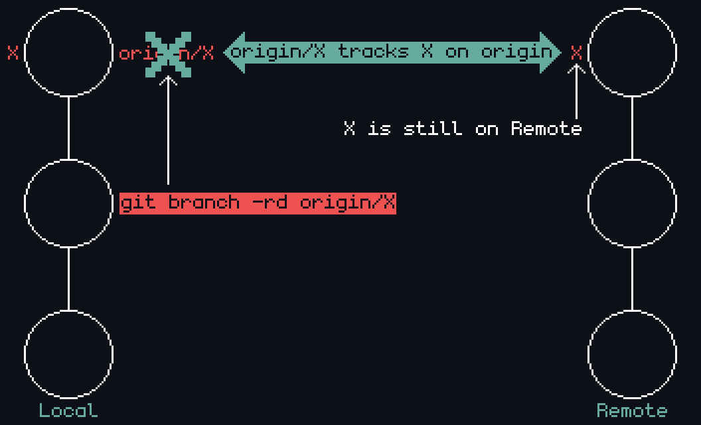
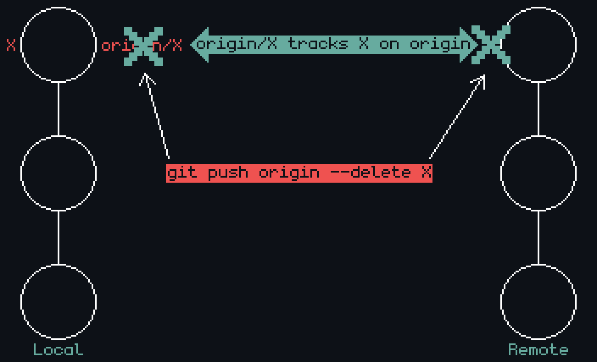

# Git Answers

    Get answers...on how to do things with Git.

# Table of Contents

- [Git Answers](#git-answers)
- [Table of Contents](#table-of-contents)
- [Getting and Creating Projects](#getting-and-creating-projects)
  - [Create New Repository](#create-new-repository)
- [Basic Snapshotting](#basic-snapshotting)
  - [Stage Changes](#stage-changes)
  - [Check Staging](#check-staging)
  - [Create Commit](#create-commit)
- [Branching and Merging](#branching-and-merging)
  - [Create Branch](#create-branch)
  - [Switch Branch](#switch-branch)
  - [Checkout Branch](#checkout-branch)
  - [Delete Branch](#delete-branch)
    - [Delete Local Branch](#delete-local-branch)
    - [Delete Tracking Branch](#delete-tracking-branch)
    - [Delete Remote Branch](#delete-remote-branch)
    - [Visualization](#visualization)
    - [Considerations](#considerations)
    - [Credit](#credit)
  - [List Branches](#list-branches)
  - [Merge Branches](#merge-branches)
    - [](#)
- [Sharing and Updating Projects](#sharing-and-updating-projects)
  - [Fetch Changes](#fetch-changes)
  - [Pull Changes](#pull-changes)
  - [Push Changes](#push-changes)
- [Patching](#patching)
  - [Cherry-Pick Commits](#cherry-pick-commits)
  - [Ammend Unpushed Commit](#ammend-unpushed-commit)
  - [Ammend Pushed Commit](#ammend-pushed-commit)
  - [Squash Commits](#squash-commits)
  - [Prune Local-Tracking Branches](#prune-local-tracking-branches)

# Getting and Creating Projects

    Repository-related inquiries and commands.

- [Create New Repository](#create-new-repo)

## Create New Repository

    How to take any folder, turn it into a git repository, and push to remote (GitHub) repo of the same name.

Make sure there is a newly initialized and empty repository with the same name as the folder you wish to push.

1. `git init`
2. `git add .`
3. `git commit -m <msg>`
4. `git branch -M main`
5. `git remote add origin https://github.com/<username>/<repo>.git`
6. `git push -u origin main`

---

`git init`

- Initialize repository, this creates a `.git` folder in the project's root folder (whose name should be the same as the repo you are trying to push to).

`git add .`

- Add all files to be staged for commit.

`git commit -m <msg>`

- Commit staged files with a commit message using `-m <msg>` where `<msg>` message is surrounded in single quotes or double quotes.

`git branch -M main`

- This branch renames the default branch name `master` to `main` via the use of the `-M` flag.
- I prefer to use `main` over `master`, otherwise this step could be skipped entirely.

`git remote add origin https://github.com/<username>/<repo>.git`

- To tell the local git repository on your computer which remote repository `<repo>` to send changes to.
- In this case, a GitHub repo is provided, but any valid remote repository would work fine.

`git push -u origin main`

- The `-u` flag, also `--upstream`, adds a tracking reference to the upstream server you are pushing to.
- This means that every next push/pull done from within our local repository will know to send/retrieve information to/from the `main` branch to which we just added a tracking reference.
- Recall and note that if you didn't do `git branch -M main` then you would instead invoke `git push -u origin master` at this point since you want a reference to `master`, not `main`.

# Basic Snapshotting

    Commit-related inquiries and commands.

Capturing the current state of your project's files and creating a new version of that state in the Git repository.

- [Stage Changes](#stage-changes)
- [Check Staging](#check-staging)
- [Create Commit](#create-commit)

## Stage Changes

    What it means to "Stage" changes and how to do it.

## Check Staging

    How to check the current state of staged changes.

## Create Commit

    What it means to "Commit" changes and how to do it.

# Branching and Merging

    Branch-related and Merge-related inquiries and commands.

- [Create Branch](#create-branch)
- [Switch Branch](#switch-branch)
- [Checkout Branch](#checkout-branch)
- [Delete Branch](#delete-branch)
- [List Branches](#list-branches)
- [Merge Branches](#merge-branches)

## Create Branch

    How to create a new branch.

When working on projects with various features and components, it is smart (and industry standard) to create a new branch to work on in order to avoid breaking changes on a working branch. Often times there will be a `main` or `dev` branch that contains versions of the project that are working and/or deployed from to production (live for customer use rather than solely existing when running from/on a local machine).

`git branch <branch>`

- Creates a new branch that is identical to the current branch.
- Does not switch you onto the new branch.

## Switch Branch

    How to switch branches.

After creating a branch, you want to make sure you switch onto it before writing any code as this can result in mistakenly pushing to a branch you did not intend to push to. Or maybe you're working on multiple features so you need to switch between branches.

The `git switch` command was introduced in Git version 2.23 to be a more explicit, user-friendly means for switching branches as well as prevent potential issues that arise due to the multipurpose `git checkout` command.

`git switch <branch>`

- Switches you onto the specified pre-existing branch.

`git switch -c <branch>`

- Creates the new branch and switches you onto it.

## Checkout Branch

    How to checkout branches.

The `git checkout` command is a versatile command that can be used for a variety of tasks such as switching branches as well as creating _and_ switching onto created branch all in one command.

`git checkout`

- "Checks out" (switches to) an existing branch.

`git checkout -b <branch>`

- Creates specified branch and switches onto it.
- Don't forget the `-b` flag as this is what signals creation of the new branch.
- Can be thought of as a combination of the following two commands:

```
git branch <branch>
git checkout <branch>
```

## Delete Branch

    How to delete local, remote, and tracking branches.

In Git, when you clone a remote repository, you create a local copy of it that has "tracking" branches that track their associated remote branches. In order to work on a branch in the repository, you `checkout` the branch which then creates a local copy of the branch called a "local" branch.

Deleting a local branch typically doesn't delete the associated tracking branch nor the remote branch on the remote repository. To delete a remote branch, you often need to push the deletion to the remote repository explicitly. This explanation will clarify how to delete a local branch, the tracking branch, their corresponding remote branch (or any remote branch, for that matter), and how to propagate these changes to other machines with local clones of the repository as well as when you may want to use these commands.

### Delete Local Branch

```
git branch --delete <branch>
git branch -d <branch> # Shorter version
git branch -D <branch> # Force-delete un-merged branches
```

### Delete Tracking Branch

```
git branch --delete --remote <remote>/<branch>
git branch -dr <remote>/<branch> # Shorter

git fetch <remote> --prune # Delete multiple obsolete remote-tracking branches
git fetch <remote> -p      # Shorter
```

### Delete Remote Branch

```
git push origin --delete <branch>  # Git version 1.7.0 or newer
git push origin -d <branch>        # Shorter version (Git 1.7.0 or newer)
git push origin :<branch>          # Git versions older than 1.7.0
```

### Visualization

- When dealing with deleting branches both locally and remotely, keep in mind that there are **_three_** different branches involved:

  1. Local Branch `X`
  2. Remote Origin Branch `X`
  3. Local Remote-Tracking Branch `origin/X` that tracks Remote Origin Branch `X`

```
git branch -rd origin/X
```

<div align="center" width="100%">
  
  <br />
  <em>Only deletes local remote-tracking branch.</em>
</div>

<br />

```
git push origin --delete X
```

<div align="center" width="100%">
  
  <br />
  <em>Deletes actual remote branch as well as local remote-tracking branch.</em>
</div>

### Considerations

1. Using `push` to delete a remote branch `X` will also remove the tracking branch `origin/X`.

   - This makes it unnecessary to prune obsolete tracking braches with `git fetch --prune` or `git fetch -p`, but it wouldn't cause harm if you did anyway.
   - You can verify that the tracking branch `origin/X` was deleted by running the following:

```
# View just tracking branches
git branch --remotes
git branch -r

# View both strictly local as well as remote-tracking branches
git branch --all
git branch -a
```

2. If you delete a remote branch via some web interface (such as CodeCommit or GitHub), then your local copy of the repository will still contain a (now obsolete) tracking branch `origin/X`.
   - A typical way to remove these obsolete tracking branches (since Git version 1.6.6) is to simply run `git fetch` with the `--prune`, or shorter `-p`, flag.
   - Note that this removes _all_ obsolete tracking branches for any remote branches that no longer exist on the remote:

```
git fetch origin --prune
git fetch origin -p # Shorter
```

3. Alternatively, rather than using automatic pruning with `git fetch -p`, you can avoid the extra network operation by manually removing the tracking branches as mentioned earlier:

```
git branch --delete --remotes origin/X
git branch -dr origin/X # Shorter
```

### Credit

- Credit to user456814 on [StackOverflow](https://stackoverflow.com/a/23961231)

## List Branches

    How to list branches in a repository.

It can be useful to list all the branches on a project. There are different "kinds" or branches and so we will explore how to list them.

`git branch`

- Lists all local branches only.

`git branch -r`

- Lists all remote branches only.

`git branch -a`

- Lists all local and remote branches.

## Merge Branches

    How to merge branches and the different ways to do so.

###

# Sharing and Updating Projects

    Project management related inquiries and commands.

- [Fetch Changes](#fetch-changes)
- [Pull Changes](#pull-changes)
- [Push Changes](#push-changes)

## Fetch Changes

    What it means to "Fetch" changes, how to do it, and why you may want to use it over "Pull".

## Pull Changes

    What it means to "Pull", how to do it, and why you may want to use it over "Fetch".

## Push Changes

    What it means to "Push" changes and how to do it.

# Patching

    Different patching-related inquiries and commands.

- [Cherry-Pick Commits](#cherry-pick-commits)
- [Ammend Unpushed Commit](#ammend-unpushed-commit)
- [Ammend Pushed Commit](#ammend-pushed-commit)

## Cherry-Pick Commits

    How to cherry-pick commits from one branch into another.

## Ammend Unpushed Commit

    How to ammend a commit that hasn't been pushed yet.

## Ammend Pushed Commit

    How to ammend a commit that has already been pushed.

## Squash Commits

    How to combine two or more commits under one commit and why you might want to do so.

## Prune Local-Tracking Branches

    Cleaning up all local-tracking branches at once in bulk rather than individually.

When you fetch or pull changes from a remote repository using `git fetch` or `git pull`, Git retrieves information about the remote branches, and it updates your local references to those remote branches.

If a branch was deleted on the remote repository (e.g., someone deleted a branch on GitHub), your local repository still keeps references to that branch.

`git remote prune origin`

- Checks the remote repository (in this case, `origin`) for any branches that no longer exist there and removes the corresponding remote tracking branches in your local repository.
