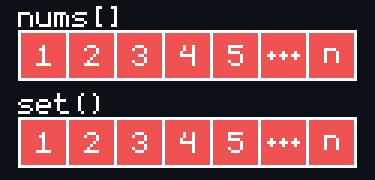
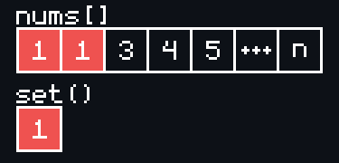

# [Contains Duplicate](https://leetcode.com/problems/contains-duplicate/)

    Easy

# Table of Contents

- [Contains Duplicate](#contains-duplicate)
- [Table of Contents](#table-of-contents)
- [Question](#question)
  - [Example 1](#example-1)
    - [Input](#input)
    - [Output](#output)
  - [Example 2](#example-2)
    - [Input](#input-1)
    - [Output](#output-1)
  - [Example 3](#example-3)
    - [Input](#input-2)
    - [Output](#output-2)
  - [Constraints](#constraints)
- [Solutions](#solutions)
  - [HashSet](#hashset)
    - [Complexity](#complexity)
      - [Worst Case](#worst-case)
      - [Best Case](#best-case)
  - [Length](#length)
    - [Complexity](#complexity-1)

# Question

Given an integer array `nums`, return `true` if any value appears at least twice in the array, and return `false` if every element is distinct.

## Example 1

### Input

```
nums = [1,2,3,1]
```

### Output

```
true
```

## Example 2

### Input

```
nums = [1,2,3,4]
```

### Output

```
false
```

## Example 3

### Input

```
nums = [1,1,1,3,3,4,3,2,4,2]
```

### Output

```
true
```

## Constraints

- `1 <= nums.length <= 10^5`
- `-10^9 <= nums[i] <= 10^9`

# Solutions

1. HashSet
2. Length

## HashSet

```python
def containsDuplicate(self, nums: List[int]) -> bool:
    hashset = set()
    for num in nums:
        if num in hashset:
            return True
        else:
            hashset.add(num)
    return False
```

- Sets by definition contain unique values.
- For this solution, initialize an empty set using `hashset = set()` and then loop over the input array `nums`, looking at every value in it, in order.
  - For every `num` in `nums`, check if it is already in the `hashset`, if not, then add it to the `hashset`. This way, if the same `num` comes up again during our iteration, we will know it is a duplicate value at which point we can end the program early via `return True`.
  - If the `for`-loop iterates over the entire input array `nums` without satisfying the `if num in hashset` condition, then we know there were no duplicates found and can `return False`.

### Complexity

- Time Complexity: $O(n)$
  - The time complexity in the worst case will be $O(n)$ which is the case where there are no duplicates in the input array `nums` and so the entire input array `nums` is iterated over before returning `False`, which is $O(n)$ time.
- Space Complexity: $O(n)$
  - Likewise, the space complexity in the worst case will be $O(n)$ which is the case where there are no duplicates in the input array `nums` and so the entire input array `nums` is iterated over and has it's values added to a `set` of eventually the same size as `nums`, which is $O(n)$ space.

#### Worst Case

<div align="center" width="100%">
  
</div>

#### Best Case

<div align="center" width="100%">
  
</div>

> Note: The time and space complexity can be _less than_ $O(n)$ in the cases where it exits early, such as the when the first two elements of the input array are the same digit, which is the best case since it is the fastest and least spacious scenario.

## Length

```python
def containsDuplicate(self, nums: List[int]) -> bool:
    return len(set(nums)) != len(nums)
```

- Convert input array `nums` into a set using `set(nums)`.
- Sets by definition contain unique values.
- If the `set` version of the input array `nums` has a different length than the input array `nums`, this means there are duplicate values in the input array `nums`.

### Complexity

<div align="center" width="100%">
  
</div>

- Time Complexity: $O(n)$
  - It takes $O(n)$ time for the `set()` function to iterate over the input array `nums` to create the `set` representation of `nums`.
  - It takes $O(1)$ time to compare the lengths.
  - It takes $O(1)$ time to perform `len(nums)` as well since `len()` has been optimized in Python to take $O(1)$ time.
- Space Complexity: $O(n)$
  - This solution is slightly worse than the previous solution in terms of Space Complexity.
  - This solution _always_ has an $O(n)$ space complexity since this approach needs to create a `set` of the input array `nums` via `set(nums)` whose length can _then_ be compared to the length of the original input array `nums` to determine the result.
