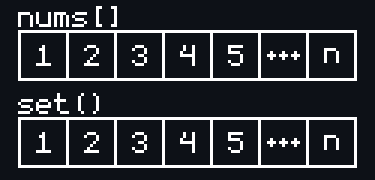
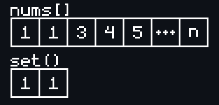

# [Contains Duplicate](https://leetcode.com/problems/contains-duplicate/)

    Easy

# Question

Given an integer array `nums`, return `true` if any value appears at least twice in the array, and return `false` if every element is distinct.

## Example 1

### Input

```
nums = [1,2,3,1]
```

### Output

```
true
```

## Example 2

### Input

```
nums = [1,2,3,4]
```

### Output

```
false
```

## Example 3

### Input

```
nums = [1,1,1,3,3,4,3,2,4,2]
```

### Output

```
true
```

## Constraints

- `1 <= nums.length <= 10^5`
- `-10^9 <= nums[i] <= 10^9`

# Solutions

1. HashSet
2. Length

## HashSet

```python
def containsDuplicate(self, nums: List[int]) -> bool:
    hashset = set()
    for num in nums:
        if num in hashset:
            return True
        else:
            hashset.add(num)
    return False
```

- Sets by definition contain unique values.
- Therefore, we add numbers to a set while the number isn't already in it.
- If we come across a number that is already in the set, then we know it is a duplicate and can `return True` early.

- Otherwise, we will iterate over the entire list (worst case) and have a set of the same size as the input array which is $O(n)$ time complexity and space complexity.

<div align="center" width="100%">
  
</div>

- Note that the time and space complexity can be less than $O(n)$ in the cases where it exits early, such as the when the first two elements of the input array are the same digit (best case).

<div align="center" width="100%">
  
</div>

- If we are able to exit the `for`-loop that is iterating over the entire input array, then we know to `return False` because it means no duplicate values were found via the logic in the `for`-loop.

## Length

```python
def containsDuplicate(self, nums: List[int]) -> bool:
    return len(set(nums)) != len(nums)
```

- Convert array `nums` using `set(nums)` into a set.
- Sets by definition contain unique values and as such there exists no duplicate elements.
- If the set version of the input array has a different length than the array, it means there are duplicate values in the input array.
- The time complexity and space complexity of this solution is also $O(n)$ for both, however this solution is slightly worse since it _always_ has a space complexity of $O(n)$ since we are creating a set of the input array entirely before being able to perform the comparison.
