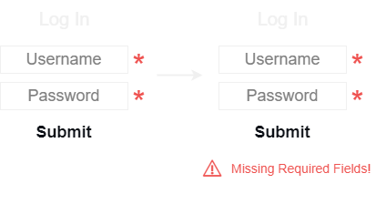
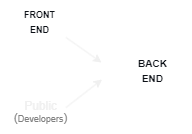
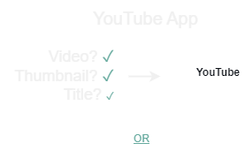
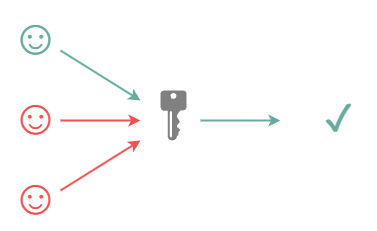

# API

    Metasynthesized Notes on Application Programming Interfaces.

# Table of Contents

- [API](#api)
- [Table of Contents](#table-of-contents)
- [Definitons](#definitons)
  - [Interface](#interface)
    - [Example: Buttons](#example-buttons)
  - [API](#api-1)
    - [Examples](#examples)
      - [Example: Strings](#example-strings)
      - [Example: Operating Systems](#example-operating-systems)
      - [Example: Web Browsers](#example-web-browsers)
    - [Analogies](#analogies)
      - [Restaurant](#restaurant)
      - [Puzzle](#puzzle)
        - [Puzzle Piece](#puzzle-piece)
        - [Puzzle](#puzzle-1)
        - [Blanks](#blanks)
        - [Example: Uber](#example-uber)
        - [Example: Review System](#example-review-system)
          - [Shape](#shape)
        - [Example: Login Form](#example-login-form)
          - [Endpoint](#endpoint)
        - [Frontend-Backend](#frontend-backend)
        - [Example: YouTube](#example-youtube)
          - [Authorization](#authorization)
        - [Example: Google](#example-google)
          - [Automation](#automation)
        - [Example: Facebook \& Slack](#example-facebook--slack)
          - [Triggers](#triggers)
        - [Documentation](#documentation)
- [Remote API](#remote-api)
  - [Example: Shazam](#example-shazam)
- [Web Review](#web-review)
  - [Client-Server](#client-server)
  - [URL/URI](#urluri)
  - [Scheme](#scheme)
  - [HTTP](#http)
    - [Protocol](#protocol)
      - [Request](#request)
        - [Example: HTTP Requests](#example-http-requests)
        - [Verb](#verb)
      - [Transfer](#transfer)
      - [Response](#response)
        - [Body](#body)
          - [HypterText](#hyptertext)
      - [Stateless](#stateless)
      - [Request Methods](#request-methods)
      - [Query String Parameters](#query-string-parameters)
        - [Arguments](#arguments)
          - [Example: Query String Parameters](#example-query-string-parameters)
      - [Header Fields](#header-fields)
        - [Caching](#caching)
        - [Authentication](#authentication)
      - [Status Codes](#status-codes)
- [REST](#rest)
  - [RESTful API](#restful-api)
  - [Constraints](#constraints)
    - [Client-Server](#client-server-1)
    - [Stateless](#stateless-1)
    - [Uniform Interface](#uniform-interface)
      - [Data](#data)
      - [Resources \& Collections](#resources--collections)
      - [CRUD](#crud)
    - [Cacheable](#cacheable)
    - [Layered System](#layered-system)
    - [Code on Demand (Optional)](#code-on-demand-optional)
  - [REST APIs \& Web Services](#rest-apis--web-services)
    - [HTTP Methods](#http-methods)
      - [Common HTTP Methods](#common-http-methods)
    - [Status Codes](#status-codes-1)
      - [Common Status Codes](#common-status-codes)
      - [Status Codes Categories](#status-codes-categories)
    - [API Endpoints](#api-endpoints)
  - [REST \& Python](#rest--python)
    - [Consuming APIs](#consuming-apis)
    - [Building APIs](#building-apis)
    - [Tools of the Trade](#tools-of-the-trade)
  - [Conclusion](#conclusion)
- [Sources](#sources)

# Definitons

An "Application Programming Interface", or "API", allows use of the application by a user through some interface that is easily understandable and abstracts the inner workings of the application.

## Interface

- Commonly used interfaces make their way into "GUI" which stands for "Graphical User Interface".
- Provide abstractions at many levels.
- Define ways for a user to interact or communicate with an object, whether than be physical or software.
- Interfaces abstract away the implementation.

### Example: Buttons

A programmer might program a "Play" button, which is also an example of a commonly used interface making its way into GUI.

- The programmer may write code to handle the actual event itself, however, the interaction or behavior of the "Play" button is provided by an API and is abstracted from the user.
  - That is, the programmer didn't _need_ to determine a way to do this or implement it themselves (although they could) because it has already been done and serviced to them through an API.
    - As such, "Buttons" are an example of an API.

## API

APIs exist for developers to use and extend in their own applications.

- A contract of sorts that defines how the API is meant to be used as well as what the user can expect in return from it.
- Makes life easier by allowing developers to accomplish desired operations and behaviors while abstracting away their exact implementations.
  - As a user of the application, we don't need to understand _how_ it works, but simply _how_ to use it.
- When designed well, they can allow a programmer to perform a lot of work with a few lines of code.
  - Although, of course, under the hood the actual implementation may be much more complex.
- Frameworks define an API that allow extension of what is provided for the user's own use cases.
  - Simply need to understand how to write an implementation to whatever the framework is expecting.
    - That is, using the API and honoring the "contract" enforced by it.

> **Note:** In the current technological climate, the term API is almost always used to refer to Web-Based API. However all kinds of APIs exist.

### Examples

- Some Examples of APIs:
  1. Strings
  2. Operating Systems
  3. Web Browsers

#### Example: Strings

- Different built-in functions within a programming language can be thought of as members of an API.
- Most languages provide some API for dealing with `String` objects such as a `toUpperCase()` function.
  - A programmer could write this themselves using some low-level bit operation, but the programming language abstracts this from a user by providing pre-packaged built-in API functions to call, in this case, a String API.
- These APIs exist because it is a common enough problem that it makes sense to solve it once and provide a simple interface for performing these operations.

#### Example: Operating Systems

- Another example to consider is Operating System APIs.
- These APIs allow for code to run regardless of the operating system running the code.
  - How exactly this is done is abstracted from the programmer, we simply know that when we run our code, it will work.

```python
"""Lists files and directories in the current working directory"""

import os

current_dir = os.getcwd()
for entry in os.listdir(current_dur):
    print(entry)
```

#### Example: Web Browsers

- Code can be written to work on any web browser which is possible as a result of APIs.
  - All web browsers are required to implement and support a certain set of APIs to ensure this.

### Analogies

- Analogies can be helpful to visualize the role and use of APIs, such as:
  - Restaurants
  - Puzzles

#### Restaurant

- May help to understand the role of an API on a higher-level.
- Analogy:
  - Back End:
    - Cooks in the kitchen.
  - Front End:
    - Dining area for guests.
  - API:
    - Servers in the restaurant.

#### Puzzle

- May help to understand the use of an API on a lower-level.
- Analogy:
  - App:
    - Puzzle Piece.
  - Apps:
    - Puzzle compised of Puzzle Pieces.
  - APIs:
    - Blanks of Puzzle Piece.
  - UI:
    - Blanks of Puzzle Piece.
  - API Definition:
    - Shape of a Puzzle Piece.
  - API Endpoint:
    - Acceptable Piece of a Puzzle Piece.

##### Puzzle Piece

- An individual `App` can be likened to a `Puzzle Piece`.
  - Is some code running on a server.

##### Puzzle

- A larger app, comprised of connecting many smaller `Apps` can be likened to a `Puzzle`.

##### Blanks

- The parts where the puzzle piece connect, called `Blanks`, are `APIs`.
  - But can also be `UI`.

##### Example: Uber

- Using an Uber application as an example:
  - One API handles billing and money.
  - Another API handles location information.
  - Another API handles the review system.
  - And so on so forth for many more APIs and their provided functionalities.

##### Example: Review System

<p align="center" width="100%">
    
</p>

- Taking a closer look at the aforementioned API that handles the review system:
  - Needs data, such as:
    - Rider
    - Driver
    - Stars

###### Shape

- If the puzzle piece "fits" then this means the API recieved the required data.
  - In which case, the API or "puzzle piece" can do its job.
- The `Shape` of a "puzzle piece" can be likened to an `API Definition`.

##### Example: Login Form

- Consider a Login Form as an example:
  - Required fields are:
    - Username
    - Password
  - If _both_ are _not_ provided then the form will not submit.
    - The missing fields cause the "puzzle piece" to not fit.

<p align="center" width="100%">
    
</p>

- These kinds of forms are part of UI.
  - UI: User Interface
    - For the user.
  - API: Application User Interface
    - For the code.

<p align="center" width="100%">
    
</p>

- "LOG IN" connects to "FRONT END" via "UI".
- "FRONT END" needs to also connect to "BACK END" via "API" in order to allow "BACK END" to check password and verify information.
  - In this case, API and UI have the "same shape".
    - Because both are accepting the same data:
      - Username
      - Password
    - This data will pass through UI and then to API.

###### Endpoint

<p align="center" width="100%">
    
</p>

- APIs usually have different ways they can be used.
  - In analogous terms, APIs have multiple "pieces" that can connect to it.
- "Shape" of "LOG IN" is:
  - Username
  - Password
- There can be a "piece" for "FORGOT PASSWORD" whose "shape" requires:
  - Username or Email
- There can be a "piece" for "CREATE ACCOUNT" whose "shape" requires:
  - Email
  - Password
- We can call each `Acceptable Piece` of a `Puzzle Piece` one of its `API Endpoint`s.

> **Note:** In this example, both "LOG IN" and "CREATE ACCOUNT" can be said to have the same "shape" because they require the same data. Depending on which "endpoint" the data is delivered to, the resulting behavior delivered by the API will differ.

##### Frontend-Backend

<p align="center" width="100%">
    
</p>

- Every back end pretty much has an API for its front end so it is not too much extra work to make the API accessible to the public.
  - This makes the API usable by developers.

##### Example: YouTube

<p align="center" width="100%">
    
</p>

- YouTube videos can be watched through the YouTube [UI](https://youtube.com).
  - However, YouTube also has a "Public API" in order to get information without using UI.
- When viewing a video on YouTube, the user is getting the name, thumbnail, file, etcetera for it through the YouTube UI.
  - However, this information can be programatically requested and received via the YouTube API by writing some code.

> **Note:** Once again the prevalence of a UI, in this case the "YouTube UI", for users and API, in this case YouTube API, for code.

###### Authorization

<p align="center" width="100%">
    
</p>

- APIs like YouTube cannot simply make its services 100% "open" or people can abuse this.
  - Can spam and overload a server until it shuts down, known as a denial of service attack.
    - Such matters can be prevented using an "API Key".
- An API Key can be thought of as:
  - A username and password combined which then can be used to uniquely identify who the user is.
- API Keys allow the API developers to monitor how their service is being used:
  - If YouTube wanted to, they could see all the data that a particular user is requesting.
  - There are also usually rules about request volume and frequency to monitor how much data is being requested/serviced since it can be costly to do so.
    - The API Key assists in allocating resources to users so they stay within a volume pre-determined by the API developers.
      - Sometimes offer different plans/tiers of volume for users to purchase in order to utilize more of a particular API's services.

##### Example: Google

<p align="center" width="100%">
    
</p>

- Let us consider the following Google APIs:
  - Google Drive
  - Google Sheets
  - GMail

###### Automation

<p align="center" width="100%">
    
</p>

- APIs can be used to "automate" some tasks or behaviors.
- Such as automating a work report:
  - Google Drive:
    - Creates report
  - GMail
    - Emails to recipient

##### Example: Facebook & Slack

<p align="center" width="100%">
    
</p>

- Let us consider the following APIs:
  - Facebook
  - Slack

###### Triggers

- Multiple APIs can be used together by writing your own code as the glue that determines what each piece is doing.
- You can use one API to "trigger" another API.
- Such as:
  - Facebook:
    - New post trigger
  - Slack:
    - Posts the facebook post to a Slack Channel on trigger being recieved

##### Documentation

- API developers provide instructions for how to use their service, called "Documentation".
  - Tells you how to use it, or what "shape", the piece of the puzzle is.
- Reading up on documentation and understanding how an API can be used has some overhead and can become time consuming/tedious.
  - This is increasingly true if many APIs are being used:
    - Would have to read up on all of them.
    - Would have to potentially set up accounts and keys.

# Remote API

Exist because oftentimes there is not enough space or computing power on local everyday machines to accomodate all the data that is available or needed. With Remote APIs, the expensive searching and processing is done externally via the cloud on a machine that can actually handle and compute the request.

## Example: Shazam

Uses a remote API to look up the track that is playing via some external source containing a large quantity of song data that obviously cannot be stored on an every single local machine.

- Does all the searching and processing (computing power) externally.

# Web Review

Review of how the web works before continuing REST discussion.

## Client-Server

Given a computer, it has an internet browser which is a web client that is used to connect to a server.

## URL/URI

This can be done by entering an address into the address bar, called a "URL" which stands for "Universal Resource Locator", also known as a "URI" which stands for "Universal Resource Identifier".

## Scheme

URLs have a scheme portion such as "HTTP".

## HTTP

"HTTP" stands for "Hyper Text Transfer Protocol".

### Protocol

- A protocol can be likened to a contract.
  - A bit lower level than an API but is similar in concept.
  - Can be thought of as defining the expectations of how to communicate.

#### Request

- The browser creates an HTTP Request with the URI and some specified HTTP Verb.

##### Example: HTTP Requests

- `GET URL/URI`
- `POST URL/URI`

##### Verb

- One example of an HTTP Verb is `GET` which is used to clarify that this request will _only_ recieve data.
  - That is, it won't be making any changes.

#### Transfer

- The server recieves the request that was transferred from the client, which is the "T" portion of "HTTP".
- The server does the work it needs to in order to satisfy said request.

#### Response

- Once the request is complete, the server generates the resulting webpage and returns a response to the client which is the browser in this example.
  - The browser uses the response to render the new page.

##### Body

- The most important part of the response is the body.
- For a webpage, the body contains "HTML" which stands for "HyperText Markup Language", hence the "HT" portion of "HTTP".

###### HypterText

- HyperText is text that can link to other texts.
- In HTML that can be done using anchor tags:
  - `<a>Anchor Tags<\a>`

#### Stateless

- HTTP as it was orignally designed, is a "Stateless" protocol.
- Every time a link is clicked, a new HTTP request is being made.
  - However, in between the requests, the protocol is complete.
  - Once the request recieves a response, it is done.
- If we want to maintain some "State", the client will need to manage that and send this information with every new request.

#### Request Methods

- There are more HTTP Verbs, also known as request methods, besides `GET`.
- The verb post `POST` is used to explain that some information is being submitted or "post"ed to the server.

#### Query String Parameters

- URLs sometimes have a `?` in them through which the user is able to pass some information, to/about the request by including additional information after it.

##### Arguments

- The information passed by the user are called "arguments".

###### Example: Query String Parameters

- `https://httpbin.org/get?arg1=true&arg2=false`
- `https://youtube.com/watch?v=arg`

#### Header Fields

- Another common way request/response information is passed around.
- Both requests and responses have headers.
- Used to help further communincate what is wanted as well as what is sent back.
  - Some of the popular request headers allow the user to specify information about the content that is expected in return.

##### Caching

- Retrieve a page "if and only if" it has changed since a certain time.
  - This technique is powerful because it enables "Caching".
- No need to retrieve information we already have in local cache.

##### Authentication

- Authentication information can be embedded into requests using a header.
  - Allows a client to remain logged in accross various requests.

#### Status Codes

- Responses contain headers as well, one of the most important ones being the status code.
- Allows user to determine what has occurred on the server side:
  - 1XX
    - Informational Response
  - 2XX
    - Success
  - 3XX
    - Redirection
  - 4XX
    - Client Errors
  - 5XX
    - Server Errors

# REST

**RE**presentation **S**tate **T**ransfer, or REST, is an architectural style/standard that allows users to interact with resources over the web. Became so popular that the term "REST" became ubiquitous with "API".

- Defines a pattern for client and server communications over a network.
- Provides a set of constraints for software architecture to promote performance, scalability, simplicity, and reliability in the system.

> **Note:** REST is not a specification but a set of guidelines on how to architect a network-connected software system.

## RESTful API

When APIs embrace the style and constraints of REST, they are said to be "RESTful".

## Constraints

Guiding architectural constraints required for an API to be considered RESTful.

1. Client-Server
   - The client and server must be decoupled from each other, allowing each to develop independently.
2. Stateless
   - The server won't maintain any state between requests from the client.
3. Uniform Interface
   - The server will provide a uniform interface for accessing resources without defining their representation.
4. Cacheable
   - The data retrieved from the server should be cacheable either by the client or by the server.
5. Layered System
   - The client may access the resources on the server indirectly through other layers such as a proxy or load balancer.
6. Code on Demand (Optional)
   - The server may transfer code to the client that it can run, such as JavaScript for a single-page application.

### Client-Server

- The job of an API is to connect two pieces of software without limiting their own functionalities.
- The client (makes requests) and the server (returns responses) stay separate and independent.

### Stateless

- For an API to be stateless, it has to handle calls independently of each other.
- Each API call has to contain the data and commands necessary to complete the desired action.
- State must be managed manually by the user via the client.
  - That is for example, if an authentication key is necessary, this must be manually sent by the user with every API call which introduces a layer of security.
- Statelessness has the advantage that one bad or failed call does not derail subsequent calls.

### Uniform Interface

- Concept:
  - While the client and server can take on many forms, it is important that the API can still facilitate communication regardless.
- Result:
  - RESTful APIs impose a uniform interface that can easily accomodate all connected software.
    - In most cases, that interface is based on HTTP protocols because it is widely used on the internet.

#### Data

- Data is often stored and exchanged through JSON format files because of their versatility.
- Two commonly used formats are JSON and XML although these aren't the only options available:
  - JSON stands for "JavaScript Object Notation"
  - XML stands for "Extensible Markup Language"

#### Resources & Collections

- The term "Resource" refers to the "R" in "URL" and "URI".
- Requests are said to be made regarding some "resource" which is a (intentionally) fairly abstract term meant to represent any "entity" or "object" which are also (intentionally) fairly abstract terms since they can be used to describe anything that is built.
- Everything a user may want to build can be expressed in terms of "Resources" and "Collections".

#### CRUD

| HTTP Verbs | CRUD       |
| ---------: | :--------- |
|     `POST` | **C**reate |
|      `GET` | **R**ead   |
|    `PATCH` | **U**pdate |
|      `PUT` | **U**pdate |
|   `DELETE` | **D**elete |

- Most of what a user may want their application to be able to do can be described by the accronym "CRUD" which stands for:
  - Create
  - Read
  - Update
  - Delete

### Cacheable

- It is not uncommon for a stateless API requests to have large overhead.
  - In some cases this is unavoidable, but for repeated requests that need the same data, caching said information can make a notable difference.
- The client has the option to locally store certain pieces of data for a predetermined period of time.
- Concept:
  - When a request is made for that data, instead of having the server send it again, the client uses the stored version.
- Result:
  - Instead of the client sending several costly requests in a short span of time, it only has to do it once.

### Layered System

- RESTful architecture dictates that its design is structures into layers with a clear hierarchy that operate together.
- Executing a command means that each layer carries out its role and then sends the data to the next.
- Connected layers communicate with each other, but not with every component of the program.
  - This improves the overall security of the API.
- If the scope of the API changes, layers can be added, modified, or taken out without compromising other components of the interface.

### Code on Demand (Optional)

- This is an optional constraint because it can be a security risk.
- Concept:
  - Allow code of applets to be sent through the API and used for the application.
    - Code from an unknown or shady source can pose security threats.
- Result:
  - This constraint is best left for internal APIs where you have less to fear from hackers and people with bad intentions.
- Drawback:
  - Code may need to be in a particular programming language for the application, which isn't always the case.
- Upside:
  - Can help the client implement their own features on the go, with less work being necessary on the API or server.
    - In essence, it permits the whole system to be much more scalable and agile.

## REST APIs & Web Services

A REST Web Service is any web service that adheres to the aforementioned REST Architecture Constraints. These web services share their data with the public through the use of an API via public web URLs.

### HTTP Methods

- REST APIs listen for HTTP methods such as the aforementioned `GET` and `POST` methods in order to know what operations to perform on the resources of the web service recieving these requests.
- As previously explored, a "resource" is any data available in the web service that can be accessed via HTTP Requests made to the REST API.
  - The HTTP Method tells the API what action to perform on the resource that follows it.

#### Common HTTP Methods

| HTTP Method | Description                           |
| ----------: | ------------------------------------- |
|      `POST` | **C**reate a new resource             |
|       `GET` | **R**etrieve a pre-existing resource  |
|       `PUT` | **U**pdate an existing resource       |
|     `PATCH` | Partially update an existing resource |
|    `DELETE` | **D**elete a resource                 |

- There are many HTTP methods, but the examples provided are the five most prominent/commonly used with REST APIs.

### Status Codes

- Once a REST API recieves and processes an HTTP request, it sends back an HTTP response.
  - The response includes an HTTP status code that provides information about the result of the request.
- HTTP status codes allow the application sending requests (client) to perform certain actions based on the result.
  - These actions could include:
    - Error Handling
    - Success Message
- Useful since the user will often need to perform different logic based on results of a request.

#### Common Status Codes

| Code | Meaning                | Description                                                                   |
| :--: | ---------------------- | ----------------------------------------------------------------------------- |
| 200  | OK                     | The requested action was successful                                           |
| 201  | Created                | A new resource was created                                                    |
| 202  | Accepted               | The request was recieved, but no modifications have been made yet             |
| 204  | No Content             | The request was successful, but the response has no content                   |
| 400  | Bad Request            | The request was malformed                                                     |
| 401  | Unauthorized           | The client is not authorized to perform the requested action                  |
| 404  | Not Found              | The requested resource was not found                                          |
| 415  | Unsupported Media Type | The request data format is not supported by the server                        |
| 422  | Unprocessable Entity   | The request data was properly formatted but contained invalid or missing data |
| 500  | Internal Server Error  | The server threw an error when processing the request                         |

- These ten status codes represent only a small subset of the available HTTP status codes.

#### Status Codes Categories

| Code Range | Category             |
| ---------- | -------------------- |
| 2xx        | Successful Operation |
| 3xx        | Redirection          |
| 4xx        | Client Error         |
| 5xx        | Server Error         |

- Status codes are numbered based on the category of the result:

### API Endpoints

## REST & Python

### Consuming APIs

### Building APIs

### Tools of the Trade

## Conclusion

# Sources

[[1]](https://www.youtube.com/watch?v=WXsD0ZgxjRw) **freeCodeCamp.org:** APIs for Beginners 2023

[[2]](https://www.youtube.com/watch?v=ByGJQzlzxQg) **Aaron Jack:** What is an API (in 5 Minutes)

[[3]](https://realpython.com/api-integration-in-python/) **RealPython:** API Integration in Python

[[4]](https://www.youtube.com/watch?v=ZveW4_ZJtVY) **CertBros:** APIs Explained w/ Real World Examples

[[5]](https://www.youtube.com/watch?v=dfaj4vI8QxE) **Code with Ana Kubów**: How to Use APIs
