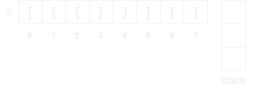
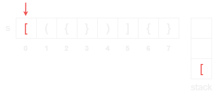
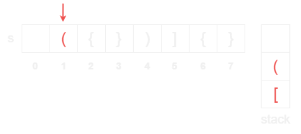
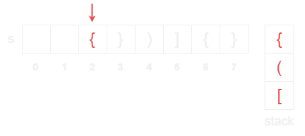
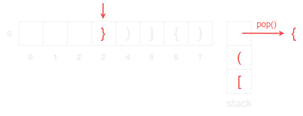
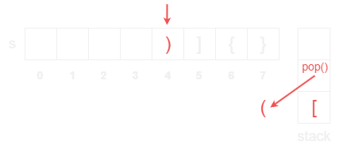
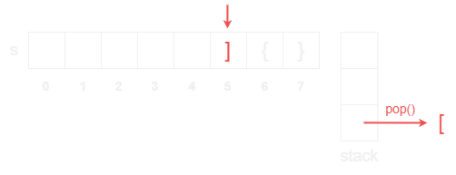
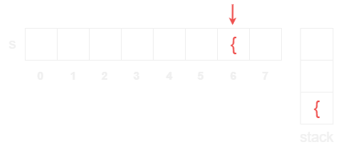
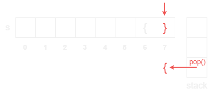

# [Valid Parentheses](https://leetcode.com/problems/valid-parentheses/)

    Easy

# Table of Contents

- [Valid Parentheses](#valid-parentheses)
- [Table of Contents](#table-of-contents)
- [Question](#question)
  - [Example 1](#example-1)
    - [Input](#input)
    - [Output](#output)
  - [Example 2](#example-2)
    - [Input](#input-1)
    - [Output](#output-1)
  - [Example 3](#example-3)
    - [Input](#input-2)
    - [Output](#output-2)
  - [Constraints](#constraints)
- [Solutions](#solutions)
  - [Python](#python)
    - [My Solutions](#my-solutions)
      - [Initial Solution](#initial-solution)
        - [Algorithm Walkthrough: Stack](#algorithm-walkthrough-stack)
          - [Input](#input-3)
          - [Variable: Stack](#variable-stack)
          - [Step 1](#step-1)
          - [Step 2](#step-2)
          - [Step 3](#step-3)
          - [Step 4](#step-4)
          - [Step 5](#step-5)
          - [Step 6](#step-6)
          - [Step 7](#step-7)
          - [Step 8](#step-8)
        - [Step 9](#step-9)
      - [Revised Solution](#revised-solution)
    - [NeetCode Solution](#neetcode-solution)
    - [Other Solutions](#other-solutions)
      - [Solution 1](#solution-1)
      - [Solution 2](#solution-2)
  - [Java](#java)
    - [My Solutions](#my-solutions-1)
      - [Initial Solution](#initial-solution-1)
      - [Revised Solution](#revised-solution-1)
    - [Other Solutions](#other-solutions-1)
      - [Solution 1](#solution-1-1)
      - [Solution 2](#solution-2-1)

# Question

Given a string `s` containing just the characters `'('`, `')'`, `'{'`, `'}'`, `'['` and `']'`, determine if the input string is valid.

An input string is valid if:

- Open brackets must be closed by the same type of brackets.
- Open brackets must be closed in the correct order.
- Every close bracket has a corresponding open bracket of the same type.

## Example 1

### Input

```
s = "()"
```

### Output

```
true
```

## Example 2

### Input

```
s = "()[]{}"
```

### Output

```
true
```

## Example 3

### Input

```
s = "(]"
```

### Output

```
false
```

## Constraints

- `1 <= s.length <= 10^4`
- `s` consists of parentheses only `'()[]{}'`.

# Solutions

## Python

### My Solutions

#### Initial Solution

```python
class Solution:
    def isValid(self, s: str) -> bool:

        stack = []

        for bracket in s:

            if bracket == "{" or paren == "[" or bracket == "(":
                stack.append(paren)

            if bracket == "}":
                if stack == []:
                    return False
                elif stack[-1] == "{":
                    stack.pop()
                else:
                    return False
            if bracket == "]":
                if stack == []:
                    return False
                elif stack[-1] == "[":
                    stack.pop()
                else:
                    return False
            if bracket == ")":
                if stack == []:
                    return False
                elif stack[-1] == "(":
                    stack.pop()
                else:
                    return False

        if stack == []:
            return True
        else:
            return False
```

##### Algorithm Walkthrough: Stack

###### Input

```
s = "[({})]{}"
```

###### Variable: Stack

```
stack = []
```

<div align="center" width="100%">
  
</div>

###### Step 1

1. `s[0] == "["`
2. `stack.append(s[0])`
3. `stack = ["["]`

<div align="center" width="100%">
  
</div>

###### Step 2

1. `s[1] == "("`
2. `stack.append(s[1])`
3. `stack = ["[", "("]`

<div align="center" width="100%">
  
</div>

###### Step 3

1. `s[2] == "{"`
2. `stack.append(s[2])`
3. `stack = ["[", "(", "{"]`

<div align="center" width="100%">
  
</div>

###### Step 4

1. `s[3] == "}"`
2. `stack.pop()`
   - Because `stack[-1] == "{"` which is a valid matching brace for `s[3] == "}"`
3. `stack = ["[", "("]`

<div align="center" width="100%">
  
</div>

###### Step 5

1. `s[4] == ")"`
2. `stack.pop()`
   - Because `stack[-1] == "("` which is a valid matching brace for `s[4] == ")"`
3. `stack = ["["]`

<div align="center" width="100%">
  
</div>

###### Step 6

1. `s[5] == "]"`
2. `stack.pop()`
   - Because `stack[-1] == "["` which is a valid matching brace for `s[5] == "]"`
3. `stack = []`

<div align="center" width="100%">
  
</div>

###### Step 7

1. `s[6] == "{"`
2. `stack.append(s[6])`
3. `stack = ["{"]`

<div align="center" width="100%">
  
</div>

###### Step 8

1. `s[7] == "}"`
2. `stack.pop()`
   - Because `stack[-1] == "{"` which is a valid matching brace for `s[7] == "}"`
3. `stack = []`

<div align="center" width="100%">
  
</div>

##### Step 9

1. `stack == []`
2. `return True`

<div align="center" width="100%">
  
</div>

#### Revised Solution

```python
class Solution:
    def isValid(self, s: str) -> bool:
        stack = []
        brackets = {
            "}": "{",
            ")": "(",
            "]": "["
        }

        for char in s:
            if char in brackets.values():
                stack.append(char)
            elif char in brackets.keys():
                if len(stack) == 0 or stack.pop() != brackets[char]:
                    return False

        return len(stack) == 0
```

### NeetCode Solution

```python
class Solution:
    def isValid(self, s: str) -> bool:
        Map = {")": "(", "]": "[", "}": "{"}
        stack = []

        for c in s:
            if c not in Map:
                stack.append(c)
                continue
            if not stack or stack[-1] != Map[c]:
                return False
            stack.pop()

        return not stack
```

### Other Solutions

#### Solution 1

#### Solution 2

## Java

### My Solutions

#### Initial Solution

#### Revised Solution

### Other Solutions

#### Solution 1

#### Solution 2
