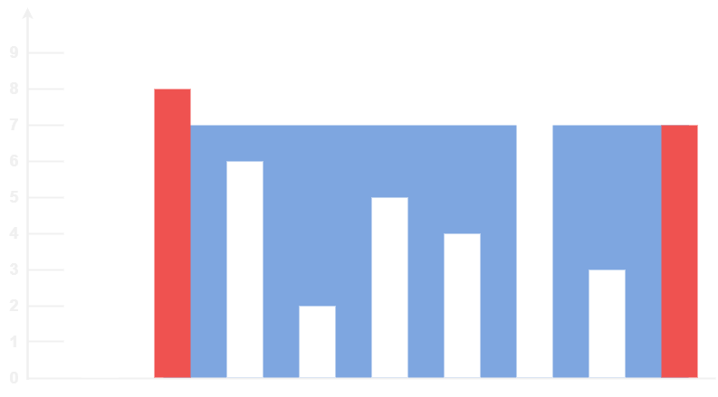

# [Container With Most Water](https://leetcode.com/problems/container-with-most-water/)

    Medium

# Table of Contents

- [Container With Most Water](#container-with-most-water)
- [Table of Contents](#table-of-contents)
- [Question](#question)
  - [Example 1](#example-1)
    - [Input](#input)
    - [Output](#output)
    - [Explanation](#explanation)
  - [Example 2](#example-2)
    - [Input](#input-1)
    - [Output](#output-1)
  - [Constraints](#constraints)
- [Solutions](#solutions)
  - [Python](#python)
    - [My Solutions](#my-solutions)
      - [Initial Solution](#initial-solution)
      - [Revised Solution](#revised-solution)
    - [Other Solutions](#other-solutions)
      - [Solution 1](#solution-1)
      - [Solution 2](#solution-2)
  - [Java](#java)
    - [My Solutions](#my-solutions-1)
      - [Initial Solution](#initial-solution-1)
      - [Revised Solution](#revised-solution-1)
    - [Other Solutions](#other-solutions-1)
      - [Solution 1](#solution-1-1)
      - [Solution 2](#solution-2-1)

# Question

You are given an integer array `height` of length `n`. There are `n` vertical lines drawn such that the two endpoints of the `i`th line are `(i, 0)` and `(i, height[i])`.

Find two lines that together with the x-axis form a container, such that the container contains the most water.

_Return the maximum amount of water a container can store.
_
Notice that you may not slant the container.

## Example 1

<figure align="center" width="100%">
  
</figure>

### Input

```
height = [1,8,6,2,5,4,8,3,7]
```

### Output

```
49
```

### Explanation

- The above vertical lines are represented by array `[1,8,6,2,5,4,8,3,7]`.
- In this case, the max area of water (blue section) the container can contain is `49`.

## Example 2

### Input

```
height = [1,1]
```

### Output

```
1
```

## Constraints

- `1 <= s.length <= 2 * 10^5`
- `s` consists only of printable ASCII characters.

# Solutions

## Python

### My Solutions

#### Initial Solution

#### Revised Solution

### Other Solutions

#### Solution 1

#### Solution 2

## Java

### My Solutions

#### Initial Solution

#### Revised Solution

### Other Solutions

#### Solution 1

#### Solution 2
