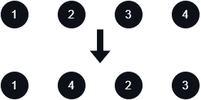
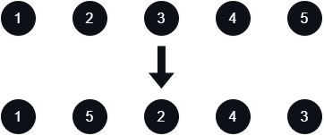

# [Reorder List](https://leetcode.com/problems/reorder-list/)

    Medium

# Table of Contents

# Question

You are given the head of a singly linked-list. The list can be represented as:

```
L0 → L1 → … → Ln - 1 → Ln
```

_Reorder the list to be on the following form:_

```
L0 → Ln → L1 → Ln - 1 → L2 → Ln - 2 → …|
```

You may not modify the values in the list's nodes. Only nodes themselves may be changed.

## Example 1

<div align="center" width="100%">
  
</div>

### Input

```
head = [1,2,3,4]
```

### Output

```
[1,4,2,3]
```

## Example 2

<div align="center" width="100%">
  
</div>

### Input

```
head = [1,2,3,4,5]
```

### Output

```
[1,5,2,4,3]
```

## Constraints

- The number of nodes in the list is in the range `[1, 5 * 10^4]`.
- `1 <= Node.val <= 1000`

# Solutions

## Python

### My Solutions

#### Initial Solution

```python

```

#### Algorithm Walkthrough: [Technique/Data Structure]

##### Input

```

```

##### Variable(s): [Technique/Data Structure]

```

```

##### Step n

#### Revised Solution

```python

```

### Neetcode Solution

```python

```

### Other Solutions

#### Friend Solution

##### Algorithm Walkthrough

#### Solution 1: [Technique/Data Structure]

```python

```

#### Solution 2: [Technique/Data Structure]

```python

```

## Java

### My Solutions

#### Initial Solution

```java

```

#### Algorithm Walkthrough: [Technique/Data Structure]

##### Input

```

```

##### Variable(s): [Technique/Data Structure]

```

```

##### Step n

#### Revised Solution

```java

```

### NeetCode Solution

```java

```

### Other Solutions

#### Solution 1: [Technique/Data Structure]

```java

```

#### Solution 2: [Technique/Data Structure]

```java

```
