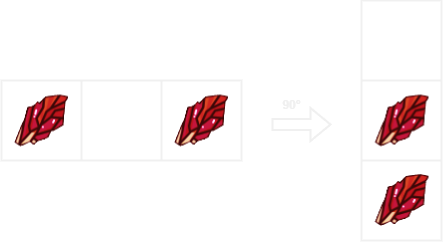
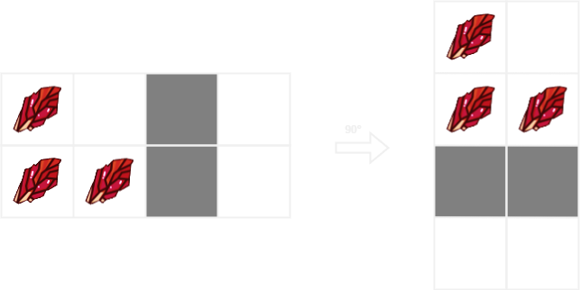
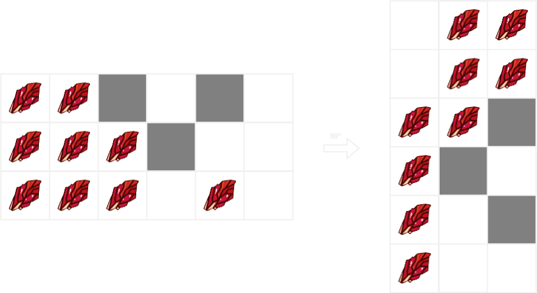

# [Rotating the Box](https://leetcode.com/problems/rotating-the-box/)

    Medium

# Table of Contents

# Question

You are given an `m x n` matrix of characters `box` representing a side-view of a box. Each cell of the box is one of the following:

- A stone `'#'`
- A stationary obstacle `'*'`
- Empty `'.'`

The box is rotated **90 degrees clockwise**, causing some of the stones to fall due to gravity.

- Each stone falls down until it lands on an obstacle, another stone, or the bottom of the box.
- Gravity **does not** affect the obstacles' positions.
- Inertia from the box's rotation **does not** affect the stones' horizontal positions.
- It is **guaranteed** that each stone in `box` rests on an obstacle, another stone, or the bottom of the box.

Return _an_ `n x m` _matrix representing the box after the rotation described above_.

## Example 1

<div align="center" width="100%">
  
</div>

### Input

```
[["#",".","#"]]
```

### Output

```
[["."],
 ["#"],
 ["#"]]
```

## Example 2

<div align="center" width="100%">
  
</div>

### Input

```
[["#",".","*","."],
 ["#","#","*","."]]
```

### Output

```
[["#","."],
 ["#","#"],
 ["*","*"],
 [".","."]]
```

## Example 3

<div align="center" width="100%">
  
</div>

### Input

```
[["#","#","*",".","*","."],
 ["#","#","#","*",".","."],
 ["#","#","#",".","#","."]]
```

### Output

```
[[".","#","#"],
 [".","#","#"],
 ["#","#","*"],
 ["#","*","."],
 ["#",".","*"],
 ["#",".","."]]
```

## Constraints

- `m == box.length`
- `n == box[i].length`
- `1 <= m, n <= 500`
- `box[i][j]` is one of the following:
  - `'#'`
  - `'*'`
  - `'.'`

# Solutions

## Python

### My Solutions

```python

```

#### Initial Solution

```python

```

#### Algorithm Walkthrough: [Technique/Data Structure]

##### Input

```

```

##### Variable(s): [Technique/Data Structure]

```

```

##### Step n

#### Revised Solution

```python

```

### Neetcode Solution

```python

```

### Other Solutions

#### Friend Solution

##### Algorithm Walkthrough

#### Solution 1: [Technique/Data Structure]

```python

```

#### Solution 2: [Technique/Data Structure]

```python

```

## Java

### My Solutions

#### Initial Solution

```java

```

#### Algorithm Walkthrough: [Technique/Data Structure]

##### Input

```

```

##### Variable(s): [Technique/Data Structure]

```

```

##### Step n

#### Revised Solution

```java

```

### NeetCode Solution

```java

```

### Other Solutions

#### Solution 1: [Technique/Data Structure]

```java

```

#### Solution 2: [Technique/Data Structure]

```java

```
