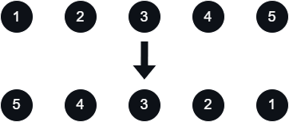
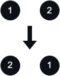

# [Reverse Linked List](https://leetcode.com/problems/reverse-linked-list/)

    Easy

# Table of Contents

# Question

Given the `head` of a singly linked list, reverse the list, and return _the reversed list_.

## Example 1

<div align="center" width="100%">
  
</div>

### Input

```
head = [1,2,3,4,5]
```

### Output

```
[5,4,3,2,1]
```

## Example 2

<div align="center" width="100%">
  
</div>

### Input

```
head = [1,2]
```

### Output

```
[2,1]
```

## Example 3

### Input

```
head = []
```

### Output

```
[]
```

## Constraints

- The number of nodes in the list is the range `[0, 5000]`.
- `-5000 <= Node.val <= 5000`

## Follow-Up

A linked list can be reversed either iteratively or recursively. Could you implement both?

# Solutions

## Python

### My Solutions

#### Initial Solution

```python
# Definition for singly-linked list.
# class ListNode:
#     def __init__(self, val=0, next=None):
#         self.val = val
#         self.next = next
class Solution:
    def reverseList(self, head: Optional[ListNode]) -> Optional[ListNode]:

        if head == None:
            return head

        rev = None
        curr = head
        while curr:
            next = curr.next
            curr.next = rev
            rev = curr
            curr = next

        return rev
```

#### Algorithm Walkthrough: [Technique/Data Structure]

##### Input

```

```

##### Variable(s): [Technique/Data Structure]

```

```

##### Step n

### Neetcode Solution

```python
# Definition for singly-linked list.
# class ListNode:
#     def __init__(self, x):
#         self.val = x
#         self.next = None
class Solution:
    def reverseList(self, head: ListNode) -> ListNode:
        prev, curr = None, head

        while curr:
            temp = curr.next
            curr.next = prev
            prev = curr
            curr = temp
        return prev
```

### Other Solutions

#### Peer Solution

##### Algorithm Walkthrough

#### Solution 1: [Technique/Data Structure]

```python

```

#### Solution 2: [Technique/Data Structure]

```python

```

## Java

### My Solutions

#### Initial Solution

```java

```

#### Algorithm Walkthrough: [Technique/Data Structure]

##### Input

```

```

##### Variable(s): [Technique/Data Structure]

```

```

##### Step n

#### Revised Solution

```java

```

### NeetCode Solution

```java

```

### Other Solutions

#### Solution 1: [Technique/Data Structure]

```java

```

#### Solution 2: [Technique/Data Structure]

```java

```
