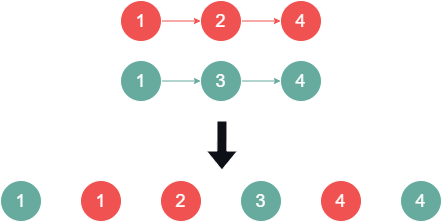

# [Merge Two Sorted Lists](leetcode.com/problems/merge-two-sorted-lists/)

    Easy

# Table of Contents

# Question

You are given the heads of two sorted linked lists `list1` and `list2`.

Merge the two lists into one **sorted** list. The list should be made by splicing together the nodes of the first two lists.

Return the _head of the merged linked list_.

## Example 1

<div align="center" width="100%">
  
</div>

### Input

```
list1 = [1,2,4], list2 = [1,3,4]
```

### Output

```
[1,1,2,3,4,4]
```

## Example 2

### Input

```
list1 = [], list2 = []
```

### Output

```
[]
```

## Example 3

### Input

```
list1 = [], list2 = [0]
```

### Output

```
[0]
```

## Constraints

- The number of nodes in both lists is in the range `[0, 50]`.
- `-100 <= Node.val <= 100`
- Both `list1` and `list2` are sorted in **non-decreasing** order.

# Solutions

## Python

### My Solutions

#### Initial Solution

```python
# Definition for singly-linked list.
# class ListNode:
#     def __init__(self, val=0, next=None):
#         self.val = val
#         self.next = next
class Solution:
    def mergeTwoLists(self, list1: Optional[ListNode], list2: Optional[ListNode]) -> Optional[ListNode]:

        # Base Case 1
        if list1 == None and list2 == None:
            return None

        # Base Case 2.1
        if list1 != None and list2 == None:
            return list1

        # Base Case 2.2
        if list1 == None and list2 != None:
            return list2

        if list1.val >= list2.val:
            curr = ListNode(list2.val)
            list2 = list2.next
        elif list1.val < list2.val:
            curr = ListNode(list1.val)
            list1 = list1.next

        # Return this when finished
        head = curr

        while list1 or list2:
            if list1 == None:
                curr.next = ListNode(list2.val)
                list2 = list2.next
                curr = curr.next
            elif list2 == None:
                curr.next = ListNode(list1.val)
                list1 = list1.next
                curr = curr.next
            elif list1.val > list2.val:
                curr.next = ListNode(list2.val)
                list2 = list2.next
                curr = curr.next
            elif list1.val < list2.val:
                curr.next = ListNode(list1.val)
                list1 = list1.next
                curr = curr.next
            elif list1.val == list2.val:
                curr.next = ListNode(list1.val)
                curr = curr.next
                curr.next = ListNode(list2.val)
                curr = curr.next
                list1 = list1.next
                list2 = list2.next

        return head
```

#### Revised Solution

```python
# Definition for singly-linked list.
# class ListNode:
#     def __init__(self, val=0, next=None):
#         self.val = val
#         self.next = next
class Solution:
    def mergeTwoLists(self, list1: Optional[ListNode], list2: Optional[ListNode]) -> Optional[ListNode]:

        # Dummy node to simplify handling the merged list
        dummy = ListNode(-1)
        curr = dummy

        while list1 and list2:
            if list1.val <= list2.val:
                curr.next = list1
                list1 = list1.next
            else:
                curr.next = list2
                list2 = list2.next

            curr = curr.next

        # Append any remaining nodes from list1 or list2
        if list1:
            curr.next = list1
        elif list2:
            curr.next = list2

        return dummy.next
```

#### Algorithm Walkthrough: [Technique/Data Structure]

##### Input

```

```

##### Variable(s): [Technique/Data Structure]

```

```

##### Step n

```python

```

### Neetcode Solution

```python
# Definition for singly-linked list.
# class ListNode:
#     def __init__(self, val=0, next=None):
#         self.val = val
#         self.next = next
class Solution:
    def mergeTwoLists(self, list1: ListNode, list2: ListNode) -> ListNode:
        dummy = ListNode()
        tail = dummy

        while list1 and list2:
            if list1.val < list2.val:
                tail.next = list1
                list1 = list1.next
            else:
                tail.next = list2
                list2 = list2.next
            tail = tail.next

        if list1:
            tail.next = list1
        elif list2:
            tail.next = list2

        return dummy.next
```

### Other Solutions

#### Friend Solution

##### Algorithm Walkthrough

#### Solution 1: [Technique/Data Structure]

```python

```

#### Solution 2: [Technique/Data Structure]

```python

```

## Java

### My Solutions

#### Initial Solution

```java

```

#### Revised Solution

#### Algorithm Walkthrough: [Technique/Data Structure]

##### Input

```

```

##### Variable(s): [Technique/Data Structure]

```

```

##### Step n

```java

```

### NeetCode Solution

```java

```

### Other Solutions

#### Solution 1: [Technique/Data Structure]

```java

```

#### Solution 2: [Technique/Data Structure]

```java

```
