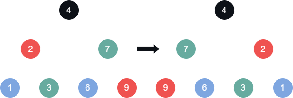
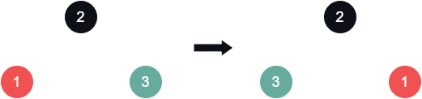

# [Invert Binary Tree](https://leetcode.com/problems/invert-binary-tree/)

    Easy

# Table of Contents

# Question

Given the `root` of a binary tree, invert the tree, and return its _root_.

## Example 1

<div align="center" width="100%">
  
</div>

### Input

```
root = [4,2,7,1,3,6,9]
```

### Output

```
[4,7,2,9,6,3,1]
```

## Example 2

<div align="center" width="100%">
  
</div>

### Input

```
root = [2,1,3]
```

### Output

```
[2,3,1]
```

## Example 3

### Input

```
root = []
```

### Output

```
[]
```

## Constraints

- The number of nodes in the tree is in the range `[0, 100]`.
- `-100 <= Node.val <= 100`

# Solutions

## Python

### My Solutions

#### Initial Solution

```python

```

#### Algorithm Walkthrough: [Technique/Data Structure]

##### Input

```

```

##### Variable(s): [Technique/Data Structure]

```

```

##### Step n

#### Revised Solution

```python

```

### Neetcode Solution

```python

```

### Other Solutions

#### Friend Solution

##### Algorithm Walkthrough

#### Solution 1: [Technique/Data Structure]

```python

```

#### Solution 2: [Technique/Data Structure]

```python

```

## Java

### My Solutions

#### Initial Solution

```java

```

#### Algorithm Walkthrough: [Technique/Data Structure]

##### Input

```

```

##### Variable(s): [Technique/Data Structure]

```

```

##### Step n

#### Revised Solution

```java

```

### NeetCode Solution

```java

```

### Other Solutions

#### Solution 1: [Technique/Data Structure]

```java

```

#### Solution 2: [Technique/Data Structure]

```java

```
