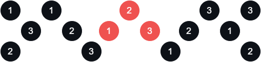

# [Unique Binary Search Trees](leetcode.com/problems/unique-binary-search-trees/)

    Medium

# Table of Contents

# Question

Given an integer `n`, _return the number of structurally unique_ **_BST's_** _(binary search trees) which has exactly_ `n` _nodes of unique values from_ `1` _to_ `n`.

## Example 1

<div align="center" width="100%">
  
</div>

### Input

```
n = 3
```

### Output

```
5
```

## Example 2

### Input

```

```

### Output

```

```

## Constraints

- `1 <= n <= 19`

# Solutions

## Python

### My Solutions

#### Initial Solution

```python

```

#### Algorithm Walkthrough: [Technique/Data Structure]

##### Input

```

```

##### Variable(s): [Technique/Data Structure]

```

```

##### Step n

#### Revised Solution

```python

```

### Neetcode Solution

```python

```

### Other Solutions

#### Friend Solution

##### Algorithm Walkthrough

#### Solution 1: [Technique/Data Structure]

```python

```

#### Solution 2: [Technique/Data Structure]

```python

```

## Java

### My Solutions

#### Initial Solution

```java

```

#### Algorithm Walkthrough: [Technique/Data Structure]

##### Input

```

```

##### Variable(s): [Technique/Data Structure]

```

```

##### Step n

#### Revised Solution

```java

```

### NeetCode Solution

```java

```

### Other Solutions

#### Solution 1: [Technique/Data Structure]

```java

```

#### Solution 2: [Technique/Data Structure]

```java

```
