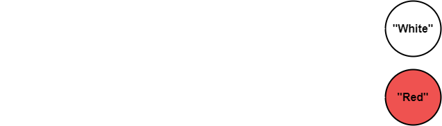
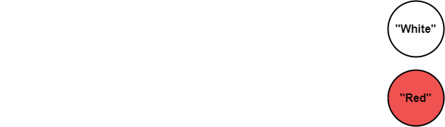
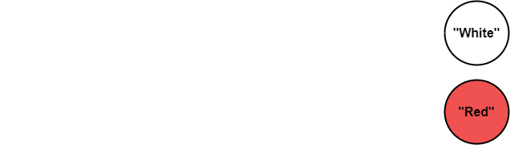
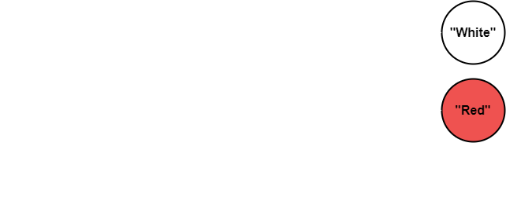
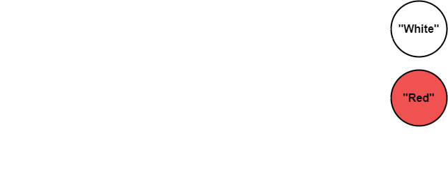
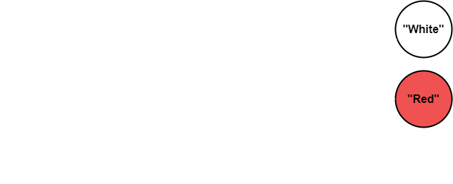
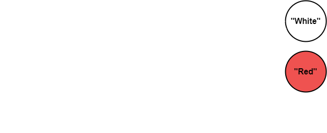

# Swap Variables

    Swap Two Variables in Java.

# Table of Contents

- [Swap Variables](#swap-variables)
- [Table of Contents](#table-of-contents)
- [Temp](#temp)
- [Examples](#examples)
  - [Incorrect Approach](#incorrect-approach)
    - [`x = y`](#x--y)
    - [`y = x`](#y--x)
  - [Correct Approach](#correct-approach)
    - [`temp = x`](#temp--x)
    - [`x = y`](#x--y-1)
    - [`y = temp`](#y--temp)
- [Post Script](#post-script)
- [Code](#code)
- [Source](#source)

# Temp

- Need to use a temporary variable to assist in swapping the contents of two variables.
  - Often called a `temp` variable.

# Examples

- Let us observe the incorrect initial solution most people attempt first, followed by the correct solution for swapping variables in Java.

## Incorrect Approach

- Let us create two variables `x` and `y`.

```java
String x = "White";
String y = "Red";
```

| Var | Data  |
| --: | :---- |
|   x | White |
|   y | Red   |

<p align="center" width="100%">
    
</p>

### `x = y`

- If we do this, `x` is pointing/assigned to the same contents that `y` is already pointing/assigned to.
  - You can almost think of it as `x = y = "Red"` reducing to `x = "Red"`.

| Var | Data |
| --: | :--- |
|   x | Red  |
|   y | Red  |

<p align="center" width="100%">
    
</p>

### `y = x`

- If we do this, `y` is pointing/assigned to the same contents that `x` is already pointing/assigned to.
  - You can almost think of it as `y = x = "White"` reducing to `y = "White"`.

| Var | Data  |
| --: | :---- |
|   x | White |
|   y | White |

<p align="center" width="100%">
    
</p>

## Correct Approach

- Let us create another variable called `temp`.

```java
String x = "White";
String y = "Red";
String temp; // Unassigned temp variable
```

|  Var | Data  |
| ---: | :---- |
|    x | White |
|    y | White |
| temp |       |

<p align="center" width="100%">
    
</p>

### `temp = x`

- Now `temp` is pointing/assigned to the contents of `x`.
  - You can almost think of it as `temp = x = "White"` reducing to `temp = "White"`.

|  Var | Data  |
| ---: | :---- |
|    x | White |
|    y | Red   |
| temp | White |

<p align="center" width="100%">
    
</p>

### `x = y`

- Now `x` is pointing/assigned to the contents of `y`.
  - You can almost think of it as `x = y = "Red"` reducing to `x = "Red"`.

|  Var | Data  |
| ---: | :---- |
|    x | Red   |
|    y | Red   |
| temp | White |

<p align="center" width="100%">
    
</p>

### `y = temp`

- Now `y` is pointing/assigned to the contents of `temp`.
  - You can almost think of it as `y = temp = "White"` reducing to `y = "White"`.

|  Var | Data  |
| ---: | :---- |
|    x | Red   |
|    y | White |
| temp | White |

<p align="center" width="100%">
    
</p>

# Post Script

- Note that the tables are illustrated in a way that makes it seem like there are two instances of identical Data.
  - In reality, there is only once instance of the Data, String `"White"`, and Data, String `"Red"`.
  - The tables simply illustrate which of those two Datas are being pointed to by which reference variable.

> Note: Recall that "`String`s" are Reference Variables.

# Code

[SwapVariables.java](https://github.com/emaanr/notes/blob/main/Programming/Java/BroCode/03/SwapVariables/src/SwapVariables.java)

# Source

[BroCode: Swap Two Variables in Java](https://www.youtube.com/watch?v=G0mFJUFMzjs&list=PLZPZq0r_RZOMhCAyywfnYLlrjiVOkdAI1&index=3)
