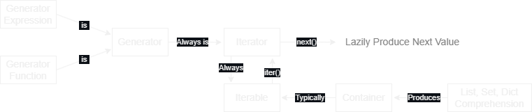
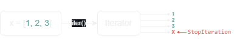
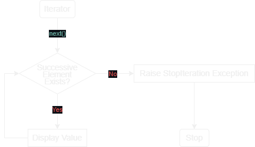

# Infodump

    Temp file to dump info and notes until I decide how I wanna organize things.

# Todo

- Take notes on [here](https://realpython.com/python-modules-packages/) for [Packages vs Modules](#packages-vs-modules) and link your own notes instead.
- Go through this [resource](http://python-course.eu/) in `anotherdump.md`.

# Table of Contents

- [Infodump](#infodump)
- [Todo](#todo)
- [Table of Contents](#table-of-contents)
- [Running](#running)
  - [REPL](#repl)
  - [CLI](#cli)
  - [Virtual Environments](#virtual-environments)
    - [`venv`](#venv)
    - [`pip`](#pip)
- [Variables \& Datatypes](#variables--datatypes)
  - [Datatypes](#datatypes)
    - [Table of Examples](#table-of-examples)
    - [Get](#get)
    - [Set](#set)
    - [Cast](#cast)
      - [Typecasting](#typecasting)
        - [Explicit](#explicit)
        - [Implicit](#implicit)
  - [Variables](#variables)
    - [Declaring](#declaring)
      - [Way 1](#way-1)
      - [Way 2](#way-2)
      - [Way 3](#way-3)
- [Duck Typing](#duck-typing)
- [Walrus Operator](#walrus-operator)
  - [Assignment Expressions](#assignment-expressions)
- [Printing](#printing)
  - [`print()`](#print)
    - [Strings](#strings)
    - [Variables](#variables-1)
    - [String Concatenation](#string-concatenation)
      - [`+`](#)
      - [`,`](#-1)
        - [Another Example](#another-example)
      - [TypeError](#typeerror)
        - [Incorrect](#incorrect)
        - [Correct](#correct)
- [Formatting](#formatting)
  - [String Formatting](#string-formatting)
    - [`%` Operator](#-operator)
      - [Single Substitution](#single-substitution)
      - [Multiple Substitutions](#multiple-substitutions)
        - [Tuple Substitution](#tuple-substitution)
        - [Mapping Substitution](#mapping-substitution)
    - [`str.format()`](#strformat)
      - [Single Substitution](#single-substitution-1)
      - [Multiple Substitutions](#multiple-substitutions-1)
        - [Explicit Substitution by Name](#explicit-substitution-by-name)
    - [`f`-Strings](#f-strings)
      - [Parser Feature](#parser-feature)
    - [`from string import Template`](#from-string-import-template)
  - [Numerical Formatting](#numerical-formatting)
- [User Input](#user-input)
  - [`input()`](#input)
- [Math](#math)
  - [Arithmetic Operations](#arithmetic-operations)
  - [Bitwise Operations](#bitwise-operations)
    - [Augmented Assignment Operations](#augmented-assignment-operations)
      - [`+=`](#-2)
      - [`-=`](#-)
      - [`*=`](#-3)
      - [`/=`](#-4)
      - [`//=`](#-5)
      - [`%=`](#-6)
      - [`**=`](#-7)
      - [`>>=`](#-8)
      - [`<<=`](#-9)
      - [`&=`](#-10)
      - [`|=`](#-11)
      - [`^=`](#-12)
  - [Some Built-In Math Functions](#some-built-in-math-functions)
    - [`round(number, decimal)`](#roundnumber-decimal)
    - [`abs(n)`](#absn)
    - [`pow(x, y, z)`](#powx-y-z)
    - [`max(iterable)`](#maxiterable)
      - [TypeError](#typeerror-1)
    - [`min(iterable)`](#miniterable)
      - [TypeError](#typeerror-2)
  - [Math Module](#math-module)
    - [Constants](#constants)
      - [`math.pi`](#mathpi)
      - [`math.e`](#mathe)
    - [Functions](#functions)
      - [`math.ceil(x)`](#mathceilx)
      - [`math.floor(x)`](#mathfloorx)
- [Controlling Program Flow](#controlling-program-flow)
  - [Conditionals](#conditionals)
    - [If-Elif-Else](#if-elif-else)
      - [If](#if)
      - [Elif](#elif)
      - [Else](#else)
    - [One-Line](#one-line)
      - [Way 1](#way-1-1)
      - [Way 2](#way-2-1)
    - [Ternary Operator](#ternary-operator)
      - [Syntax](#syntax)
      - [Why use Ternary](#why-use-ternary)
        - [Example: Without](#example-without)
        - [Example: With](#example-with)
  - [Loops](#loops)
    - [While](#while)
    - [For](#for)
      - [Looping through String](#looping-through-string)
- [Keywords](#keywords)
  - [Value](#value)
    - [`True`](#true)
    - [`False`](#false)
    - [`None`](#none)
  - [Operator](#operator)
    - [`and`](#and)
    - [`or`](#or)
    - [`not`](#not)
    - [`in`](#in)
    - [`is`](#is)
  - [Control Flow](#control-flow)
    - [`if`](#if-1)
    - [`elif`](#elif-1)
    - [`else`](#else-1)
  - [Iteration](#iteration)
    - [`for`](#for-1)
    - [`while`](#while-1)
    - [`break`](#break)
    - [`continue`](#continue)
    - [`else`](#else-2)
  - [Structure](#structure)
    - [`def`](#def)
    - [`class`](#class)
    - [`with`](#with)
    - [`as`](#as)
      - [`with-as`](#with-as)
    - [`pass`](#pass)
    - [`lambda`](#lambda)
  - [Returning](#returning)
    - [`return`](#return)
    - [`yield`](#yield)
  - [Import](#import)
    - [`import`](#import-1)
    - [`from`](#from)
    - [`as`](#as-1)
  - [Exception Handling](#exception-handling)
    - [`try`](#try)
    - [`except`](#except)
    - [`raise`](#raise)
    - [`finally`](#finally)
    - [`else`](#else-3)
    - [`assert`](#assert)
  - [Asynchronous](#asynchronous)
    - [`async`](#async)
    - [`await`](#await)
  - [Variable Handling](#variable-handling)
    - [`del`](#del)
    - [`global`](#global)
    - [`nonlocal`](#nonlocal)
- [Built-Ins](#built-ins)
  - [Functions](#functions-1)
    - [`abs()`](#abs)
    - [`aiter()`](#aiter)
    - [`all()`](#all)
    - [`any()`](#any)
    - [`anext()`](#anext)
    - [`ascii()`](#ascii)
    - [`bin()`](#bin)
    - [`bool()`](#bool)
    - [`breakpoint()`](#breakpoint)
    - [`bytearray()`](#bytearray)
    - [`bytes()`](#bytes)
    - [`callable()`](#callable)
    - [`chr()`](#chr)
    - [`classmethod()`](#classmethod)
    - [`compile()`](#compile)
    - [`complex()`](#complex)
    - [`delattr()`](#delattr)
    - [`dict()`](#dict)
    - [`dir()`](#dir)
    - [`divmod()`](#divmod)
    - [`enumerate()`](#enumerate)
    - [`eval()`](#eval)
    - [`exec()`](#exec)
    - [`filter()`](#filter)
    - [`float()`](#float)
    - [`format()`](#format)
    - [`frozenset()`](#frozenset)
    - [`getattr()`](#getattr)
    - [`globals()`](#globals)
    - [`hasattr()`](#hasattr)
    - [`hash()`](#hash)
    - [`help()`](#help)
    - [`hex()`](#hex)
    - [`id()`](#id)
    - [`input()`](#input-1)
    - [`int()`](#int)
    - [`isinstance()`](#isinstance)
    - [`issubclass()`](#issubclass)
    - [`iter()`](#iter)
    - [`len()`](#len)
    - [`list()`](#list)
    - [`locals()`](#locals)
    - [`map()`](#map)
    - [`max()`](#max)
    - [`memoryview()`](#memoryview)
    - [`min()`](#min)
    - [`next()`](#next)
    - [`object()`](#object)
    - [`oct()`](#oct)
    - [`open()`](#open)
    - [`ord()`](#ord)
    - [`pow()`](#pow)
    - [`print()`](#print-1)
    - [`property()`](#property)
    - [`range()`](#range)
    - [`repr()`](#repr)
    - [`reversed()`](#reversed)
    - [`round()`](#round)
    - [`set()`](#set-1)
    - [`setattr()`](#setattr)
    - [`slice()`](#slice)
    - [`sorted()`](#sorted)
    - [`staticmethod()`](#staticmethod)
    - [`str()`](#str)
    - [`sum()`](#sum)
    - [`super()`](#super)
    - [`tuple()`](#tuple)
    - [`type()`](#type)
    - [`vars()`](#vars)
    - [`zip()`](#zip)
    - [`__import__()`](#__import__)
  - [String Methods](#string-methods)
    - [`capitalize()`](#capitalize)
    - [`casefold()`](#casefold)
    - [`center()`](#center)
    - [`count()`](#count)
    - [`encode()`](#encode)
    - [`endswith()`](#endswith)
    - [`expandtabs()`](#expandtabs)
    - [`find()`](#find)
    - [`format()`](#format-1)
    - [`format_map()`](#format_map)
    - [`index()`](#index)
    - [`isalnum()`](#isalnum)
    - [`isalpha()`](#isalpha)
    - [`isascii()`](#isascii)
    - [`isdecimal()`](#isdecimal)
    - [`isdigit()`](#isdigit)
    - [`isidentifier()`](#isidentifier)
    - [`islower()`](#islower)
    - [`isnumeric()`](#isnumeric)
    - [`isprintable()`](#isprintable)
    - [`isspace()`](#isspace)
    - [`istitle()`](#istitle)
    - [`isupper()`](#isupper)
    - [`join()`](#join)
    - [`ljust()`](#ljust)
    - [`lower()`](#lower)
    - [`lstrip()`](#lstrip)
    - [`maketrans()`](#maketrans)
    - [`partition()`](#partition)
    - [`replace()`](#replace)
    - [`rfind()`](#rfind)
    - [`rindex()`](#rindex)
    - [`rjust()`](#rjust)
    - [`rpartition()`](#rpartition)
    - [`rsplit()`](#rsplit)
    - [`rstrip()`](#rstrip)
    - [`split()`](#split)
    - [`splitlines()`](#splitlines)
    - [`startswith()`](#startswith)
    - [`strip()`](#strip)
    - [`swapcase()`](#swapcase)
    - [`title()`](#title)
    - [`translate()`](#translate)
    - [`upper()`](#upper)
    - [`zfill()`](#zfill)
  - [List Methods](#list-methods)
    - [`append()`](#append)
    - [`clear()`](#clear)
    - [`copy()`](#copy)
    - [`count()`](#count-1)
    - [`extend()`](#extend)
    - [`index()`](#index-1)
    - [`insert()`](#insert)
    - [`pop()`](#pop)
    - [`remove()`](#remove)
    - [`reverse()`](#reverse)
    - [`sort()`](#sort)
  - [Dictionary Methods](#dictionary-methods)
    - [`clear()`](#clear-1)
    - [`copy()`](#copy-1)
    - [`fromkeys()`](#fromkeys)
    - [`get()`](#get-1)
    - [`items()`](#items)
    - [`keys()`](#keys)
    - [`pop()`](#pop-1)
    - [`popitem()`](#popitem)
    - [`setdefault()`](#setdefault)
    - [`update()`](#update)
    - [`values()`](#values)
  - [Tuple Methods](#tuple-methods)
    - [`count()`](#count-2)
    - [`index()`](#index-2)
  - [Set Methods](#set-methods)
    - [`add()`](#add)
    - [`clear()`](#clear-2)
    - [`copy()`](#copy-2)
    - [`difference()`](#difference)
    - [`difference_update()`](#difference_update)
    - [`discard()`](#discard)
    - [`intersection()`](#intersection)
    - [`intersection_update()`](#intersection_update)
    - [`isdisjoint()`](#isdisjoint)
    - [`issubset()`](#issubset)
    - [`issuperset()`](#issuperset)
    - [`pop()`](#pop-2)
    - [`remove()`](#remove-1)
    - [`symmetric_difference()`](#symmetric_difference)
    - [`symmetric_difference_update()`](#symmetric_difference_update)
    - [`union()`](#union)
    - [`update()`](#update-1)
  - [File Methods](#file-methods)
    - [`close()`](#close)
    - [`detach()`](#detach)
    - [`fileno()`](#fileno)
    - [`flush()`](#flush)
    - [`isatty()`](#isatty)
    - [`read()`](#read)
    - [`readable()`](#readable)
    - [`readline()`](#readline)
    - [`readlines()`](#readlines)
    - [`seek()`](#seek)
    - [`seekable()`](#seekable)
    - [`tell()`](#tell)
    - [`truncate()`](#truncate)
    - [`writable()`](#writable)
    - [`write()`](#write)
    - [`writelines()`](#writelines)
  - [Exceptions](#exceptions)
    - [`ArithmeticError`](#arithmeticerror)
    - [`AssertionError`](#assertionerror)
    - [`AttributeError`](#attributeerror)
    - [`Exception`](#exception)
    - [`EOFError`](#eoferror)
    - [`FloatingPointError`](#floatingpointerror)
    - [`GeneratorExit`](#generatorexit)
    - [`ImportError`](#importerror)
    - [`IndentationError`](#indentationerror)
    - [`IndexError`](#indexerror)
    - [`KeyError`](#keyerror)
    - [`KeyboardInterrupt`](#keyboardinterrupt)
    - [`LookupError`](#lookuperror)
    - [`MemoryError`](#memoryerror)
    - [`NameError`](#nameerror)
    - [`NotImplementedError`](#notimplementederror)
    - [`OSError`](#oserror)
    - [`OverflowError`](#overflowerror)
    - [`ReferenceError`](#referenceerror)
    - [`RuntimeError`](#runtimeerror)
    - [`StopIteration`](#stopiteration)
    - [`SyntaxError`](#syntaxerror)
    - [`TabError`](#taberror)
    - [`SystemError`](#systemerror)
    - [`SystemExit`](#systemexit)
    - [`TypeError`](#typeerror-3)
    - [`UnboundLocalError`](#unboundlocalerror)
    - [`UnicodeError`](#unicodeerror)
    - [`UnicodeEncodeError`](#unicodeencodeerror)
    - [`UnicodeDecodeError`](#unicodedecodeerror)
    - [`UnicodeTranslateError`](#unicodetranslateerror)
    - [`ValueError`](#valueerror)
    - [`ZeroDivisionError`](#zerodivisionerror)
- [Functions vs Methods](#functions-vs-methods)
  - [Function Aliasing](#function-aliasing)
    - [Why use Aliases](#why-use-aliases)
  - [Functions](#functions-2)
  - [Methods](#methods)
  - [Example](#example)
- [Dunder](#dunder)
  - [Methods](#methods-1)
  - [Variables](#variables-2)
    - [Special Attributes](#special-attributes)
  - [`__name__ = "__main__"`](#__name__--__main__)
- [Arguments](#arguments)
  - [Positional](#positional)
  - [Default](#default)
  - [Keyword](#keyword)
  - [Arbitrary](#arbitrary)
    - [`*args`](#args)
    - [`**kwargs`](#kwargs)
- [Unpacking Operators](#unpacking-operators)
  - [`*`](#-13)
  - [`**`](#-14)
- [Packages vs Modules](#packages-vs-modules)
- [Context Managers](#context-managers)
  - [`with`](#with-1)
    - [Supporting `with` in Objects](#supporting-with-in-objects)
      - [`__enter__(self)`](#__enter__self)
      - [`__exit__(self, exc_type, exc_value, traceback)`](#__exit__self-exc_type-exc_value-traceback)
  - [`open()`](#open-1)
    - [Example: With](#example-with-1)
    - [Example: Without](#example-without-1)
  - [`threading.Lock`](#threadinglock)
    - [Example: Without](#example-without-2)
    - [Example: With](#example-with-2)
- [Files](#files)
- [Lambda Functions](#lambda-functions)
  - [User-Defined](#user-defined)
    - [`def double(x)`](#def-doublex)
      - [Example: Without](#example-without-3)
      - [Example: With](#example-with-3)
    - [`def multiply(x, y)`](#def-multiplyx-y)
      - [Example: Without](#example-without-4)
      - [Example: With](#example-with-4)
  - [`sorted()`](#sorted-1)
    - [Example: With](#example-with-5)
    - [Example: Without](#example-without-5)
- [Containers vs Iterables vs Iterators vs Generators vs Comprehension](#containers-vs-iterables-vs-iterators-vs-generators-vs-comprehension)
  - [Containers](#containers)
    - [Built-In](#built-in)
    - [Collections Module](#collections-module)
  - [Iterables vs Iterators](#iterables-vs-iterators)
    - [Definitions](#definitions)
      - [Iterables](#iterables)
      - [Iterators](#iterators)
        - [Notable Exception: Containers](#notable-exception-containers)
    - [Iterable](#iterable)
      - [Diagram](#diagram)
      - [Disassembly](#disassembly)
      - [Check if Iterable](#check-if-iterable)
        - [Way 1](#way-1-2)
        - [Way 2](#way-2-2)
        - [Way 3](#way-3-1)
    - [Iterator](#iterator)
      - [Lazy Factory](#lazy-factory)
      - [User-Defined](#user-defined-1)
        - [`iterator.__iter__()`](#iterator__iter__)
          - [`iter()`](#iter-1)
        - [`iterator.__next__()`](#iterator__next__)
          - [`next()`](#next-1)
          - [`StopIteration`](#stopiteration-1)
        - [`itertools`](#itertools)
      - [Limitations](#limitations)
    - [Why Separate](#why-separate)
  - [Generators](#generators)
    - [Example](#example-1)
    - [Generator Functions vs Generator Expressions](#generator-functions-vs-generator-expressions)
      - [Definitions](#definitions-1)
    - [Generator Functions](#generator-functions)
      - [`yield`](#yield-1)
        - [Statement vs Expression](#statement-vs-expression)
          - [`yield` Statement](#yield-statement)
          - [`yield` Expression](#yield-expression)
        - [Advantages vs Disadvantages](#advantages-vs-disadvantages)
          - [Advantages](#advantages)
          - [Disadvantages](#disadvantages)
      - [Generator Iterators](#generator-iterators)
    - [Generator Expressions](#generator-expressions)
      - [Generator Comprehensions](#generator-comprehensions)
    - [Generator Methods](#generator-methods)
      - [`send()`](#send)
      - [`throw()`](#throw)
      - [`close()`](#close-1)
  - [Comprehensions](#comprehensions)
    - [Lists](#lists)
      - [List vs Array](#list-vs-array)
      - [List Comprehension](#list-comprehension)
        - [List Comprehension vs Generator Comprehension](#list-comprehension-vs-generator-comprehension)
    - [Dictionaries](#dictionaries)
      - [Dictionary Comprehension](#dictionary-comprehension)
    - [Sets](#sets)
      - [Set Comprehension](#set-comprehension)
- [OOP](#oop)
  - [Inheritance](#inheritance)
    - [Overriding](#overriding)
      - [Absence of `@Override`](#absence-of-override)
  - [Polymorphism](#polymorphism)
  - [Encapsulation](#encapsulation)
  - [Abstraction](#abstraction)
  - [Classes vs Functions](#classes-vs-functions)
- [Regular Expressions](#regular-expressions)
- [Data Scraping \& Extraction](#data-scraping--extraction)
- [Packages](#packages)
- [Time Complexity](#time-complexity)

# Running

## REPL

## CLI

## Virtual Environments

### `venv`

### `pip`

# Variables & Datatypes

Python is a dynamically-typed language where the interpreter assigns variables a data type at runtime based on the variable's value at the time.

- This means we do not need to declare the variable type in Python, it is intuited by the interpretor at run-time.

## Datatypes

Python has the following data types built-in by default, in these categories:

- Text Type:
  - `str`
- Numeric Types:
  - `int`
  - `float`
  - `complex`
- Sequence Types:
  - `list`
  - `tuple`
  - `range`
- Mapping Type:
  - `dict`
- Set Types:
  - `set`
  - `frozenset`
- Boolean Type:
  - `bool`
- Binary Types:
  - `bytes`
  - `bytearray`
  - `memoryview`
- None Type:
  - `NoneType`

### Table of Examples

| Example                                     | Data Type    |
| ------------------------------------------- | ------------ |
| `x = "Hello World"`                         | `str`        |
| `x = 25`                                    | `int`        |
| `x = 25.0`                                  | `float`      |
| `x = e2r5`                                  | `complex`    |
| `x = ["Emaan", "Aadil", "Hiba"]`            | `list`       |
| `x = ("Emaan", "Aadil", "Hiba")`            | `tuple`      |
| `x = range(5)`                              | `range`      |
| `x = {"name" : "Emaan", "age" : 23}`        | `dict`       |
| `x = {"Emaan", "Aadil", "Hiba"}`            | `set`        |
| `x = frozenset({"Emaan", "Aadil", "Hiba"})` | `frozenset`  |
| `x = True`                                  | `bool`       |
| `x = b"Hello"`                              | `bytes`      |
| `x = bytearray(8)`                          | `bytearray`  |
| `x = memoryview(bytes(8))`                  | `memoryview` |
| `x = None`                                  | `NoneType`   |

### Get

```python
x = 25
print(type(x))
```

```
<class 'int'>
```

- The `type()` function will return the datatype of its argument.

### Set

```python
x = 25
```

- Setting a variable `x` of type `int` to `25`.

### Cast

```python
x = int(25)
```

- Explicitly setting the specific type of variable using the `int()` constructor function.

#### Typecasting

The process of converting a value of one data type to another data type:

- E.g:
  - String
  - Integer
  - Float
  - Boolean
  - Etc.

##### Explicit

```python
x = int(25.0)
print(type(x))
```

```
<class 'int'>
```

- Variable `x` is originally a float, but is explicit cast to an int.

##### Implicit

```python
x = 25
print(type(x))
y = 25.0
print(type(y))
x = x / y
print(type(x))
```

```
<class 'int'>
<class 'float'>
<class 'float'>
```

- A value or variable is converted to a different data type automatically.
- Variable `x` becomes implicitly casted to a float due to the division operation with `y` which is a float.

## Variables

Recall that a variable is a reusable container for storing a value and behaves as if it were the value it contains.

### Declaring

- There are various ways to declare variables that may be beneficial given a particular use case.

#### Way 1

```python
x = 1
y = True
z = "Three"
```

- Simplest way to declare a variable.
- Can be good to:
  - Separate the declarations of unrelated variables.
  - Declare certain variables closer to the blocks of code that use them.

#### Way 2

```python
x, y, z = 1, True, "Three"
```

- Can declare variables on one line like this regardless of the data type.
- Can be beneficial if:
  - Variables are related somehow.
  - It's more convenient to declare in one place for the particular program being written.

#### Way 3

```python
x = y = z = 0
```

- Beneficial if all the variables need to be initialized to the same value.
  - Especially true if they represent similar ideas within the context of the program.
  - Might become confusing if the variables represnt different things, depending on the program.

# Duck Typing

# Walrus Operator

## Assignment Expressions

# Printing

We can print using the `print()` function whose arguments can be formatted further depending on their class.

## `print()`

The `print()` function is one way to print to console in Python.

### Strings

```python
print("Message")
print('Message')
```

```
Message
Message
```

- If argument is a String:
  - Surround string with either single `''` or double `""` quotes.

### Variables

```python
integer = 25
print(integer)

string = "String"
print(string)
```

```
25
String
```

- If argument is a Variable:
  - We can simply pass the name of the variable as the argument to print.

### String Concatenation

- String concatenation can be done using `+` or `,` within `()`.

#### `+`

```python
name = "Emaan Rana"
print("My name is " + name + "!")
```

```
My name is Emaan Rana!
```

#### `,`

```python
name = "Emaan Rana"
print("My name is", name, "!")
```

```
My name is Emaan Rana !
```

- Note that this may not be possible in older versions of python like Python2.
- Additionally, note that using commas will automatically insert a space.

##### Another Example

```python
age = 23
print("I am", 23, "years old!")
```

```
I am 23 years old!
```

- Note that this is another way to handle the TypeError issue discussed directly below this.

#### TypeError

- If we want to concatenate a string, type `str`, and a variable that is not type `str`, we would need to cast the other, non-`str` variable to a `str` using `str(<non-str var>)`.

##### Incorrect

```python
integer = 25
string = "My favorite number is: "

print(string + integer)
```

```
TypeError: Can only concatenate str (not "int") to a str.
```

##### Correct

```python
integer = 25
string = "My favorite number is: "

print(string + str(integer))
```

```
My favorite number is 25
```

- We can cast the type `int` variable called `integer` to a `str` using `str(integer)`.

# Formatting

## String Formatting

There have been a number of ways to format strings:

1. Old-Style
   - `%` Operator
2. New-Style
   - `str.format()`
3. Interpolation
   - `f`-Strings
4. Template
   - `from string import Template`

> Still, the official Python 3 Documentation doesn't exactly recommend "old style" formatting or speak too fondly of it:
>
> > "The formatting operations described here exhibit a variety of quirks that lead to a number of common errors (such as failing to display tuples and dictionaries correctly). Using the newer formatted string literals or the `str.format()` interface helps avoid these errors. These alternatives also provide more powerful, flexible and extensible approaches to formatting text."
>
> — [Official Python 3 Documentation](https://docs.python.org/3/library/stdtypes.html?highlight=sprintf#printf-style-string-formatting)

### `%` Operator

The "Old Style" enables simple positional string formatting denoted by `%s` using the `%` operator.

- Emulates the [`printf`](https://docs.python.org/3/library/stdtypes.html#old-string-formatting) functionality found in other languages.
- Technically superseded by "New Style" formatting in Python 3.
- Other format specifiers exist as well to convert non-string values to a string in the desired position such as, but not limited to:
  - `%d`
    - Converts `int` positional element to `str` class.
  - `%x`
    - Converts `int` positional element as its hexadecimal value to `str` class.

#### Single Substitution

```python
name = "Emaan"
print('My name is %s' %(name))
```

```
My name is Emaan
```

#### Multiple Substitutions

- Syntax changes slightly if you want to make multiple substitutions in a single string.

##### Tuple Substitution

```python
fname = "Emaan"
lname = "Rana"
print('My name is %s %s' %(fname, lname))
```

```
My name is Emaan Rana
```

- The `%` operator takes only one argument, so right-hand side need to be wrapped in a tuple.

##### Mapping Substitution

```python
fname = "Emaan"
lname = "Rana"
print('Hello, %(fname)s %(lname)s' %{"fname": fname, "lname": lname})
```

```
My name is Emaan Rana
```

- Also possible to refer to variable substitutions by name in format string by passing a mapping to the `%` operator.
- This style comes up when defining a format for a logger in the `logging` module.

### `str.format()`

The "New-Style" introduced in Python 3 which replaces the `%` operator special syntax in effort to make syntax for string formatting more regular.

- Formatting is now handled by calling `.format()` on a string object.

#### Single Substitution

```python
name = "Emaan"
print('My name is {}'.format(name))
```

```
My name is Emaan
```

- You can use `format()` to do simple positional formatting.

#### Multiple Substitutions

```python
fname = "Emaan"
lname = "Rana"
print('My name is {} {}'.format(fname, lname))
```

```
My name is Emaan Rana
```

##### Explicit Substitution by Name

```python
print('My name is {fname} {lname}'.format(lname="Rana", fname="Emaan"))
```

```
My name is Emaan Rana
```

- A powerful feature as it allows for re-arranging the order of display without changing the arguments passed to the `format()` function.

### `f`-Strings

Read as "format strings" or "formatted string literals", `f`-Strings are another way to format strings in Python using "String Interpolation".

- Lets you use embedded Python expressions inside string constants.
- Powerful because:
  - Can embed arbitrary Python expressions.
  - Can do inline arithmetic with it.
- Similar to using format specifiers in other languages.
- Denote location of variable using `{}` notation within the string and include the name of the variable in it like so: `{<var>}`.
  - Can be used with single `f''` or double `f""` quotes.

```python
age = 23
print(f"I am {age} years old")
```

```
I am 23 years old
```

#### Parser Feature

- Formatted string literals are a Python parser feature that converts `f`-Strings into a series of string constants and expressions which then get joined up to build the final string.

```python
fname = "Emaan"
lname = "Rana"
age = 23
print(f"My name is {fname} {lname} and I am {age} years old")
```

- Is built to:

```python
print("My name is " + fname + " " + lname + " and I am " + str(age) + " years old")
```

- Both output:

```
My name is Emaan Rana and I am 23 years old
```

### `from string import Template`

A simpler and less powerful means of formatting strings that excludes the use of format specifiers.

- Requires some manual labor, that is, we cannot simply use format specifier`%x` to convert to hexadecimal.

```python
from string import Template

fname = input("Enter Your First Name: ")
lname = input("Enter Your Last Name: ")
string = Template('Hey, $fname $lname!')
print(string.substitute(fname=fname, lname=lname))
```

```
Enter Your First Name: Program
Enter Your Last Name: User
Hey, Program User!
```

- Often useful for handling formatted strings generated by users of a program.
  - Due to reduced complexity, template strings are a safer choice.

## Numerical Formatting

// Do this section

# User Input

We can accept user input using the `input()` function in Python.

## `input()`

Grants terminal access/control to user to provide input until user hits `enter` at which point the function will terminate.

```python
user_input = input("Accept some user input: ") # Store in variable
print(user_input) # Print variable to confirm assignment
```

```
Accept some user input: Hello World!
Hello World!
```

- Need to store return of function in a variable, in this case `user_input`, to actually accesss it.

# Math

Math in Python:

1. Arithmetic Operations
2. Built-In Functions
3. Math Module

## Arithmetic Operations

Python can perform the same basic arithmetic operations as any other language including augmented operations.

| Operator | Operation      | Example       |
| :------: | -------------- | ------------- |
|    +     | Addition       | `2 + 5 = 7`   |
|    -     | Subtraction    | `4 - 2 = 2`   |
|    \*    | Multiplication | `2 * 3 = 6`   |
|    /     | Division       | `5 / 2 = 2.5` |
|    //    | Floor Division | `5 // 2 = 2`  |
|    %     | Modulo         | `5 % 2 = 1`   |
|   \*\*   | Power          | `4 ** 2 = 16` |

## Bitwise Operations

Python can also perform bitwise operations.

| Operator | Operation   | Example         |
| :------: | ----------- | --------------- |
|    >>    | Shift Right | `23 >> 3 = 2`   |
|    <<    | Shift Left  | `23 << 3 = 184` |
|    &     | AND         | `23 & 3 = 3`    |
|    \|    | OR          | `23 \| 3 = 23`  |
|    ^     | XOR         | `23 ^ 3 = 20`   |

### Augmented Assignment Operations

- Python supports the following augmented assignment operations:
  1. `+=`
  2. `-=`
  3. `*=`
  4. `/=`
  5. `//=`
  6. `%=`
  7. `**=`
  8. `>>=`
  9. `<<=`
  10. `&=`
  11. `|=`
  12. `^=`

#### `+=`

```python
num = 2
num += 5
print(num) # 7
```

```
7
```

#### `-=`

```python
num = 4
num -= 2
print(num) # 2
```

```
2
```

#### `*=`

```python
num = 2
num *= 3
print(num) # 6
```

```
6
```

#### `/=`

```python
num = 5
num /= 2
print(num) # 2.5
```

```
2.5
```

#### `//=`

```python
num = 5
num //= 2
print(num) # 2
```

```
2
```

#### `%=`

```python
num = 5
num %= 2
print(num) # 1
```

```
1
```

#### `**=`

```python
num = 4
num **= 2
print(num) # 16
```

```
16
```

#### `>>=`

```python
num = 23
num >>= 3
print(num) # 2
```

```
2
```

#### `<<=`

```python
num = 23
num <<= 3
print(num) # 184
```

```
184
```

#### `&=`

```python
num = 23
num &= 3
print(num) # 3
```

```
3
```

#### `|=`

```python
num = 23
num |= 3
print(num) # 23
```

```
23
```

#### `^=`

```python
num = 23
num ^= 3
print(num) # 20
```

```
20
```

## Some Built-In Math Functions

Built-In functions do not require explicit import of external modules or packages.

1. `round()`
2. `abs()`
3. `pow()`
4. `max()`
5. `min()`

A list of more built-ins can be found [here](https://www.w3schools.com/python/python_ref_functions.asp).

### `round(number, decimal)`

```python
result = round(3.1415)
print(result)

result = round(3.1415, 2)
print(result)
```

```
3
3.14
```

- The `round()` function returns a floating point `number` rounded to some number of `decimal` places.
- The default number of `decimal` is 0, meaning that the function will return the nearest integer.

### `abs(n)`

```python
result = abs(-25)
print(result)
```

```
25
```

- The `abs()` functions returns the absolute value of the numerical argument passed to it.

### `pow(x, y, z)`

```python
result = pow(4, 3)
print(result)

result = pow(4, 3, 5)
print(result)
```

```
64
4
```

- Returns `x` to the power of `y` with an optional modulus operation of `z`.
  - That is, `pow(4, 3, 5)` is the same as `(4 * 4 * 4) % 5`.

### `max(iterable)`

```python
result = max(10, 31, 99)
print(result)

result = max('Emaan', 'Ben', 'Aki')
print(result)
```

```
99
Emaan
```

- The `max()` function can return:
  - The element with the highest value.
  - The element with the highest value in an iterable.
- If the values are strings, an alphabetical comparison is done.

#### TypeError

```
TypeError: 'int' object is not iterable
```

- Note that `max(n)` where `n` is a singular `int` datatype will return a TypeError.

### `min(iterable)`

```python
result = min(10, 31, 99)
print(result)

result = min('Emaan', 'Ben', 'Aki')
print(result)
```

```
10
Aki
```

- The `min()` function can return:
  - The element with the lowest value.
  - The element with the lowest value in an iterable.
- If the values are strings, an alphabetical comparison is done.

#### TypeError

```
TypeError: 'int' object is not iterable
```

- Note that `min(n)` where `n` is a singular `int` datatype will return a TypeError.

## Math Module

The `math` module contains some useful functions and constants that can be used by including `import math` at the top of a Python file.

### Constants

- Some useful constants:

  1. `math.pi`
  2. `math.e`

#### `math.pi`

```python
# Import math library
import math

# Print the value of pi
print (math.pi)
```

```
3.141592653589793
```

- Constant `math.pi` returns a float representing the value of pi.

#### `math.e`

```python
# Import math library
import math

# Print the value of e
print (math.e)
```

```
2.718281828459045
```

- Constant `math.e` returns a float representing the value of e.

### Functions

- Some useful functions:

  1. `math.ceil()`
  2. `math.floor()`

#### `math.ceil(x)`

```python
# Import math library
import math

# Round a number upward to its nearest integer
print(math.ceil(3.1))
print(math.ceil(1.9))
print(math.ceil(-1.9))
print(math.ceil(9.9))
print(math.ceil(10.0))
```

```
4
2
-1
10
10
```

- The `math.ceil()` method rounds a required numerical parameter, denoted by `x`, **UP** to the nearest integer, if necessary, and returns the result.

#### `math.floor(x)`

```python
# Import math library
import math

# Round numbers down to the nearest integer
print(math.floor(0.6))
print(math.floor(3.1))
print(math.floor(1.9))
print(math.floor(-1.9))
print(math.floor(9.9))
print(math.floor(10.0))
```

```
0
3
1
-2
9
10
```

- The `math.floor()` method rounds a required numerical parameter, denoted by `x`, **DOWN** to the nearest integer, if necessary, and returns the result.

# Controlling Program Flow

Conditionals and Loops are two means through which programmers control Program Flow.

1. If-Elif-Else
   - Conditional
2. While
   - Conditional Loop
3. For
   - Loop

## Conditionals

Conditionals are expressions that evaluate to either `True` or `False` and are mostly used to determine Program Flow through `if` statements and `while` loops.

### If-Elif-Else

```python
if <expr>:
  <code>
elif <expr>:
  <code>
... # Can have any number of 'elif' conditions
else:
  <code>
```

- These conditionals will only run **_one_** block of code within its Program Flow.

#### If

- The first conditional being checked.
- Can be used by itself, does not necessarily need an `elif` or `else` following it.
  - However if used with `else` this means that at least either `if` block or `else` block will execute.
  - If used by itself it will simply run if the condition evaluates to `True` and will not run at all if the condition evaluates to `False` otherwise.

#### Elif

- If the previous condition wasn't true, try this one.
- Can have any number of these.

#### Else

- If not of the previous conditions were true, run this one.
- Catches anything not caught by previous conditions.

### One-Line

- It is permissible to write an entire `if`, `elif`, or `else` statements each on one line.
- Generally discouraged due to poor readability.

#### Way 1

```python
if <expr>: <code>
elif <expr>: <code>
else: <code>
```

- Can write a single segment of `<code>` to execute such that the conditional expression evaluates to `True`.

#### Way 2

```python
if <expr>: <code_1>; <code_2>; ... <code_n>;
elif <expr>: <code_1>; <code_2>; ... <code_n>;
else: <code_1>; <code_2>; ... <code_n>;
```

- There can be more than one segment of `<code>` to execute on the same line.
- Interpreted as such in Python:
  - If `<expr>` is `True`, execute all of `<code_1> ... <code_n>`.
  - Otherwise, don't execute any of them.
  - The `else` block simply executes all the segments of `<code>` if the preceding conditions evaluated to `False`.

### Ternary Operator

- Called:

  1. Conditional Expression
  2. Conditional Operator
  3. Ternary Operator

- Not a control structure that directs the flow of program execution.
  - Acts more like an operator that defines an expression.

#### Syntax

```python
<expr1> if <conditional_expr> else <expr2>
```

- The `<conditional_expr>` is evaluated first.
  - If it is `True`, the expression evaluates to `<expr1>`.
  - If it is `False`, the expression evaluates to `<expr2>`.
- Notice the non-obvious order:
  - The middle expression is evaluated first and based on that result, one of the expressions on the ends is returned.

#### Why use Ternary

- Commonly used to select variable assignment.
- Uses short-circuit evaluation like compound logical expressions meaning that portions of a conditional expression are not evaluated if they don't need to be.
  - In the expression `<expr1> if <conditional_expr> else <expr2>`:
    1. If `<conditional_expr>` is `True`, `<expr1>` is returned and `<expr2>` is not evaluated.
    2. If `<conditional_expr>` is `False`, `<expr2>` is returned and `<expr1>` is not evaluated.

##### Example: Without

```python
if a > b:
  x = a
else:
  x = b
```

- A standard `if` statement with an `else` clause.

##### Example: With

```python
x = a if a > b else b
```

- A conditional expression is shorter and arguably more readable as well.

## Loops

A loop is a sequence of instructions that are continually executed until a certain condition is reached. Python has two primitive loop commands:

1. While
2. For

### While

```python
<condition> # Set up condition
while <condition>:
  <code>
```

- The `while` loop will execute a set of statements so long as the condition `cond` remains `True`.
- The while loop, unlike the other Program Flow utilities discussed, requires its `cond` to be ready before it can use it.

> Note: Python **_does not_** have native support for Do-While loops the same way other languages might, but there are ways to achieve the same result using just a While loop.

### For

```python
for <element> in <iterable>:
  <code>
```

- A `for` loop is used for iterating over a sequnce.
  - This is less like the `for` keyword in other programming languages and works more like an iterator method as found in other object-oriented languages.
- The `iterable` can be any iterable object such as:
  - The `range()` function to do something like:
    - `for(initialization; condition; statement)` in other languages.
  - Any iterable datatype like:
    - Tuple
      - `tuple`
    - Dictionary
      - `dict`
    - Set
      - `set`
    - String
      - `str`
    - Range
      - `range`

> Note: Python **_does not_** have native support for For-Each loops the same way other languages might, but there are ways to achieve the same result using just a For loop. The `for-in` functions very similarly to `for-each` except `for-in` iterates over every element while `for-each` may not necessarily.

#### Looping through String

```python
for char in "str":
  print(char)
```

```
s
t
r
```

- Because strings are iterable objects in Python, they contain a sequence of characters than the `for` keyword can iterate over.

# Keywords

As of Python 3.8, there are 35 keywords. More information can be found [here](https://realpython.com/python-keywords/).

## Value

There are three Python keywords that are used as values. These values are [singleton](https://python-patterns.guide/gang-of-four/singleton/) values that can be used over and over again and always reference the exact same object.

- Singleton denotes that the object only has once instance of it at most.

### `True`

- To determine if a value is truthy, pass it as the argument to `bool()`.
  - If it returns `True`, then the value is truthy.
- Examples:
  - Non-Empty Strings
  - Non-Zero Numbers: `!= 0`
  - Non-Empty Lists
  - Etcetera.

### `False`

- To determine if a value is falsy, pass it as the argument to `bool()`.
  - `If it returns `False`, then the value is falsy.
- Examples:
  - `""`
  - `0`
  - `[]`
  - `{}`
  - `set()`

### `None`

- Represents no value.
- In other programming languages, `None` is represented as:
  - `null`
  - `nil`
  - `none`
  - `undef`
  - `undefined`
- `None` is also the default value returned by a function if it doesn't have a return statement.
- Learn more about `null` in Python [here](https://realpython.com/null-in-python/).

## Operator

Python code was designed for readability. That's why many of the operators that use symbols in other programming languages are keywords in Python.

### `and`

- Math operator `AND`:
  - Denoted by `∧` in mathematics.
  - Denoted by `&&` in other programming languages.
- Expression evaluates to `True` if both left and right operands are `True`, else `False`.

### `or`

- Math operator `OR`:
  - Denoted by `∨` in mathematics.
  - Denoted by `||` in other programming languages.
- Expression evaluates to `True` if either left and right operands are `True`, else (if both are not true) `False`.

### `not`

- Math operator `NOT`:
  - Denoted by `¬` in mathematics.
  - Denoted by `!` in other programming languages.
- Negates the truthiness of an expression, so `!False` evaluates to `True` and `!True` evaluates to `False`.

### `in`

- Math operator `CONTAINS`:
  - Denoted by `∈` in mathematics.
  - Not formally denoted in other programming languages.
- A powerful containment check, or membership operator.
- Given an element to find and a container or sequence to search, `in` will return `True` or `False` indicating whether the element was found in the container.
- The `in` keyword works with all types of containers:
  - `list`
  - `dict`
  - `set`
  - `string`
  - Anything else that defines `__contains__()` or can be iterated over.

### `is`

- Math operator `IDENTITIY`:
  - Denoted by `===` in other programming languages.
- An identity check.
- This is different from the `==` operator, which checks for equality.
  - Sometimes two things can be considered equal but not be the exact same object in memory.
- The `is` keyword determines whether two objects are exactly the same object (in memory).
- Often, `is` used to check if an object is `None`.
  - Since `None` is a singleton, only one instance of `None` can exist, so all `None` values are the exact same object in memory.

## Control Flow

Allow you to use conditional logic and execute code given certain conditions.

### `if`

- Used to start a conditional statement.
- Allows you to write a block of code that gets executed only if the expression after `if` is truthy.

### `elif`

- Looks and functions like the `if` statement, with two major differences:

1. Using `elif` is only valid after an `if` statement or another `elif`.
2. You can use as many `elif` statements as you need.

- In other programming languages, `elif` is either:
  - `else if` (Two separate words)
  - `elseif` (Both words mashed together)

> Note: Python **_does not_** have native support for `switch` statements, however similar functionality can be achieved through the use of of `if` and `elif`.

### `else`

- In conjunction with the Python keywords `if` and `elif`, denotes a block of code that should be executed only if the other conditional blocks, `if` and `elif`, are all falsy.
- Does not require a condition associated with it.
- Will always run if none of the preceding `if` and `elif` blocks did not evalute to `True`.

## Iteration

Looping and iteration are hugely important programming concepts for which several Python keywords are used to create and work with loops.

### `for`

- The most common loop in Python is the `for` loop.
- It is constructed by combining the Python keywords `for` and `in`.
- In Python, the `for` loop is like a `for-each` loop in other programming languages.
- The basic syntax for a for loop is as follows:

```python
for <element> in <container>:
  <code>
```

### `while`

- Works like a `while` loop in other programming languages.
- As long as the condition that follows the `while` keyword is `True`, the block following the `while` statement will continue to be executed over and over again.

```python
while <expr>:
  <code>
```

- As a result, `while` loops are the easiest way to create an infinite loop:

```python
while True:
  <code> # Will execute infinitely
```

- Can be terminated using `Ctrl-C`.

### `break`

- If you need to exit a loop early, then you can use the `break` keyword.
- This keyword will work in both `for` and `while` loops.

```python
for <element> in <container>:
  if <expr>:
    break
```

### `continue`

- For when you want to skip to the next loop iteration.
- Like in most other programming languages, the `continue` keyword allows you to stop executing the current loop iteration and move on to the next iteration.
- Also works in `while` loops.
  - If the `continue` keyword is reached in a loop, then the current iteration is stopped, and the next iteration of the loop is started.

```python
for <element> in <container>:
  if <expr>:
    continue
```

### `else`

- Also used as part of loops.
  - When used with a loop, the `else` keyword specifies code that should be run if the loop exits normally:
    - Meaning `break` was not called to exit the loop early.
- The syntax for using else with a `for` loop looks like the following:

```python
for <element> in <container>:
  <code>
else:
  <code>
```

- This is very similar to using `else` with an `if` statement.
- Using `else` with a `while` loop looks similar:

```python
while <expr>:
  <code>
else:
  <code>
```

## Structure

In order to define functions or classes and use [context managers](#context-managers).

### `def`

- Used to define a function or method of a class.
- The basic syntax for defining a function with def looks like this:

```python
def <function>(<params>):
  <body>
```

### `class`

- Used to define a class.
- The general syntax for defining a class with `class` is as follows:

```python
class <Class>(<extends>):
  <body>
```

### `with`

- [Context managers](#context-managers) execute specific code before and after the statements you specify. To use one, you use the `with` keyword:

```python
with <context manager> as <var>:
    <statements>
```

- Using `with` gives you a way to define code to be executed within the context manager's scope.
- The most basic example of this is when working with file I/O in Python.
  - Use a context manager to ensure that a file is closed properly after opening it to do something with it.
- The `with` statement can make code dealing with system resources more readable.
- It also helps avoid bugs or leaks by making it almost impossible to forget cleaning up or releasing a resource after we’re done with it.
- The `with` statement simplifies exception handling by encapsulating standard uses of `try...finally` statements in so-called Context Managers.
- Most commonly it is used to manage the safe acquisition and release of system resources.
  - Resources are acquired by the `with` statement and released automatically when execution leaves the `with` context.
- Using `with` effectively can help you avoid resource leaks and make your code easier to read.

### `as`

- Used to create aliases for entities like:
  1. Imports
     - `import <module> as <alias>`
  2. Exceptions
     - `except <exception> as <alias>`
  3. Context Managers
     - `with <expr> as <alias>`

#### `with-as`

- If you want access to the results of the expression or context manager passed to `with`, you'll need to alias it using `as`.
- The alias is available in the `with` block:

```python
with <expr> as <alias>:
  <statements>
```

- Most of the time, you'll see these two Python keywords: `with` and `as`, used together.

### `pass`

- Since Python doesn't have block indicators to specify the end of a block, the `pass` keyword is used to specify that the block is intentionally left blank.
- Equivalent of a `no-op`, or no operation.
- Here are a few examples of using `pass` to specify that the block is blank:

```python
def function():
    pass

class Class:
    pass

if True:
    pass
```

### `lambda`

- Used to define a function that doesn't have a name and has only one statement, the results of which are returned.
- Functions defined with `lambda` are referred to as [lambda functions](#lambda-functions):

```python
lambda <args>: <statement>
```

## Returning

There are two Python keywords used to specify what gets returned from functions or methods:

1. `return`
2. `yield`

### `return`

- Is valid only as part of a function defined with `def`.
- When Python encounters this keyword, it will exit the function at that point and return the results of whatever comes after the return keyword:

```python
def <function>():
  return <expr>
```

- When given no expression, return will return `None` by default:

```python
def return_none():
  return

r = return_none()
print(r)
```

```
None
```

- Most of the time, however, you want to return the results of an expression or a specific value:

```python
def hello():
  return "Hello World"

print(hello())
```

```
Hello World
```

```python
def hello(name):
  greeting = "Hello " + name
  return greeting

printf(hello("Emaan"))
```

```
Hello Emaan
```

- The `return` keyword can be used multiple times in a function to create more than one exit point.
  - A classic example of this being a recursive function to calculate the factorial:

```python
def factorial(n):
  if n == 1:
    return 1
  else:
    return n * factorial(n - 1)
```

### `yield`

- Keyword `yield` is considered both a [statement](#yield-statement) and an [expression](#yield-expression).
- When a function uses the `yield` keyword, what gets returned is a [generator](#generators).
  - The generator can be passed to Python's built-in `next()` function to get the next value returned from the function.
  - The caller receives an object from the generator class.
    - To put it another way, the `yield` keyword will transform any expression supplied with it into a generator object and then return that generator object to the caller.
      - Therefore, we must iterate through the generator object to obtain the values.
- Python executes the function until it encounters `yield` at which point execution is suspended and then returns a generator.
  - These are known as generator functions:

```python
def <function>():
  yield <expr>
```

## Import

### `import`

### `from`

### `as`

## Exception Handling

### `try`

### `except`

### `raise`

### `finally`

### `else`

### `assert`

## Asynchronous

### `async`

### `await`

## Variable Handling

### `del`

### `global`

### `nonlocal`

# Built-Ins

## Functions

The Python interpreter has a number of functions and types built into it that are always available:

- [Python Documentation: Built-Ins](https://docs.python.org/3/library/functions.html)

### `abs()`

### `aiter()`

### `all()`

### `any()`

### `anext()`

### `ascii()`

### `bin()`

### `bool()`

### `breakpoint()`

### `bytearray()`

### `bytes()`

### `callable()`

### `chr()`

### `classmethod()`

### `compile()`

### `complex()`

### `delattr()`

### `dict()`

### `dir()`

### `divmod()`

### `enumerate()`

### `eval()`

### `exec()`

### `filter()`

### `float()`

### `format()`

### `frozenset()`

### `getattr()`

### `globals()`

### `hasattr()`

### `hash()`

### `help()`

### `hex()`

### `id()`

### `input()`

### `int()`

### `isinstance()`

### `issubclass()`

### `iter()`

### `len()`

### `list()`

### `locals()`

### `map()`

### `max()`

### `memoryview()`

### `min()`

### `next()`

### `object()`

### `oct()`

### `open()`

### `ord()`

### `pow()`

### `print()`

### `property()`

### `range()`

### `repr()`

### `reversed()`

### `round()`

### `set()`

### `setattr()`

### `slice()`

### `sorted()`

### `staticmethod()`

### `str()`

### `sum()`

### `super()`

### `tuple()`

### `type()`

### `vars()`

### `zip()`

### `__import__()`

## String Methods

Python has a set of built-in methods that you can use on strings:

- [Python: String Methods](https://www.w3schools.com/python/python_ref_string.asp)

> **Note:** All string methods returns new values. They do not change the original string.

### `capitalize()`

### `casefold()`

### `center()`

### `count()`

### `encode()`

### `endswith()`

### `expandtabs()`

### `find()`

### `format()`

### `format_map()`

### `index()`

### `isalnum()`

### `isalpha()`

### `isascii()`

### `isdecimal()`

### `isdigit()`

### `isidentifier()`

### `islower()`

### `isnumeric()`

### `isprintable()`

### `isspace()`

### `istitle()`

### `isupper()`

### `join()`

### `ljust()`

### `lower()`

### `lstrip()`

### `maketrans()`

### `partition()`

### `replace()`

### `rfind()`

### `rindex()`

### `rjust()`

### `rpartition()`

### `rsplit()`

### `rstrip()`

### `split()`

### `splitlines()`

### `startswith()`

### `strip()`

### `swapcase()`

### `title()`

### `translate()`

### `upper()`

### `zfill()`

## List Methods

Python has a set of built-in methods that you can use on lists/arrays:

- [Python: List Methods](https://www.w3schools.com/python/python_ref_list.asp)

> **Note:** Python does not have built-in support for Arrays, but Python Lists can be used instead.

### `append()`

### `clear()`

### `copy()`

### `count()`

### `extend()`

### `index()`

### `insert()`

### `pop()`

### `remove()`

### `reverse()`

### `sort()`

## Dictionary Methods

Python has a set of built-in methods that you can use on dictionaries:

- [Python: Dictionary Methods](https://www.w3schools.com/python/python_ref_dictionary.asp)

### `clear()`

### `copy()`

### `fromkeys()`

### `get()`

### `items()`

### `keys()`

### `pop()`

### `popitem()`

### `setdefault()`

### `update()`

### `values()`

## Tuple Methods

Python has two built-in methods that you can use on tuples:

- [Python: Tuple Methods](https://www.w3schools.com/python/python_ref_tuple.asp)

### `count()`

### `index()`

## Set Methods

Python has a set of built-in methods that you can use on sets:

- [Python: Set Methods](https://www.w3schools.com/python/python_ref_set.asp)

### `add()`

### `clear()`

### `copy()`

### `difference()`

### `difference_update()`

### `discard()`

### `intersection()`

### `intersection_update()`

### `isdisjoint()`

### `issubset()`

### `issuperset()`

### `pop()`

### `remove()`

### `symmetric_difference()`

### `symmetric_difference_update()`

### `union()`

### `update()`

## File Methods

Python has a set of methods available for the file object:

- [Python: File Methods](https://www.w3schools.com/python/python_ref_file.asp)

### `close()`

### `detach()`

### `fileno()`

### `flush()`

### `isatty()`

### `read()`

### `readable()`

### `readline()`

### `readlines()`

### `seek()`

### `seekable()`

### `tell()`

### `truncate()`

### `writable()`

### `write()`

### `writelines()`

## Exceptions

Built-in exceptions that are usually raised in Python:

- [Python: Exceptions](https://www.w3schools.com/python/python_ref_exceptions.asp)

### `ArithmeticError`

### `AssertionError`

### `AttributeError`

### `Exception`

### `EOFError`

### `FloatingPointError`

### `GeneratorExit`

### `ImportError`

### `IndentationError`

### `IndexError`

### `KeyError`

### `KeyboardInterrupt`

### `LookupError`

### `MemoryError`

### `NameError`

### `NotImplementedError`

### `OSError`

### `OverflowError`

### `ReferenceError`

### `RuntimeError`

### `StopIteration`

### `SyntaxError`

### `TabError`

### `SystemError`

### `SystemExit`

### `TypeError`

### `UnboundLocalError`

### `UnicodeError`

### `UnicodeEncodeError`

### `UnicodeDecodeError`

### `UnicodeTranslateError`

### `ValueError`

### `ZeroDivisionError`

# Functions vs Methods

Functions and methods can have nuances meanings depending on this programming language but generally we can define them as such.

- Function:
  - Standalone feature or functionality.
- Method:
  - One way of doing something which has different approaches or "methods" but related to the same aspect such as a class.
    - That is, we can think of methods as ubiquitous in classes and object oriented programming in that, a "method" is somewhat of an object-oriented word for a "function".
    - In general, methods are functions that belong to classes.

## Function Aliasing

Function aliasing is the idea of assigning a function to a variable to use via the variable instead of directly calling the function.

```python
def fun(via):
    print(f"Called via {via}")

var = fun
print(f'The id of fun() : {id(fun)}')
print(f'The id of var() : {id(var)}')

fun('Function')
var('Variable')
```

```
The id of fun() : 139626643099432
The id of var() : 139626643099432
Called via Function
Called via Variable
```

- As we can see in the example, both the variable and the function share an `id` and perform the same functionality.
  - However, we are able to use `var()` to call the functionality of the function `fun()`.
- Note that although the assignment is done like `var = fun`, when we actually call the newly assigned variable, we do so with parens: `var()` instead of just `var`.
  - This remains true regardless of whether or not arguments are accepted/required in the function being aliased.

### Why use Aliases

Here are some potential cases where we might want to use function aliasing since at first glance it seems somewhat pointless.

```python
class Person:
  def __init__(self):
    self.name = "Emaan" # Default name value

  def get_name(self):
    return self.name

# Create object of Person class
person = Person()

# Create function reference and it's alias
name = person.get_name

# Print name via class function (method)
print(person.get_name())

# Print name via alias
print(name())
```

```
Emaan
Emaan
```

- Creating an alias for a specific function (method) from a class so we dont have to call it through the class it belongs to every time we want to use it.
  - Especially reasonable if we are needing to use that function _alot_ since this will likely improve readability of the entire program.

## Functions

A function is a piece of code that is called by name.

- It can be passed data to operate on:
  - Parameters
  - Arguments
- It can optionally return data:
  - Return Value
- All data passed to a function is explicitly passed.

## Methods

A method is a piece of code that is called by a name that is associated with some object. A method is identical to a function in most respects expect for two key differences:

1. A method is implicitly passed the object on which it was called.
   - Think of the `self` parameter in Python object constructors.
2. A method is able to operate on data that is contained within the class.
   - Remembering that an object is an instance of a class, the class is the definition and the object is an instance of that data.

## Example

Take the following Python example which demonstrates a class called `Door` that has a method called `open` as well as a function called `knock_door`:

```python
class Door:
  def open(self):
    print 'Hello Stranger'

def knock_door():
    a_door = Door()
    Door.open(a_door)

knock_door()
```

- The `open` function is called a "method" because it is declared within a class.
- The `knock_door` function is simply a function because it is not declared inside of a class.
  - This function makes a method call to `open` via an instance of the `Door` class.
- A function can be called anywhere, but a method can only be called (at least in Python) by:
  1. Passing a new object of the same type as the class where the method is declared:
     - `Class.method(Object)`
  2. Invoking the method inside the object:
     - `Object.method()`

# Dunder

## Methods

## Variables

### Special Attributes

## `__name__ = "__main__"`

# Arguments

## Positional

## Default

## Keyword

## Arbitrary

### `*args`

### `**kwargs`

# Unpacking Operators

## `*`

## `**`

# Packages vs Modules

- Any Python file is a [_module_](https://docs.python.org/3/tutorial/modules.html), its name being the file's base name without the `.py` extension.
- A [_package_](https://docs.python.org/3/tutorial/modules.html#packages) is a collection of Python modules.
  - While a module is a single Python file, a package is a directory of Python modules containing an additional `__init__.py` file, to distinguish a package from a directory that just happens to contain a bunch of Python scripts.
  - Packages can be nested to any depth, provided that the corresponding directories contain their own `__init__.py` file.
- The distinction between module and package seems to hold just at the file system level.
  - When you import a module or a package, the corresponding object created by Python is always of type module.
  - Note, however, when you import a package, only variables/functions/classes in the `__init__.py` file of that package are directly visible, not sub-packages or modules.
- More information can be found [here](https://realpython.com/python-modules-packages/).

# Context Managers

A context manager is a simple "protocol" (or interface) that an object needs to follow so it can be used with the `with` statement.

- Context managers sandwich code blocks between two distinct pieces of logic:

  1. The Enter Logic:
     - This runs right before the nested code block executes.
  2. The Exit Logic:
     - This runs right after the nested code block is done.

## `with`

The most common way you'll work with context managers is by using the [`with`](#with) statement.

- Helps you write more expressive code and makes it easier to avoid resource leaks in your programs.

### Supporting `with` in Objects

- Add the following methods: `__enter__` and `__exit__` to an object to make it function as a context manager.
  - Python will call these methods at the appropriate times in the resource management cycle.

#### `__enter__(self)`

- Enter the runtime context related to this object.
- The `with` statement will bind this method's return value to the target(s) specified in the as clause of the statement, if any.

#### `__exit__(self, exc_type, exc_value, traceback)`

- Exit the runtime context related to this object.
- The parameters describe the exception that caused the context to be exited.
  - If the context was exited without an exception, all three arguments will be `None`.
  - If an exception is supplied, and the method wishes to suppress the exception (like preventing it from being propagated), it should return a `True` value.
  - Otherwise, the exception will be processed normally upon exit from this method.
- Note that `__exit__()` methods should not re-raise the passed-in exception.
  - This is the caller's responsibility.

## `open()`

A well-known example involves the `open()` function.

### Example: With

```python
with open('hello.txt', 'w') as f:
    f.write('Hello, World!')
```

- Opening files using the `with` statement is generally recommended because it ensures that open file descriptors are closed automatically after program execution leaves the context of the `with` statement.

### Example: Without

```python
f = open('hello.txt', 'w')
f.write('Hello, World')
f.close()
```

- Internally, the above code sample (with `with` keyword) translates to something like this.
- This implementation won't guarantee the file is closed if there is an exception during the `f.write()` call.
  - Therefore our program might leak a file descriptor.
  - Which is why the `with` statement is so useful.
    - Makes acquiring and releasing resources properly easy.

## `threading.Lock`

Another good example is the `threading.Lock` class in the Python standard library.

### Example: Without

```python
some_lock = threading.Lock()

# Harmful:
some_lock.acquire()
try:
  # Code to execute
finally:
  some_lock.release()
```

### Example: With

```python
some_lock = threading.Lock()

# Better:
with some_lock:
  # Code to execute
```

- Using a `with` statement allows you to abstract away most of the resource handling logic.
- Instead of having to write an explicit `try...finally` statement each time, `with` takes care of that for us.

# Files

# Lambda Functions

More informaton on the [`lambda`](#lambda) keyword and lambda functions in Python.

```python
lambda <args>: <statement>
```

- A lambda function is a function written in one line using the `lambda` keyword.

  - Accepts any number of arguments.
  - Has only one statement.

## User-Defined

Can be thought of as a shortcut since it is useful if needed for a short period of time after which it is "thrown away" in a sense.

### `def double(x)`

- Example of user-defined lambda function with one argument.

#### Example: Without

```python
def double(x):
  return x * 2

print(double(5))
```

```
10
```

#### Example: With

```python
double = lambda x: x * 2

print(double(5))
```

```
10
```

### `def multiply(x, y)`

- Example of user-defined lambda function with more than one argument.

#### Example: Without

```python
def multiply(x, y):
  return x * y

print(multiply(2, 5))
```

```
10
```

#### Example: With

```python
multiply = lambda x, y: x * y

print(multiply(2, 5))
```

```
10
```

## `sorted()`

Also useful to readjust behavior of pre-existing functions such as `sorted()` whose default functionality is to sort strings alphabetically:

```python
ids = ["id1", "id2", "id30", "id3", "id20", "id10"]
sorted(ids)
```

```
['id1', 'id10', 'id2', 'id20', 'id3', 'id30']
```

### Example: With

```python
sorted(ids, key=lambda x: int(x[2:]))
```

```
['id1', 'id2', 'id3', 'id10', 'id20', 'id30']
```

- Using the lambda function, the list is `sorted()` based not on alphabetical order but on the numerical order of the last characters of the strings after converting them to integers.

### Example: Without

```python
def sort_by_int(x):
  return int(x[2:])

sorted(ids, key=sort_by_int)
```

```
['id1', 'id2', 'id3', 'id10', 'id20', 'id30']
```

- Without `lambda`:
  - Would have had to define a function.
  - Give it a name.
  - Then pass it to `sorted()`.
- Using lambda functions made this code cleaner.

# Containers vs Iterables vs Iterators vs Generators vs Comprehension

Distinguishing between some important concepts in Python:

- Containers
- Iterables
- Iterators
- Generators
- Generator Expressions
- Comprehensions
  - `list`
  - `dict`
  - `set`

<figure align="center" width="100%">
    
    <figcaption><b>Relationship Diagram:</b> Containers vs Iterables vs Iterators vs Generators vs Comprehension</figcaption>
</figure>

## Containers

Containers are data structures that live in memory and typically hold all their values in memory.

- Holds other objects.
- Supports membership testing using the `in` operator via the `__contains__` dunder method found in objects classified as containers.
  - That is, if an object is a container, then under the hood it contains the `__contains__` dunder method somewhere in its code.
- Usually containers provide a way to access the contained objects and to iterate over them.
- Not all containers are necessarily iterable, however, many of them are.

### Built-In

- Some built-in data types are also containers:
  - Sequence Types:
    - `list`
    - `tuple`
    - `range`
  - Text Sequence Type:
    - `str`
  - Set Type:
    - `set`
  - Mapping Type:
    - `dict`

### Collections Module

| Specialized Container Datatype | Description                                                            |
| -----------------------------: | ---------------------------------------------------------------------- |
|                 `namedtuple()` | Factory function for creating tuple subclasses with named fields       |
|                        `deque` | A list-like container with fast appends and pops on either end         |
|                     `ChainMap` | A dict-like class for creating a single view of multiple mappings      |
|                      `Counter` | A dict subclass for counting hashable objects                          |
|                  `OrderedDict` | A dict subclass that remembers the order entries were added            |
|                  `defaultdict` | A dict subclass that calls a factory function to supply missing values |
|                     `UserDict` | Wrapper around dictionary objects for easier dict subclassing          |
|                     `UserList` | Wrapper around list objects for easier list subclassing                |
|                   `UserString` | Wrapper around string objects for easier string subclassing            |

- The [`collections`](docs.python.org/3/library/collections.html) module of the standard library implements some additional specialized container data types providing alternatives to the aforementioned general purpose built-in containers.

## Iterables vs Iterators

An iterable is any object that can return an iterator, and an iterator is the object used to iterate over an iterable object.

- Note that every iterator is also an iterable, but not every iterable is an iterator.

<figure align="center" width="100%">
    
    <figcaption><b>Flow Chart:</b> Iteration Behavior</figcaption>
</figure>

Iterables:

- Can be iterated using `for` loop.
- Iterables support `iter()` function.
- Iterables are not iterators.

Iterators:

- Can be iterated using `for` loop.
- Iterators support `next()` and `iter()` functions.
- Iterators are also iterables.

### Definitions

- Definitons for both [iterable](docs.python.org/3/glossary.html#term-iterable) and [iterator](docs.python.org/3/glossary.html#term-iterator) according to the [Python Documentation: Glossary](docs.python.org/3/glossary.html).

#### Iterables

- An object capable of returning its members one at a time.
- Examples of iterables include:
  - All Sequence Types:
    - `list`
    - `tuple`
    - `str`
  - Some Non-Sequence Types:
    - `dict`
    - `File` Objects:
      - `open()`
        - Returns an iterable file.
    - User-Defined:
      - `__iter__()`
      - `__getitem()__`
- Iterables can be used in a `for` loop and many other places where a sequnce is needed such as with:
  - `zip()`
  - `map()`
  - Etc.
- When iterable object passed as argument to `iter()` built-in, it returns an iterator for the argument.
  - The `for` statement creates a temporary unnamed variable to hold the iterator during duration of a loop so it is usualy unnecessary to explicitly call `iter()`.

#### Iterators

- An object representing a stream of data.
  - Repeated calls to iterator's `next()` method returns successive items in the stream.
  - When no more data available, raises a `StopIteration` exception.
    - Iterator is now "exhausted" and any further calls to `next()` will continue to raise the `StopIteration` exception.
- Required to have `__iter__()` method that returns itself so every iterator is also iterable and may be used in most places where other iterables are accepted.

##### Notable Exception: Containers

- One notable exception is code which attempts multiple iteration passes:
  - A container object, such as `list`, produces a fresh new iterator each time you pass it to the `iter()` function or use it in a `for` loop.
    - Attempting this with an iterator will return the same exhausted iterator object used in the previous iteration pass, making it appear like an empty container.

> Provide an example here at some point.

### Iterable

- An iterable is any object, not necessarily a data structure, than can return an iterator with the purpose of returning all the iterable's elements.
- Most containers are iterable, but not _only_ containers are iterable.
  - Some examples being:
    - Files
    - Sockets
  - Containers are finite iterables but infinite sources of data can also be iterable.

```python
x = [1, 2, 3] # Iterable
y = iter(x)   # Iterator
z = iter(x)   # Iterator

print(next(y))
print(next(y))
print(next(y))
print(next(z))

print(type(x))
print(type(y))
print(type(z))
```

```
1
2
3
1
<class 'list'>
<class 'list_iterator'>
<class 'list_iterator'>
```

- Here, `x` is an iterable.
  - In this example `x` is a data structure (list) but it need not be.
- While `y` and `z` are individual instances of an interator.
  - Both `y` and `z` hold state.

> Note: Often for pragmatic reasons, in the simplest case, iterable classes will implement both `__iter__()` and `__next__()`, having `__iter__()` returning `self`, making the class both an iterable and its own iterator.
>
> - It is fine to return a different object as the iterator though.
> - However, this has its limitations and may produce unexpected results in concurrent environments (E.g: Multiprocessing API).
> - See "[Why Separate](#why-separate)" section for more information.

#### Diagram

```python
x = [1, 2, 3]
for elem in x:
  ...
```

<figure align="center" width="100%">
    
    <figcaption><b>Example:</b> Iteration</figcaption>
</figure>

#### Disassembly

- If you disassemble iterable Python code, you will see the following instruction calls:
  - `GET_ITER` which is invoking the `iter()` function which is `__iter__()` dunder method under the hood.
  - `FOR_ITER` which is inboking the `next()` function which is `__next__()` dunder method under the hood.

#### Check if Iterable

- There are a number of ways to check if something is iterable, three of which are exemplified.

##### Way 1

```python
it = 'It'

if hasattr(it, '__iter__'):
  print(f'{it} is iterable')
else:
  print(f'{it} is not iterable')
```

```
It is iterable
```

- Using `hasattr()` to check if argument is using `__iter__` method.
  - Alternatively, calling `dir(it)` would output all of the attributes implemented by the argument.

##### Way 2

```python
from collections.abc import Iterable

it = 'It'

if isinstance(it, Iterable):
  print(f'{it} is iterable')
else:
  print(f'{it} is not iterable')
```

```
It is iterable
```

- Using `isinstance()` to check if argument is an instance of `Iterable` class from `collections.abc` module.

##### Way 3

```python
it = 'It'

try:
  iter(it)
  print(f'{} is iterable'.format(it))
except TypeError:
  print(f'{} is not iterable'.format(it))
```

```
It is iterable
```

- Using `iter()` built-in function to check if `it` is iterable.
- Function `iter()`:
  - Checks whether object implements `__iter__()` dunder method and calls it to obtain iterator.
  - If the check fails, Python raises a `TypeError`.

### Iterator

- An iterator is a stateful helper object that will produce the next value when calling the `next()` function on it.
  - Therefore, any object that implements the `__next__()` dunder method is an iterator.

#### Lazy Factory

- Central idea of an iterator is that it is like a lazy factory that is idle until you ask it for a value, at which point it will satisfy the request and return to being idle afterwards.

> Recall: That "lazy" in programming means to defer an action until it becomes necessary, if ever. If the result of the action is never used, the action will never be carried out to begin with, which saves from doing unnecessary work.

#### [User-Defined](docs.python.org/3/library/stdtypes.html#typeiter)

- Two distinct dunder methods used to allow user-defined classes to support iteration:
  - `__iter__()`
  - `__next__()`
- Whether or not these functions are supported can be confirmed using the `dir()` function on a known iterator object.

##### `iterator.__iter__()`

- Returns the iterator object itself.
- Required to allow both containers and iterators to be used with the `for` and `in` statements.

###### `iter()`

- Calling the `iter()` function on an iterable gives us an iterator.

##### `iterator.__next__()`

- Return the next item for the iterator.
- If there are no further items, raise the `StopIteration` exception.
  - Once an iterator's `__next__()` methods raises `StopIteration`, it must continue to do so on subsequenct calls.
    - Implementations that do not obey this property are deemed broken.

###### `next()`

- Calling the `next()` function on an iterator gives us the next element.

###### `StopIteration`

- Once the iterator is exhausted, meaning it has no more elements to process, calling `next()` will raise a `StopIteration` exception.

##### [`itertools`](docs.python.org/3/library/itertools.html)

- A module belonging to the "Functional Programming Modules" subcategory of the Python Standard Library.
- All the functions in this module return iterators.
- Implements a number of iterator building blocks:
  - "Functions creating iterators for efficient looping."

#### Limitations

<figure align="center" width="100%">
    
    <figcaption><b>Flow Chart:</b> Iteration Limitations</figcaption>
</figure>

- Can only go forward with iterator.
  - No way to obtain previous element.
- Cannot make copy of an individual instance of an iterator.
- Can't reset an iterator.
  - Will have to create a new instance of the iterator for the same stream.

### Why Separate

- Iteratables and iterators are separate objects, but they don't have to be.
  - As mentioned before we can create an object that implements both `__iter__` and `__next__` which would make it an iterator that is also an iterable.
- These entities are separated due to "keeping state".
  - An iterator needs to maintain information on position so it knows which element to return `next()`.
    - E.g: Pointer to an internal data object such as a list.
  - If an iterable itself maintains "state", you can only use it in one loop at a time.
    - Otherwise, the other loop(s) would interfere with the state of the first loop.
      - By returning a new iterator object with its own "state" we don't run into this issue.
  - Especially important when working with concurrency.

## Generators

Generators are objects that provide a convenient way to implement the iterator protocol.

- Note that all generators are iterators, but not all iterators are generators.
  - Anything that can be done with generators can also be done with class-based iterators.
    - However, iterators may not always be the most efficient or convenient choice.
- Can be looped over similar to that of a list.
  - Unlike lists, lazy iterator contents are not stored in the memory.
    - This makes generators the efficient choice for large or infinite streams of data.
- Returns a "lazy iterator".
  - Recall that "lazy" in programming means nothing is done unless needed.

### Example

```python
def colors():
  yield "Red"
  yield "Orange"
  yield "White"
  yield "Black"

color_generator = colors()

print(next(color_generator)) # Red
print(next(color_generator)) # Orange
print(next(color_generator)) # White
print(next(color_generator)) # Black
```

```
Red
Orange
White
Black
```

### Generator Functions vs Generator Expressions

- There are two primary ways of using a generator:
  1. Generator Functions
     - Contains keyword `yield`.
     - Returns a "Generator Iterator" object.
  2. Generator Expressions
     - Also called, "Generator Comprehensions".

#### Definitions

- Definitons for [generator functions](https://docs.python.org/3/glossary.html#generator), their returned [generator iterators](https://docs.python.org/3/glossary.html#generator-iterator), and [generator expressions](https://docs.python.org/3/glossary.html#generator-expression) according to the [Python Documentation: Glossary](docs.python.org/3/glossary.html).

### Generator Functions

- The term "generator" is ubiquitous with "generator functions".

#### [`yield`](#yield)

- A generator function is any function in which the keyword `yield` appears.
- Keyword `yield` will return a value when the generator's `__next__()` method is called.
  - Keyword `yield` suspends function execution rather than totally exiting it that way `return` does.
    - That is, local state is retained:
      - Local variables.
      - Instruction pointer.
      - Internal evaluation stack.
      - State of any exception handling.

##### Statement vs Expression

- The `yield` keyword is considered to be both a statement and an expression.

###### `yield` Statement

```python
yield <statement>
```

- Recall that a statement is an instruction that the Python interpreter can execute.

###### `yield` Expression

```python
x = (yield <expression>)
```

- Recall that an expression is a combination of values, variables and operators.

##### Advantages vs Disadvantages

- Understanding when and why the `yield` keyword may be preferred (or not).

###### Advantages

- Highly memory efficient (reduce memory consumption), since the execution happens only when the caller iterates over the object.
- Memory allocation load is kept within check because it retains local variable states.
  - Because the former state is kept, the process doesn't have to start over, which reduces time.
- If you want faster execution or computation over large datasets.
- Can be used to produce an infinite stream of data. You can set the size of a list to infinite, as it might cause a memory limit error.

###### Disadvantages

- Calling of generator functions must be handled properly, else might cause errors in program.
- Coding complexity increases due to time and storage optimization, making the reasoning behind it occasionally difficult to comprehend.
- Sometimes becomes hard to understand flow of code due to back and forth nature of generator iterator and generator functions.

#### Generator Iterators

- The object returned by generator functions called a "generator iterator" which leverages "lazy evaluation", classifying it as a "lazy iterator".
- Implements the `__iter__()` and `__next__()` dunder methods.

### Generator Expressions

- An expression that returns an iterator.
- It looks like a normal expression followed by a `for` clause defining a loop variable, range, and an optional `if` clause.

```python
<gc> = (<expression> for <loop var> in <range>)
```

- Note the use of parenthesis `()` rather than brackets `[]` as would be done for `list` objects.
  - Also note that `<gc>` stands for "generator comprehension".
- Allows you to quickly create a generator object in just a few lines of code.
  - Also useful in the same cases where list comprehensions are used, with an added benefit:
    - Can create them without holding the entire object in memory before iteration.
    - In other words: No memory penalty.

#### Generator Comprehensions

- Generator expressions are also referred to as "generator comprehensions" since they behave similarly to "list comprehensions."

### Generator Methods

- In addition to `yield`, generator objects can make use of the following methods:
  - `send()`
  - `throw()`
  - `close()`

#### `send()`

#### `throw()`

#### `close()`

## Comprehensions

### Lists

#### List vs Array

#### List Comprehension

##### List Comprehension vs Generator Comprehension

### Dictionaries

#### Dictionary Comprehension

### Sets

#### Set Comprehension

# OOP

## Inheritance

### Overriding

#### Absence of `@Override`

## Polymorphism

## Encapsulation

## Abstraction

## Classes vs Functions

# Regular Expressions

# Data Scraping & Extraction

# Packages

Useful packages in Python and what they can be used for.

# Time Complexity
