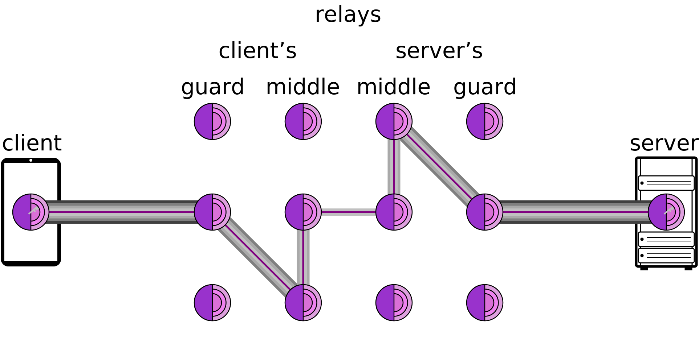
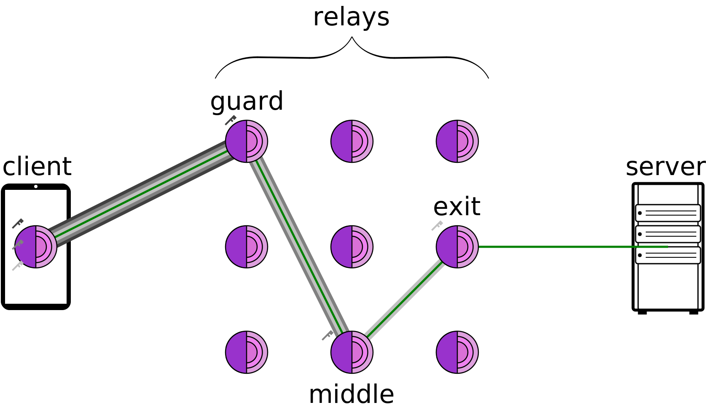

# Tor

> The Onion Router.

# Table of Contents

- [Tor](#tor)
- [Table of Contents](#table-of-contents)
- [Notes](#notes)
  - [Terminology](#terminology)
    - [Guard Relay](#guard-relay)
    - [Middle Relay](#middle-relay)
    - [Exit Relay](#exit-relay)
    - [Bridge Relay](#bridge-relay)
    - [Onion Service](#onion-service)
    - [Clearweb Site](#clearweb-site)
  - [Persist Guard Relay](#persist-guard-relay)
  - [Restrict Exit Relays](#restrict-exit-relays)
    - [`ExitRelay`](#exitrelay)
- [Programmatically](#programmatically)
  - [Changing `torrc`](#changing-torrc)
  - [Proxies \& IP Rotation using Tor](#proxies--ip-rotation-using-tor)
    - [Disable Being An Exit Node](#disable-being-an-exit-node)
    - [Disable Being A Relay Node](#disable-being-a-relay-node)
    - [Disable Being A Bridge Node](#disable-being-a-bridge-node)
    - [Disable Being Any Node](#disable-being-any-node)
  - [Restricting Exit Relays](#restricting-exit-relays)
    - [Key Takeaways](#key-takeaways)
    - [Scope of Damage](#scope-of-damage)
- [Wiki](#wiki)
  - [Overview](#overview)
    - [Operation](#operation)
    - [Onion Services](#onion-services)
  - [Onion Routing](#onion-routing)
    - [Data Structure](#data-structure)
      - [Onion Creation \& Transmission](#onion-creation--transmission)
    - [Weaknesses](#weaknesses)
      - [Timing Analysis](#timing-analysis)
      - [Exit Node Vulnerability](#exit-node-vulnerability)

# Notes

> Personal notes from my own research and experience with/surrounding Tor.

## Terminology

### Guard Relay

- The guard relay, sometimes referred to as an entry relay, is the first Tor server your connection hits when you start using the Tor network. It knows your real IP address, but it does not know what websites you are visiting or what you're doing. It simply passes your encrypted data to the next relay in the chain. These (guard) relays are not necessarily hidden or secret, but they are more trustworthy servers than other relays in the network.

### Middle Relay

- The middle relay is the second relay in the chain of your Tor traffic, increasing anonymity by adding an additional layer of encryption. This relay knows where the data is coming from (the guard relay) and where it is going (the exit relay), but it doesn't know the origin of the data (real IP address) or the final destination (website) because the data is encrypted.

### Exit Relay

- The exit relay is the final relay in the Tor network chain, where your data leaves the encrypted Tor network and enters the regular internet. It decrypts the final layer of encryption and sends your traffic to its final destination like a website or server. The exit relay sees the destination you are visiting as well as the data being transferred, but it does not know who you are or your real IP address (origin IP address of the Tor user).

### Bridge Relay

- Tor relies on a network of relays (servers) to route traffic in a way that hides user information. Normally these relays are public, but sometimes, Tor uses bridge relays, which are secret (not publicly listed). The idea is that if someone is trying to block or censor Tor usage by blocking known relays, they can't block these secret bridge relays because they don't know where they are.
- Bridge Relays make it harder for censors to block access to Tor itself by keeping some relays secret.
- These relays can be accessed via (1) Requests to Tor's "Bridge Database", (2) Getting Bridges through Trusted Contacts, (3) Email or other methods.

### Onion Service

- Tor offers a feature called "onion services," which allows users to host websites or content in a way that hides both the user's identity and the content's location. This means the content hosted through Tor's onion services can be resistant to censorship because it doesn't reveal the actual location of the server or the identity of the person hosting it.
- Onion Services makes it hard to block or censor content because the hosting location is hidden.

### Clearweb Site

- Any site that doesn't end in `.onion` in the context of Tor. Generally, any website that is a part of the regular, publicly accessible internet. These sites are also known as part of the Surface Web or Clearnet.

## Persist Guard Relay

Tor recommends that you stick with the same entry (guard) relay for a longer period to improve security and anonymity. The reason this makes your connection more secure has to do with protecting you from certain types of attacks and reducing the chances of traffic correlation or identity tracking. You are essentially reducing the number of points an attacker can use to try to identify you or correlate your traffic to your real identity.

## Restrict Exit Relays

When using Tor, restricting certain exit relays can help improve privacy and security. The exit node is the last point of contact with the public internet, and it can see and interact with unencrypted data (if you're not using HTTPS). While you can't completely avoid using an exit node, configuring Tor to avoid specific exit nodes or using trusted exit nodes can help:

1. Prevent Attacks:
   - Malicious exit nodes could potentially modify or monitor unencrypted traffic, so avoiding these nodes adds a layer of protection.
2. Reduce Liability:
   - By restricting exit relays, you can prevent your traffic from being associated with malicious activities conducted through a compromised exit node, although your real origin IP address is typically protected by the Tor network's anonymity features.
   - If a user engages in illegal activities through your exit node (assuming you are [hosting a Tor relay](#exitrelay)), the authorities or the website will trace the action back to your exit node's IP address (which is your IP).

While this doesn't eliminate all risks, ensuring the use of trusted exit relays and using end-to-end encryption (like HTTPS) is key to maximizing privacy and security when browsing with Tor.

### `ExitRelay`

In the Tor nextwork, an Exit Node is the final relay in the chain that sends traffic from the Tor network to the regular internet (the clear web). When you enable `ExitRelay` on your Tor server, you're essentially volunteering your server to act as an Exit Node in the Tor network. This means that if someone uses Tor to visit a website or engage in some online activity, your server could be the one that their traffic exits from, making it look like your server's IP address is the source of that traffic.

# Programmatically

> Some notes on interfacing with the Tor network programatically.

## Changing `torrc`

The Tor configuration file should be accessible by invoking something like the following in the CLI:

    sudo nano /etc/tor/torrc

Restart Tor after making changes to `torrc` by invoking something like the following in the CLI:

    sudo systemctl restart tor

> **Note:** Commands were invoked in Linux Ubuntu. YMMV.

## Proxies & IP Rotation using Tor

If using Tor purely as a client for IP rotation (for something like web scraping), then Tor is being used as a proxy which is fine and commonly done. Just _using_ Tor does not automatically turn your server into a (Exit, Relay, Bridge) Node in the network.

Your server will use the Tor network as _only_ a client if it does not participate as any kind of Node in the Tor network. This means your own traffic will travel and exit the Tor network through _other_ Nodes, and other people's traffic will not travel through your server.

### Disable Being An Exit Node

- If you disable the `ExitRelay` setting in your Tor configuration, your server will _not_ be an Exit Node. Traffic will _not_ be allowed to exit the Tor network through your server.
- You only become an Exit Node if you explicitly enable `ExitRelay` in the Tor configuration.
- By defualt `ExitRelay` should not be enabled, but it's good to check.
- Enable with `ExitRelay 1` in the `torrc`.
- Disable with `ExitRelay 0` in the `torrc`.

### Disable Being A Relay Node

- You can configure Tor to not participate in relaying traffic at all, meaning it won't participate as a middle relaying layer in the network for Tor users' traffic to use in their relay circuits.
- This is useful if you are just using Tor for IP rotation and don't want to be involved in contributing to the network by relaying traffic.
- `ORPort XXXX` defines the port for the Relay Node to accept incoming connections. If you don't want your server to be a relay at all, you can comment this line out.
- By default `ORPort XXXX` should be commented, but it's good to check.
- Optionally, check that `RelayBandwidthRate XXX KBytes` is also commented out.

### Disable Being A Bridge Node

- You can disable your server participating as a Bridge Relay Node by ensuring `BridgeRelay 0` in the `torrc` configuration file.
- This means your server won't be helping bypass censorship as a Bridge Node in the Tor network.

### Disable Being Any Node

- You can disable your server participating as any kind of Node in the Tor network by ensuring `DisableAllRelay 1` in the `torrc` configuration file.

## Restricting Exit Relays

When using Tor programmatically on an AWS server for web scraping, configuring the exit relays is crucial for controlling your traffic's security and anonymity. Disallowing specific exit relays or restricting exit nodes helps ensure that your traffic exits the Tor network through trusted or specific exit nodes.

1. Traffic Flow
   - Your traffic moves through entry nodes, relay nodes, and finally exit nodes. By configuring the `ExitNodes` parameter in your `torrc` file, you can specify or restrict which exit nodes Tor uses, adding an extra layer of control to avoid potentially untrusted or malicious exit nodes.
2. Security with Non-HTTPS or Expired Certificates
   - Non-HTTPS Sites
     - If the site you're requesting does not use HTTPS, your data is not encrypted beyond the Tor exit node, making it vulnerable to interception or manipulation. This is a significant privacy risk. Therefore, always prioritize using HTTPS websites for secure communication, as the data will remain encrypted all the way through.
   - Expired SSL Certificates
     - If a site has an expired certificate, Tor will still route the traffic, but you could face warnings or errors. Bypassing SSL/TLS checks is possible programmatically (e.g., using `verify=False` in Python's `requests` library), but it’s not recommended due to the security risks of potentially accepting malicious traffic.
3. Disallowing Exit Relays
   - Disallowing exit relays or using the `ExitNodes` parameter allows you to limit the exit nodes to those in specific locations or those that meet certain criteria. For example, you could restrict Tor to use only trusted exit nodes by specifying node fingerprints or country codes.
   - By using `StrictNodes 1`, you enforce Tor to only use specified exit nodes, reducing the risk of encountering untrusted or malicious exit nodes.
4. Security Implications
   - Even though Tor anonymizes your IP, scraping non-HTTPS websites or sites with expired certificates exposes your traffic at the exit node. If you must request such sites, you should carefully select trusted exit nodes to mitigate risks.
   - Malicious exit nodes can potentially intercept or alter your data, which is why restricting exit relays and ensuring HTTPS communication is critical to maintaining the security of your activity.

### Key Takeaways

- Restrict exit relays to use trusted or specific exit nodes (e.g., by country or node fingerprint).
- Always prefer HTTPS websites to ensure end-to-end encryption and prevent data interception at the exit node.
- If requesying sites with expired certificates, be aware of the risks of bypassing SSL checks and avoid doing so unless absolutely necessary.
- Carefully configure your exit node settings to protect your traffic from malicious actors on the network.

### Scope of Damage

- In a MITM attack scenario, the worst-case impact would generally be contained within your EC2 instance. If your traffic is intercepted or altered, it would be limited to that instance, and you could mitigate the issue by terminating and rebuilding it. Killing the instance is a valid mitigation step but ideally we wouldn't have to interface without HTTPS.

# Wiki

> Content truncated from [Tor (network) Wikipedia page](https://en.wikipedia.org/wiki/Tor_(network)) and [Onion routing Wikipedia page](https://en.wikipedia.org/wiki/Onion_routing) for my own reference.

## Overview

Tor is a free overlay network for enabling anonymous communication. Built on free and open-source software, and more than 7,000 volunteer-operated relays worldwide, users can have their internet traffic routed via a random path through the network.

Using Tor makes it more difficult to trace a user's internet activity by preventing any single point on the Internet (other than the user's device) from being able to view _both_ where traffic originated from and where it is ultimately going _at the same time_. This conceals a user's location and usage from anyone performing network surveillance or traffic analysis from any such point, protecting the user's freedom and ability to communicate confidentially.

The core principle of Tor is [Onion Routing](#onion-routing) and was developed in the mid-1900s by United States Naval Research Laboratory employees (mathematician and computer scientists) to protect American intelligence communications online. The Onion Routing project, "Tor", was launched on September 20, 2002 and had its first public release a year later. In 2004, the Naval Research Laboratory released the Tor code under a free license after which The Tor Project was founded as a non-profit organization in 2006 with financial support from the Electronic Frontier Foundation (EFF) and several other organizations.

### Operation

Tor aims to conceal its users' identities and their online activity from surveillance and traffic analysis by separating identification and routing. It is an implementation of [onion routing](#onion-routing), which encrypts and then randomly bounces communications through a network of relays run by volunteers around the globe. These onion routers employ encryption in a multi-layered manner (hence the onion metaphor) to ensure [perfect forward secrecy](https://en.wikipedia.org/wiki/forward_secrecy) between relays, thereby providing users with anonymity in a network location.

That anonymity extends to the hosting of censorship-resistant content by Tor's anonymous onion service feature. Furthermore, by keeping some of the entry relays (bridge relays) secret, users can evade Internet censorship that relies upon blocking public Tor relays.

### Onion Services

See also: [List of Tor onion services](https://en.wikipedia.org/wiki/List_of_Tor_onion_services) and Further information: [Dark web](https://en.wikipedia.org/wiki/Dark_web)

> The high-level design of onion services. The client and onion service each select three relays (a guard and two middle relays) to route traffic to each other, never leaving the Tor network, and never transmitting plaintext.

Tor can also provide anonymity to websites and other servers. Servers configured to receive inbound connections only through Tor are called onion services (formerly, hidden services). Rather than revealing a server's IP address (and thus its network location), an onion service is accessed through its onion address, usually via the Tor Browser or some other software designed to use Tor. The Tor network understands these addresses by looking up their corresponding public keys and introduction points from a distributed hash table within the network. An introduction point refers to a specific relay (node) within the Tor network that is used by onion services to establish connections with clients while maintaining anonymity. It can route data to and from onion services, even those hosted behind firewalls or network address translators (NAT), while preserving the anonymity of both parties. Tor is necessary to access these onion services. Because the connection never leaves the Tor network, and is handled by the Tor application on both ends, the connection is always end-to-end encrypted.

Onion services were first specified in 2003 and have been deployed on the Tor network since 2004. They are unlisted by design, and can only be discovered on the network if the onion address is already known, though a number of sites and services do catalog publicly known onion addresses.

While onion services are often discussed in terms of websites, they can be used for any TCP service, and are commonly used for increased security or easier routing to non-web services.

## Onion Routing

Onion Routing is a technique for anonymous communication over a computer network. In an onion network, messages are encapsulated in layers of encyption analogous to the layers of an onion. The encrypted data is transmitted through a series of network nodes called "onion routers", each of which "peels" away a single layer, revealing the data's next destination. When the final layer is decrypted, the message arrives at its destination. The sender remains anonymous because each intermediary knows _only_ the location of the _immediately preceding_ and _immediately following_ nodes. While onion routing provides a high level of security and anonymity, there are methods to infultrate this such as [timing analysis](#timing-analysis).

### Data Structure

Metaphorically, an onion is the data structure formed by "wrapping" a message with successive layers of encryption to be decrypted ("peeled" or "unwrapped") by as many intermediary computers as there are layers before arriving at its destination. The original message remains hidden as it is transferred from one node to the next, and no intermediary knows both the origin and final destination of the data at any given point in the route, allowing the sender to remain anonymous.

> The high-level design of Tor. Tor protects client anonymity by nesting layers of encryption over three proxy hops, known as relays, or onion routers: a guard relay, followed by a middle relay, then an exit relay. Nodes running Tor are here represented as onions.

#### Onion Creation & Transmission

To create and transmit an onion, the originator selects a set of nodes from a list provided by a "directory node". The chosen nodes are arranged into a path, called a "chain" or "circuit", through which the message will be transmitted. To preserve the anonymity of the sender, no node in the circuit is able to tell whether the node before it is the originator or another intermediary like itself. Likewise, no node in the circuit is able to tell how many other nodes are in the circuit and only the final node, the "exit node", is able to determine its own location in the chain.

Using [asymmetric key cryptography](https://en.wikipedia.org/wiki/Public-key_cryptography), the originator obtains a public key from the directory node to send an encrypted message to the first ("entry") node, establishing a connection and a shared secret ("session key"). Using the established encrypted link to the entry node, the originator can then relay a message through the first node to a second node in the chain using encryption that only the second node, and not the first, can decrypt. When the second node receives the message, it establishes a connection with the first node. While this extends the encrypted link from the originator, the second node cannot determine whether the first node is the originator or just another node in the circuit. The originator can then send a message through the first and second nodes to a third node, encrypted such that only the third node is able to decrypt it. The third, as with the second, becomes linked to the originator but connects only with the second. This process can be repeated to build larger and larger chains but is typically limited to preserve performance.

When the chain is complete, the originator can send data over the Internet anonymously. When the final recipient of the data sends data back, the intermediary nodes maintain the same link back to the originator, with data again layered, but in reverse such that the final node this time adds the first layer of encryption and the first node adds the last layer of encryption before sending the data, for example a web page, to the originator, who is able to decrypt all layers.

### Weaknesses

See also: [Tor (network) & Weaknesses](https://en.wikipedia.org/wiki/Tor_(network)#Weaknesses)

#### Timing Analysis

One of the reasons why the typical Internet connections are not considered anonymous is the ability of Internet service providers to trace and log connections between computers. For example, when a person accesses a particular website, the data itself may be secured through a connection like HTTPS such that the user's password, emails, or other content is not visible to an outside party, but there is a record of the connection itself, what time it occurred, and the amount of data transferred. Onion routing creates and obscures a path between two computers such that there is no discernible connection directly from a person to a website, but there still exist records of connections between computers. Traffic analysis searches those records of connections made by a potential originator and tries to match the timing and data transfers to connections made to a potential recipient. If an attacker has compromised both ends of a route, a sender may be seen to have transferred an amount of data to an unknown computer a specified amount of seconds before a different unknown computer transferred data of the same exact size to a particular destination. Factors that may facilitate traffic analysis include nodes failing or leaving the network and a compromised node keeping track of a session as it occurs when chains are periodically rebuilt.

[Garlic routing](https://en.wikipedia.org/wiki/Garlic_routing) is a variant of onion routing associated with the [I2P](https://en.wikipedia.org/wiki/I2P) (Invisible Internet Project) network that encrypts multiple messages together, which both increases the speed of data transfer and makes it more difficult for attackers to perform traffic analysis.

#### Exit Node Vulnerability

Although the message being sent is transmitted inside several layers of encryption, the job of the exit node, as the final node in the chain, is to decrypt the final layer and deliver the message to the recipient. A compromised exit node is thus able to acquire the raw data being transmitted, potentially including passwords, private messages, bank account numbers, and other forms of personal information. Dan Egerstad, a Swedish researcher, used such an attack to collect the passwords of over 100 email accounts related to foreign embassies.

Exit node vulnerabilities are similar to those on unsecured wireless networks, where the data being transmitted by a user on the network may be intercepted by another user or by the router operator. Both issues are solved by using a secure end-to-end connection like [SSL/TLS](https://en.wikipedia.org/wiki/Transport_Layer_Security) or [secure HTTP](https://en.wikipedia.org/wiki/Secure_HTTP) (S-HTTP). If there is [end-to-end encryption](https://en.wikipedia.org/wiki/End-to-end_encryption) between the sender and the recipient, and the sender isn't lured into trusting a false SSL certificate offered by the exit node, then not even the last intermediary can view the original message.
